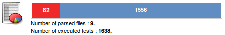
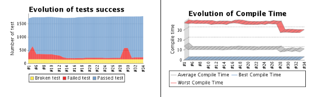
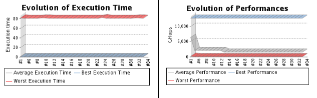
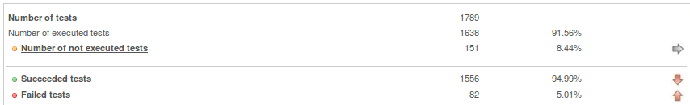
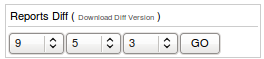
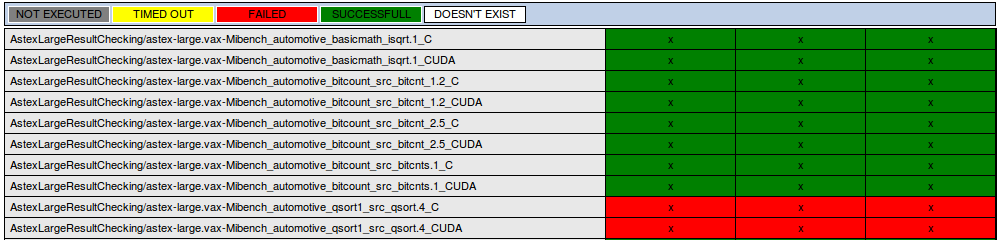
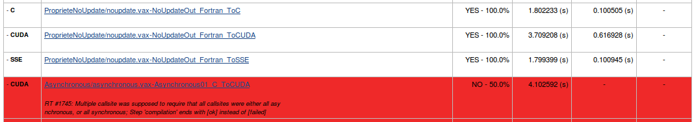
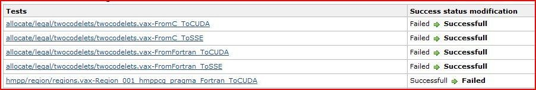

This plugin generates global and trend reports for tests results
analysis. Based on an open XML tests results format, the plugin parses
the generated files and publish statistics, reports and analysis on the
current health of the project.

# Context

CAPS entreprise provides software developers with an easy access to
manycore systems thanks to its flagship product HMPP™ (Heterogeneous
Multicore Parallel Programming).

Based on C and FORTRAN directives, HMPP offers a high level abstraction
of hybrid programming that fully leverages the computing power of stream
processors without the complexity associated with GPU programming.  
HMPP compiler integrates powerful data-parallel backends for NVIDIA CUDA
and AMD CAL/IL that drastically reduce development time. The HMPP
runtime ensures application deployment on multi-GPU systems. Software
assets are kept independent from both hardware platforms and commercial
software. While preserving portability and hardware interoperability,
HMPP increases application performance and development productivity.

The HMPP product validation criteria are many and various (with regard
to the supported languages, the behavior of the directives, in relation
to the OS, with regard to performance,...). So, a validation
infrastructure has been developed based on internal tools and hudson
projects for the control and the pretty-print of reports.  
In the following, we only describe what we call the performance
publisher part. This part is dedicated to the pretty-print of the report
resulting of the validation phase. The usual Hudson functionalities like
the management of the projects, of the slaves, the automatic launch of
the command, the notifications, etc. are not described in the present
document.

# Description

The PerfPublisher plug-in scans for xml tests reports defined in the
administration panel and generates trend graphs, computes stats and
underline regressions and modifications. The xml files must be generated
by your own testing tool.

# Features

The following features are provided by this plug-in:

-   **Configuration of the plug-in**
    -   Multiple reports
    -   Unstable threshold: Set the project as unstable when a number of
        failed test is reached.
    -   Health reporting: Interpolate the project health in function of
        the percent of failed test.

&nbsp;

-   **Multiple analysis point** : A test can publish multiple measures :
    -   Status (success / fail / broken)
    -   Compile time
    -   Execution time
    -   Performances

&nbsp;

-   **Build summary** : showing the number of failed and successful
    tests, number of files and number of executed tests.

 


-   **Several trend reports**
    -    showing the evolution of failed, broken and successful tests
        and the evolution of three types of measures : **Compile Time,
        Execution Time and Performances** per build.

  


-   **Global build report** of the tests executions status.
    -   Tests can be categorized ( per categories and/or xml-file )

&nbsp;

-   **Graphic view** of the results
    -   The tests can be characterized by their declared target.
        

&nbsp;

-   **Stats on results and their trend**
    -   (Number/Percent/Trend) of executed tests
    -   (Number/Percent/Trend) of not executed tests
    -   (Number/Percent/Trend) of successful tests
    -   (Number/Percent/Trend) of failed tests



-   **Multiple analysis points**
    -   (Number/Average/Trend) of compile time
    -   (Number/Average/Trend) of execution time
    -   (Number/Average/Trend) of performance


-   **Tests history**
    -   (Number/Percent) of new tests
    -   (Number/Percent) of deleted tests
    -   (Number/Percent) of execution changed status tests
    -   (Number/Percent) of success changed status tests


-   **Possibility to perform reports diff.**
    -   Manual export of a TXT diff summary of the current build ( to
        use with your favorite diff application)
    -   Integrated diff between none concurrent builds ( up to 3 builds
        )




-   **List of the executed tests**  
    \*\*Can be sorted by target, name, status, compile time, execution
    time, performance.



-   **List of the success changed status tests**



-   **Each test has its own description page**
    -   Execution and result trend
    -   Status
    -   Measures
    -   Platform description
    -   Unlimited number of log (error logs compile log, execution
        log... )
    -   Execution parameters

# DTD, XML FILES

Any xml report file, must be validated by the following DTD : [DTD
report](http://localhost:8085/download/attachments/42468412/report.dtd?version=1&modificationDate=1262493971000&api=v2).

## How-to generate your reports

Each "build" can contain multiple Xml reports, representing a part of
the repository of tests you have executed on your project. The results
will be included in the computation of statistics as a comprehensive
analysis but also more specifically, as sub-reports analysis (by
category and by name of file).

The contents of XML files has been developed to be as generic as
possible. The aim of this plugin is to integrate all your test results
and to generate an efficient quality metric defining the current health
of your project. For this metric to be effective, we have been providing
a report format adapted to a large number of types of tests. (We should
say, "we tried to...")

A report is structured around the following key elements:

``` syntaxhighlighter-pre
<report name="{REPORT_NAME}" categ="{CATEGORY_NAME}">
  <test name="{TEST_NAME}" executed="{EXECUTED_STATUS}">
    <result>
     <success passed="{RESULT_STATUS}" state="{RESULT_STATE}"/>
    </result>
  </test>
</report>
```

Warning

These elements are mandatory

Useful Information

The plugin was developed with a strong constraint: "a number of tests
well above 5000 per build".

From a point of view a little bit more technical, these tests are
considered as members of a file and more generally, of a category.
However, each test is independent of others. It possess its own
definition, and especially its own execution context. However, we
mention that a forthcoming features, will provide case simplifications
of writing and reporting through mechanisms of factorizations.

You can provide a large amount of information on each test in order to
characterize them.  
To go further more into the details of all available tags, I suggest you
view the reports generated by the "xml-generator" application.

Of course a test can have a complete description. And furthermore, a
test ban be considered as "boken" with the EXECUTION\_STATUS attribute
(yes\|no). A broken test, is test that you know should exists but you've
have disabled it.

``` syntaxhighlighter-pre
[...]
 <test name="{TEST_NAME}" executed="{EXECUTION_STATUS}">
    <description>&lt;![CDATA[This is the description of the test number 0 member of the 1 file.]]</description>
[...]
```

But it can also be "targeted". That is, you can set it a target of
testing, one or more keywords describing the purpose of the test. For
example, in the case of a test solution for a web application, you can
set the targets tested by languages

-   CSS
-   HTML
-   JAVASCRIPT
-   ....  
    or rather preferred functional approach analysis using the following
    targets:
-   SECURITY
-   HMI
-   EMAILS
-   ...
    ``` syntaxhighlighter-pre
    [...]
      <test name="{TEST_NAME}" executed="{EXECUTION_STATUS}">
        <description>{TEST_DESCRIPTION}</description>
        <targets>
          <target threaded="{THREADED_STATE}">{TARGET_NAME}</target>
        </targets>
    [...]
    ```

    Useful Information

    A test can have multiple targets. The attribute
    THREADED\_STATE(true\|false) has been integrated for language like
    C, FORTRAN, which can be threaded

Let's deal now with the context of the implementation of a test.
Experiments run on your machine, which can be dedicated, and which can
intervene heavily on results such as performances or just for a test
repository adapted to the notion of integration. You have the ability to
describe this context using the following tags.

``` syntaxhighlighter-pre
[...]
  <test name="{TEST_NAME}" executed="{EXECUTION_STATUS}">
    <description>{TEST_DESCRIPTION}</description>
    <targets>
      <target threaded="{THREADED_STATE}">{TARGET_NAME}</target>
    </targets>
    <platform name="{PLATFORM_NAME}">
      <os>
        <type>&lt;![CDATA[{OS_FULLNAME}]]&gt;</type>
        <name>&lt;![CDATA[{OS_NAME}]]&gt;</name>
        <version>&lt;![CDATA[{OS_VERSION}]]&gt;</version>
        <distribution>&lt;![CDATA[{OS_FULL_VERSION}]]&gt;</distribution>
      </os>
      <processor arch="{PROCESSOR_ARCHITECTURE}">
        <frequency unit="{FREQ_UNIT}" cpufreq="{CPU_FREQ}" />
      </processor>
      <hardware>&lt;![CDATA[{HARDWARE_INCLUDED}]]&gt;</hardware>
      <compiler name="{COMPILER_NAME}" version="{COMPILER_VERSION}" path="{COMPILER_PATH}" />
      <environment>{OTHER}</environment>
    </platform>
[...]
```

Useful Information

-   You can only have one platform description per test.
-   Only one os per test
-   Only one processor architecture
-   Multiple processor frequency per processor architecture
-   Multiple hardwares
-   Multiple compilers
-   One environment description

Useful Information

| ELEMENT                 | UNIQUE | MANDATORY | DESCRIPTION                                                                                                                        |
|-------------------------|--------|-----------|------------------------------------------------------------------------------------------------------------------------------------|
| PLATFORM\_NAME          | YES    | NO        | The name of the platform.                                                                                                          |
| OS\_FULLNAME            | NO     | NO        | The name of the os. (ex. : Linux-2.6.26-2-amd64-x86\_64-with-glibc2.3.2)                                                           |
| OS\_NAME                | NO     | NO        | The name of the os. (ex. : Linux)                                                                                                  |
| OS\_VERSION             | NO     | NO        | The version of the os (ex. : 2.6.26-2-amd64).                                                                                      |
| OS\_FULL\_VERSION       | NO     | NO        | The full name of the version (ex. : Linux-2.6.26-2-amd64-x86\_64-with-debian-5.0.3).                                               |
| PROCESSOR\_ARCHITECTURE | NO     | NO        | The name of the architecture of the test platform (ex. : x86\_64).                                                                 |
| FREQ\_UNIT              | NO     | NO        | The unit of the value representing the frequency unit of the cpu (ex. : MHz).                                                      |
| CPU\_FREQ               | NO     | NO        | The frequency value of your cpu (ex. : 2667.000).                                                                                  |
| HARDWARE\_INCLUDED      | NO     | NO        | A description of an included hardware in your test platform (ex. : nVidia Corporation GT200 - Tesla C1060 / Tesla S1070 (rev a1)). |
| COMPILER\_NAME          | NO     | NO        | The name of a compiler (ex. : ifort).                                                                                              |
| COMPILER\_VERSION       | NO     | NO        | The version number of the compiler (ex. 11.0 20090131).                                                                            |
| COMPILER\_PATH          | NO     | NO        | The path to you compiler binary (ex. : .).                                                                                         |
| OTHER                   | NO     | NO        | Any other libs or environment data you want to include in the test report.                                                         |

Let us focus now on the representation of test results. A test can have
multiple output data. A simple test may called "boolean". That is, it
just indicate whether or not the test succeed (or failed).  
Coupled with this, we can provide, the percentage of success in the case
of a test failed. For example, a test can fail at 90% of its execution
status, representing a partial error, certainly important but partial.  
It is also important to highlight the tests that have failed due to a
timeout. You have the option to specify it.

In addition to this type of result, a test can provide important
informations such that its compilation time, execution time or
performance that it could have measured.  
It is therefore important to trace this information. The format adopted
proposes xml tags for the representation of these data. But event you
want to save the values, for a reason on another one, you perhaps only
wants few of the metrics to be included in the global statistics
analysis. To include or not a measure in the stats, you can specify the
IS\_RELEVANT tag.

``` syntaxhighlighter-pre
[...]
  <test name="{TEST_NAME}" executed="{EXECUTION_STATUS}">
    <description>{TEST_DESCRIPTION}</description>
    <targets>
      <target threaded="{THREADED_STATE}">{TARGET_NAME}</target>
    </targets>
    <platform name="{PLATFORM_NAME}">
      <os>
        <type>&lt;![CDATA[{OS_FULLNAME}]]&gt;</type>
        <name>&lt;![CDATA[{OS_NAME}]]&gt;</name>
        <version>&lt;![CDATA[{OS_VERSION}]]&gt;</version>
        <distribution>&lt;![CDATA[{OS_FULL_VERSION}]]&gt;</distribution>
      </os>
      <processor arch="{PROCESSOR_ARCHITECTURE}">
        <frequency unit="{FREQ_UNIT}" cpufreq="{CPU_FREQ}" />
      </processor>
      <hardware>&lt;![CDATA[{HARDWARE_INCLUDED}]]&gt;</hardware>
      <compiler name="{COMPILER_NAME}" version="{COMPILER_VERSION}" path="{COMPILER_PATH}" />
      <environment>{OTHER}</environment>
    </platform>
    <result>

      <success passed="{SUCCESS_STATUS}" state="{SUCCESS_PERCENT}" hasTimedOut="{TIMEDOUT_STATUS}" />

      <compiletime unit="{UNIT}" mesure="{MEASURE}" isRelevant="{IS_RELEVANT}" />

      <performance unit="{UNIT}" mesure="{MEASURE}" isRelevant="{IS_RELEVANT}" />

      <executiontime unit="{UNIT}" mesure="{MEASURE}" isRelevant="{IS_RELEVANT}" />

      <metrics>
        <{CUSTOM_METRIC_ID} unit="{UNIT}" mesure="{MEASURE}" isRelevant="{IS_RELEVANT}" />
      </metrics>

      <errorlog><![CDATA[{ERROR_LOG}]]></errorlog>

      <log name="{LOG_NAME}"><![CDATA[{LOG}]]></log>

    </result>
[...]
```

Useful Information

-   A test can only have one result tag.
-   A result can only contains one compile time, execution time and
    performance.
-   A result can only contains one errorlog but it can have multiple
    logs.

Useful Information

[TABLE]

# XML-GENERATOR

The tool xml-generator
([xml-generator.jar](http://localhost:8085/download/attachments/42468412/xml-generator.jar?version=1&modificationDate=1270879301000&api=v2))
generates exemples of valid reports.

xml-generator usage

Usage : java -jar xml-generator.jar (number of file to generate) (number
of test per file)  
Exemple : java -jar xml-generator.jar 10 600

-   **If you want to try the plugin with this tool :**
    -   Create an empty project (freestyle or multiconfig)
    -   Execute a first build (it will create the project workspace
        directory)
    -   Copy xml-generator.jar in the workspace directory of your
        project
    -   Activate PerfPublisher plugin for your project (tick the option
        : Activate PerfPublisher for this project) and configure it to
        parse \*.xml files
    -   Add a build step to your project containing the following
        commands :  
        On Linux :
        ``` syntaxhighlighter-pre
        rm -f ${WORKSPACE}/*.xml
        java -jar ${WORKSPACE}/xml-generator.jar 5 200
        ```

        On Windows (thx to Jéssica Yoshie Kussuda)
        ``` syntaxhighlighter-pre
        del ${WORKSPACE}\*.xml
        java -jar ${WORKSPACE}\xml-generator.jar 5 200
        ```

&nbsp;

-   -   Execute a build

&nbsp;

-   **This tool generates xml random reports. It should respects the
    following random ratio :**
    -   4 targets (C, JAVA, PHP, FORTRAN) equiprobables
    -   80% of executed test
    -   70% of passed test
    -   On the 30% of failed test, 20% are timedout
    -   30% of compile time, execution time and performance measures are
        considered as relevants (included in the stats)
    -   Up to 5 auxilliary logs

# RELEASES AND UPDATES

The current release is available in the [download
section](https://hudson.dev.java.net/servlets/ProjectDocumentList?folderID=11990&expandFolder=11990&folderID=9183).
This plug-in is developed and maintained by Georges Bossert. Please use
the Hudson [mailing
lists](https://hudson.dev.java.net/servlets/ProjectMailingListList) or
[issue tracker](https://hudson.dev.java.net/issues/) to ask questions,
create feature request or bug reports.

**This plugin is provided as it is. CAPS entreprise provides no warranty
on the correction of errors or its support.**

# Changelog

-   **What's new in 7.98**
    -   New details Passed and Failed tests pages
    -   Addind trend analysis for the last 5 builds
    -   \[BETA\] Possibility to specify your own metrics
    -   More efficient Categories and Files sub-reports.
    -   A bit of i18n

&nbsp;

-   **What's new in 7.97**
    -   Error on release process has transformed this version as an
        unstable one. Should not be used !

&nbsp;

-   **What's new in 7.96**
    -   Update Matrix support
    -   Resolve a jelly duplicated code section
    -   Resolve few bugs
    -   Optimize loading and memory usage
    -   Offers a filter option in the build diff
    -   Add links in the build diff to directly access tests results
    -   Add a "regression alarm" on the build main page.

&nbsp;

-   **What's new in 7.95**
    -   Optimizes FreeStyle Project analysis
    -   Reduces "New Executed Tests" statistics computation time
    -   Offers direct links between Diff Display and associated results
    -   Add a filter option to the diff display
    -   Supports Multi-Configuration projects
        -   Offers a "Global test report" including build trend for each
            combinations
        -   Aggregates axes results of a build in a summary report
    -   Rename menu links in function of reports
    -   Prepare the support of official Test Result plugins
    -   Update source code annotations and javadoc comments
    -   Prepare the support of multi-languages via associated Plugin
