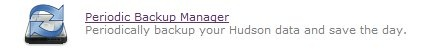
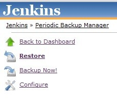
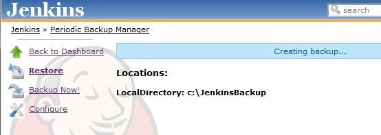
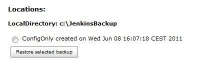

| Plugin Information                                                                                         |
|------------------------------------------------------------------------------------------------------------|
| View Periodic Backup [on the plugin site](https://plugins.jenkins.io/periodicbackup) for more information. |

Older versions of this plugin may not be safe to use. Please review the
following warnings before using an older version:

-   [Missing permission checks and CSRF vulnerability in Periodic Backup
    Plugin](https://jenkins.io/security/advisory/2017-07-10/)

**This plugin is up for adoption.** Want to help improve this plugin?
[Click here to learn
more](http://localhost:8085/display/JENKINS/Adopt+a+Plugin "Adopt a Plugin")!

## Description

This plugin was created as alternative to existing [Backup
Plugin](http://localhost:8085/display/JENKINS/Backup+Plugin) that would
work periodically.  
The main idea was to create a backup plugin that provides an **easy**
way to be **extended** with new functionality in the future without the
need of hacking around the code.  
The plugin defines three extension points (basically plugins inside the
plugin):

-   FileManager - defines what files should be included in the backup
    and what will be the restore policy of the files. Example:
    ConfigOnly - will choose only the configuration XML files from
    HUDSON\_HOME, all the configuration files of each job and the XML of
    every user if you are using an internal database for access control.
-   Storage - specifies method of archiving and unarchiving backups.
    Example: ZipStorage - will compress backup files into a zip archive.
-   Location - specifies localization of the backups. Example:
    LocalDirectory - will store the backup files inside the specified
    path.

## Usage

1.  After installing the plugin and restarting Jenkins, new icon will
    appear in the **Manage Jenkins** section.  
    
2.  After pressing **Periodic Backup Manager** in the side panel choose
    **configure** to set up the plugin.  
    
3.  In the configuration page set all the required parameters which are:
    -   **Temporary Directory** - path to the directory for creating
        archives during backup, storing archives during restore, and
        unpacking their content. It is vital for PeriodicBackup that
        this directory is writable, empty, and outside of the Jenkins
        home directory.
    -   **Backup schedule (cron)** - schedule following the syntax of
        cron (with minor differences). Validate cron button may be
        useful to check if the syntax of the input is correct. More
        about cron can be found here:
        <http://adminschoice.com/crontab-quick-reference>
    -   **Maximum backups in location** - A number of existing old
        backups exceeding this value in each location will be deleted
        after backup.
    -   **Store no older than (days)** - Backups older then number of
        days specified here will be deleted after backup.
    -   **File Management Strategy** - choose a suitable FileManager and
        fill in required fields (if any)
    -   **Storage Strategy** - add a suitable Storage(s) and fill in
        required fields (if any)
    -   **Backup Location** - add a suitable Location(s) and fill in
        required fields (if any)

        Temporary Directory

        Please be aware the using a path inside **Temporary Directory**
        (for example for location like LocalDirectory) will lead to a
        very bad things (like loss of data).

4.  After setting up all values correctly and pressing **Save** button,
    configuration will be persisted and user will be redirected to the
    main page of the plugin. Any backup available for restore will be
    listed here, and one can navigate here via **Restore** link from the
    **sidepanel**. The backup will be performed according to the cron
    schedule or when **Backup Now!** is pressed from the **sidepanel**.
    A message will be shown on the top of the page as on the picture
    below.  
    
5.  When the backup is successfully created it will be listed on the web
    page as on the picture below.  
      
    To restore the backup it has to be chosen from the list and the
    "restore selected backup" button has to be pressed.

    Backup not showed/"Creating backup..."/"Restoring backup..." message
    does not disappear

    Sometimes the backup will not be shown on the web page just after
    performing the backup. Also the "Creating backup..."/"Restoring
    backup..." messages may not disappear from the page when they
    should. In that case page has to be refreshed or the link to
    **Restore** has to be pressed in order to show the new backup. This
    will be fixed in future by a widget informing about the current
    status of the backup/restore process

## Change Log

#### Version 1.5 (July 10, 2017)

-   [Fix security
    issue](https://jenkins.io/security/advisory/2017-07-10/)

#### Version 1.4 (Jun 22, 2017)

-   [ JENKINS-17487](https://issues.jenkins-ci.org/browse/JENKINS-17487) -
    Add support of excludes in Full Backup
-   [ ](https://issues.jenkins-ci.org/browse/JENKINS-17487)[PR
    \#10](https://github.com/jenkinsci/periodicbackup-plugin/pull/10) -
    Update minimal Jenkins core requirement to 1.609.3
-   [ JENKINS-25887](https://issues.jenkins-ci.org/browse/JENKINS-25887) -
    Do not follow symbolic links when performing Full Backups
-   [ ](https://issues.jenkins-ci.org/browse/JENKINS-25887)[JENKINS-44997](https://issues.jenkins-ci.org/browse/JENKINS-44997) -
    Restore the "Restore Backup" button, which was doing nothing in
    modern Jenkins UIs
-   [ ](https://issues.jenkins-ci.org/browse/JENKINS-25887)[PR
    \#10](https://github.com/jenkinsci/periodicbackup-plugin/pull/10) -
    Prevent NullPointerException if an error happens during listing
    directories
-   [ PR
    \#10](https://github.com/jenkinsci/periodicbackup-plugin/pull/10) -
    Internal: Update the release flow, fix generation of the Maven Site,
    FindBugs cleanup

#### Version 1.3 (Jan 4, 2013)

-   JENKINS-12846: Add support for backing up user XMLs in users folder.

#### Version 1.2 (Jan 3, 2013)

-   JENKINS-13635: TarGzStorage changed to GNU long file mode (long
    filenames up to 256 chars).
-   JENKINS-16223: Update plexus dependencies.

#### Version 1.0 (Jun 3, 2011)

-   Initial release
