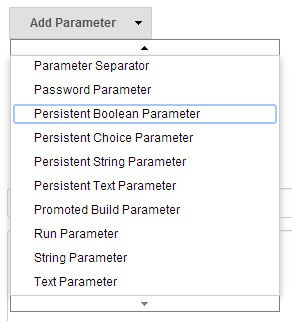
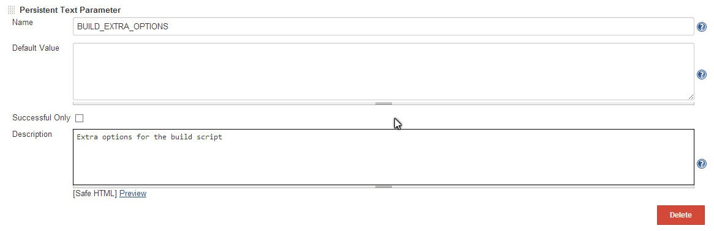

String, text, boolean and choice parameters with default values taken
from the previous build (if any).

#### Version History

##### 1.1 (Feb 20, 2015)

-   Support for non-interactive (periodic, SCM poll etc) builds

##### 1.0 (Oct 24, 2014)

-   Initial release
