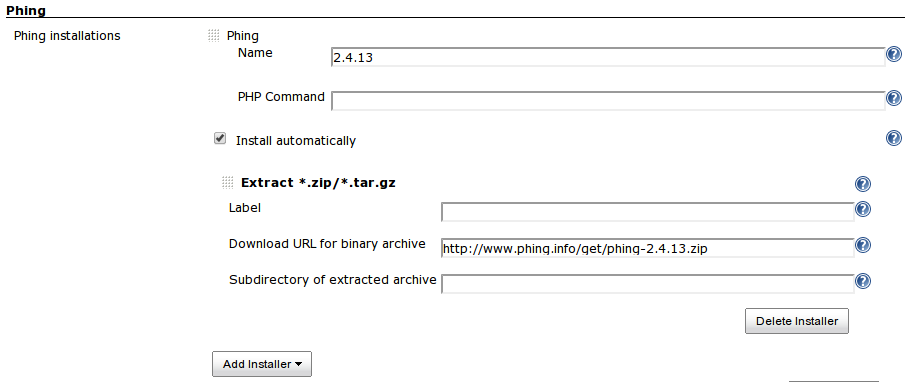
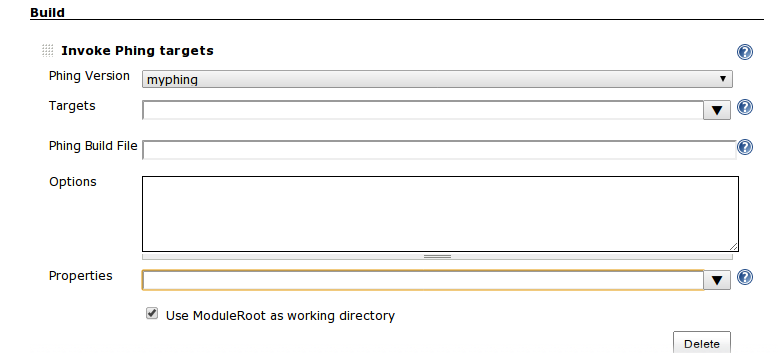

# Phing Plugin

This plugin allows you to use [Phing](http://phing.info/trac/) to build
PHP projects.

## Configuration

### System Configuration

  
If you have **multiple** Phing installations, you can configure Jenkins
to allow that each project will select the installation that will use.

If phing is in the path, you don't have to configure phing.

You can use environment variables in PHING\_HOME like $WORKSPACE, $HOME
etc.

Composer users

For composer users, if you have phing installed in
$HOME/vendor/bin/phing, then specify ''$HOME/vendor/'' or
''$HOME/vendor/bin'' as PHING\_HOME.

PEAR users

For PEAR users, if you have phing installed in /usr/bin/phing, then
specify ''/usr'' or ''/usr/bin'' as PHING\_HOME.

Do not specify "Subdirectory of extracted archive".

#### Project Configuration

  
This plugin works as other builders like Ant builder or Gant builder.

## History

###### Version 0.13.2 (Mar 22, 2015)

-   sone fixes.

###### Version 0.13.1 (Apr 20, 2013)

-   Windows phing is broken, jenkins tries to execute phing.bat with
    php.exe
    ([JENKINS-17668](https://issues.jenkins-ci.org/browse/JENKINS-17668)).

###### Version 0.13 (Apr 6, 2013)

-   Support Phing auto installer.

###### Version 0.12 (Mar 18, 2013)

-   added Options field to specify logger
    ([JENKINS-17073](https://issues.jenkins-ci.org/browse/JENKINS-17073)).
-   Allow environment variables in phing properties
    ([JENKINS-16967](https://issues.jenkins-ci.org/browse/JENKINS-16967)).

###### Version 0.11 (Mar 19, 2012)

-   Specifying custom phing build file does not work
    ([JENKINS-12995](https://issues.jenkins-ci.org/browse/JENKINS-12995)).

###### Version 0.10 (Mar 2, 2012)

-   Fixed that 'Use ModuleRoot as working directory' checkbox is not
    checked correctly.

###### Version 0.9 (Dec 21, 2011)

-   added "Use ModuleRoot as working dire 'Use ModuleRoot as working
    directory' checkbox is not checked correctly. ctory" checkbox on
    project configuration page.
    ([JENKINS-12078](https://issues.jenkins-ci.org/browse/JENKINS-12078))

###### Version 0.8 (Jun 3, 2011)

-   Jenkins
-   Fixed the description of Phing on system configuration page.

###### Version 0.7 (Jan. 21, 2011)

-   Support Environment variables in the "Build file" field such as
    "$WORKSPACE/build.xml".
    ([JENKINS-8549](https://issues.jenkins-ci.org/browse/JENKINS-8549))

##### Version 0.6.1 (Dec. 8, 2010)

-   Fixed Information of certain Phing tasks does not display in console
    output of the build.
    ([JENKINS-8097](https://issues.jenkins-ci.org/browse/JENKINS-8097))

##### Version 0.6 (Oct. 8, 2010)

-   Supported ConsoleNoteAnnotator.
-   Added "Executed Phing Target".

##### Version 0.5

-   Fixed NotSerializableException using Phing plugin with slaves.
    Thanks mdillon.
    ([JENKINS-6615](https://issues.jenkins-ci.org/browse/JENKINS-6615))

##### Version 0.4

-   Fixed
    [JENKINS-4398](https://issues.jenkins-ci.org/browse/JENKINS-4398).
-   Fixed deprecated api.

##### Version 0.3

-   Fixed
    [JENKINS-2504](https://issues.jenkins-ci.org/browse/JENKINS-2504).

##### Version 0.2

-   Fixed NPE when no targets are specified.

##### Version 0.1

-   First Version
