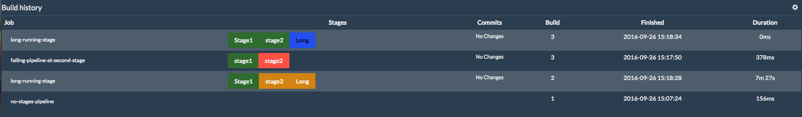

Allows the users to view the history of their pipelines with stage
information (failed/In Progress/Passed) and the changes monitored)  
Releases:

-   1.8 Added the option for showing only the last build of a pipeline
    matching the patterns
-   1.7 bugfixes
-   1.6 filter applied on full display name making it easy not to filter
    multibranch projects and branchest within its regex:
     multibranch-project-name.+(branch1\|branch2\|branch3) \#\[0-9\]+  
     
-   1.5 fixed a bug that didn't allow multibranch projects to be
    filtered correctly
-   1.4: fixed the auto-refresh
-   1.3: Added option to remove the auto-scrolling of the commits 
    -   fixed <https://issues.jenkins-ci.org/browse/JENKINS-40008>
    -   fixed <https://issues.jenkins-ci.org/browse/JENKINS-39993>
-   1.2: fixed the href issue and added auto-scrolling to the list of
    commit
-   1.1: fixed an issue that didn't allow the folder or renamed builds
    to be displayed
-   1.0: initial release a dashboard like view that selects only
    pipelines and presents the stages and the commits on each build.
