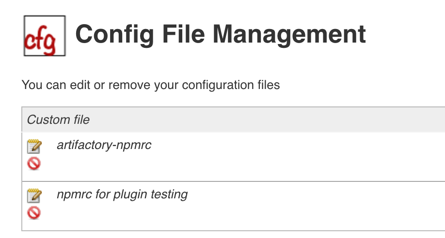

Allows pipelines to configure an NPM environment via managed npmrc files

# Summary

This plugin provides integration with Pipeline by configuring an NPM
environment to use within a pipeline job by calling `sh npm` or
`bat npm`. This is accomplished by adding an `npmrc` as a custom config
file to be centrally managed by Jenkins. This is useful for managing
registries, authorizations, and any other npm settings that one would
like to manage via Jenkins outside of the pipeline itself.

This plugin works both with and without Docker containers as build
steps.

# Configuration

Via Config File Management, Manage Jenkins -\> Managed Files, add an
npmrc entry specifying the id that will be used in the pipeline
configuration.

{width="300"}

# Basic Usage

``` syntaxhighlighter-pre
withNPM(npmrcConfig: 'my-custom-nprc') {
    sh 'npm install'
}
```

In the above example, 'my-custom-npmrc' is a config file that had been
added as a custom, Managed File. Underneath, the custom `npmrc` is being
copied to the workspace where it will serve as a local override during
the build. Nominally, npm would have a command line mechanism for
specifying the npmrc, but for now the best choice to force an override
is to place the `npmrc` in the workspace where it will be prioritized
over the home and global `npmrc`.

Here is another example using Docker and [Pipeline Model Definition
Plugin](http://localhost:8085/display/JENKINS/Pipeline+Model+Definition+Plugin).
 When using the Docker based approach, the npmrc is installed to the
user home location.

``` syntaxhighlighter-pre
stage('npm-build') {
    agent {
        docker {
            image 'node:7.4'
        }
    }

    steps {
        echo "Branch is ${env.BRANCH_NAME}..."

        withNPM(npmrcConfig:'my-custom-npmrc') {
            echo "Performing npm build..."
            sh 'npm install'
        }
    }
}
```

## Known Issues

-   When not using a Docker based build, NPM must be installed on the
    build executor.
-   When not using a Docker based build, any local npmrc to the
    workspace will be replaced by this plugin.

## Changelog

-   0.9.0 -- Initial Release
-   0.9.1 -- Removed wrapper script since there is no useful way to
    override the npmrc on the command line.  This simplifies things a
    fair bit in terms of the code.
