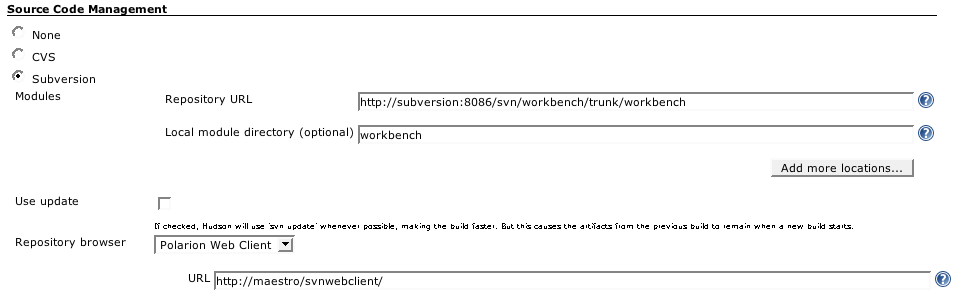

### Polarion Plugin

This plugin integrates the [Polarion WebClient for
SVN](http://www.polarion.com/products/svn/svn_webclient.php), an open
source, web based interface to Subversion.

Configuration simply involves choosing 'Polarion Web Client' as the
repository browser when configuring a project to use Subversion as its
source code management.

Once configured, the change logs of a build will provide links to the
specific Subversion revision as well as the color coded difference views
within Polarion WebClient.

Note that JIRA also integrates the Polarion WebClient as a web based
viewer of subversion changes related to issues. When coupled with the
Jenkins [JIRA
Plugin](https://wiki.jenkins.io/display/JENKINS/JIRA+Plugin) this
combination provides a very useful integration between source control
viewing, issue tracking and continuous integration and builds.

### Change History

##### Version 1.3 (Nov 03, 2011)

-   JENKINS-11602

##### Version 1.2 (Jan 29, 2010)

-   Update code for more recent Hudson

##### Version 1.1 (Sep 5, 2007)

-   Added the location option
    ([report](http://www.nabble.com/Polarion-plugin-extension-tf4358881.html))
