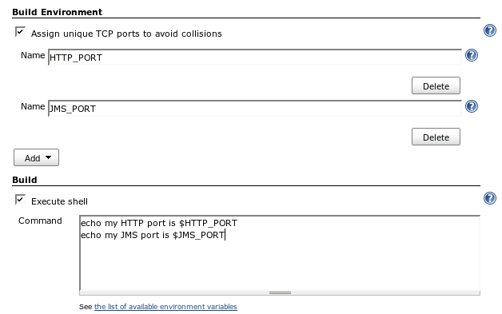
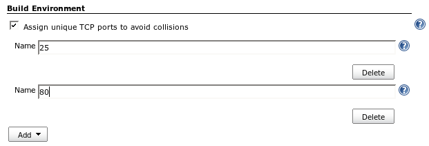
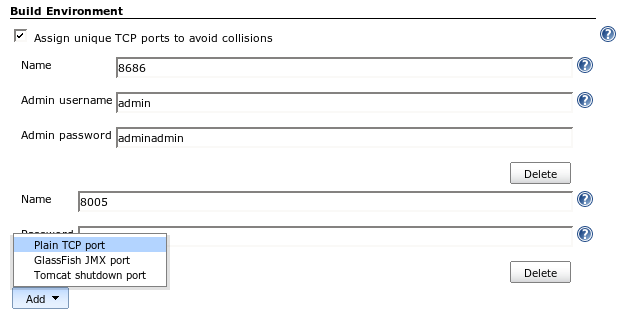

# What does this do?

### TCP port number allocation

When you have several jobs that involve in launching a daemon process
(such as application servers), making sure that each job uses unique TCP
port numbers becomes tedious. If you don't manage this, however, two
jobs that happen to run on the same machine may use the same port, like
8080, and end up interfering each other.

This plugin is written to solve this problem by letting Jenkins do the
book-keeping. With this plugin, you'd just say "I need HTTP\_PORT and
JMS\_PORT for this job", and Jenkins will assign unique available TCP
port numbers to them and expose them to the build as environment
variables.

The following screenshot illustrates this configuration.

### Reserving a fixed port

Sometimes, your job requires a certain port. For example, it's not
unusual to see tests that have hard-coded port numbers, or maybe you are
testing SMTP servers that really do require port 25.

In such a case, you'd just need to say "this job requires port 25, so
don't run it with any other job that requires the same port." Jenkins
will then schedule jobs accordingly so that the collision won't happen.

The following screenshot illustrates this configuration.

### Shutting down run-away daemons

Often these allocated TCP ports are used to run background daemon
processes, like application servers. A typical problem in this set up is
that when a job fails abnormally, the job may fail to terminate those
servers properly. This interferes with successive builds that use the
same machine.

To fix this problem, when you allocate a port (or reserve a fixed port),
you can choose one of the port types that have the knowledge of shutting
down the process. Currently, two port types are available, and more can
be added as additional plugins.

-   **GlassFish JMX port** that lets Jenkins shut down a run-away
    GlassFish through JMX. See
    [this](http://weblogs.java.net/blog/kohsuke/archive/2007/10/shutting_down_g.html).
    For how to specify a JMX port number when you create a domain,
    search 'jmxPort' in [this
    document](http://docs.sun.com/app/docs/doc/819-3675/6n5slue7j?a=view).
    Alternatively, you can configure a job to require fixed port 8686,
    which is the default port number for this.
-   **Tomcat shutdown port** that lets Jenkins shut down a run-away
    Tomcat through the shut down port. See [this
    document](http://tomcat.apache.org/tomcat-4.1-doc/config/server.html)
    for more about this feature.

The following screenshot illustrates this configuration.

# History

### Version 1.8 (Jul 25, 2013)

-   Remove remaining ResourceActivity support for Pooled port
    allocation.(see
    [JENKINS-18786](https://issues.jenkins-ci.org/browse/JENKINS-18786))

### Version 1.7 (Jul 24, 2013)

-   [JENKINS-18786](https://issues.jenkins-ci.org/browse/JENKINS-18786)
    Port allocation blocks jobs from executing concurrently

### Version 1.6 (Jul 11, 2013)

-   [JENKINS-11255](https://issues.jenkins-ci.org/browse/JENKINS-11255)
    Pooled port allocation support (+ implement ResourceActivity to
    queue builds instead of blocking after start)
-   Add PortAllocationManager\#allocateConsecutivePortRange (an enabler
    for fixing
    [JENKINS-12821](https://issues.jenkins-ci.org/browse/JENKINS-12821))

### Version 1.5 (Mar 29, 2010)

-   The plugin is made a bit more reusable
    ([report](http://n4.nabble.com/Using-plugin-dependencies-tp1680509p1680509.html))

### Version 1.4 (Dec 28, 2009)

-   Report assigned port in the build log
-   Update uses of deprecated APIs

### Version 1.3 (Jul 10, 2008)

-   Got rid of the dependency on JDK1.6 and make it compatible with
    JDK1.5. The issue was affected only when the preferred port was not
    available.

### Version 1.2 (Jun 04, 2008)

-   Replaced a deprecated API to support Maven2 style job.

### Version 1.0 (Nov 08, 2007)

-   Initial version.
