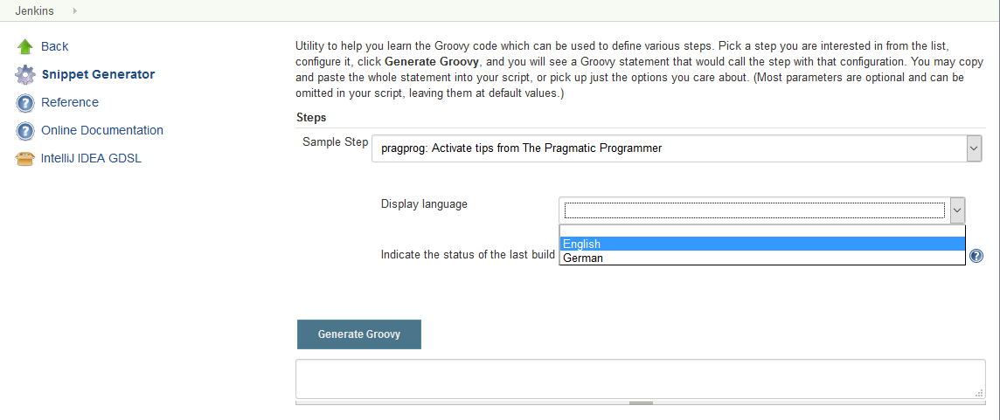
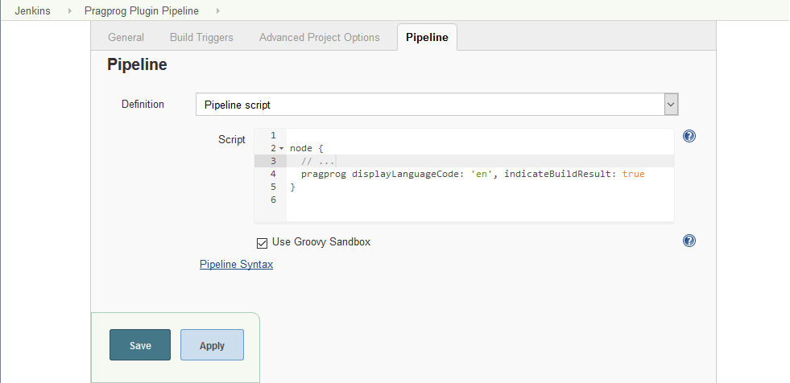
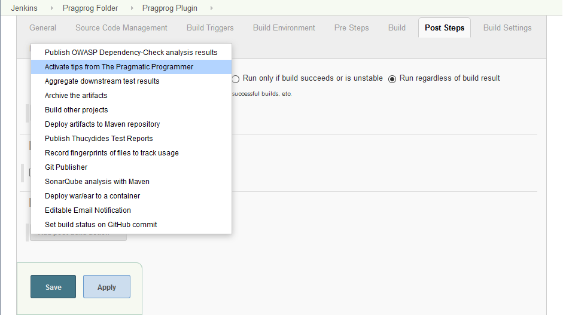
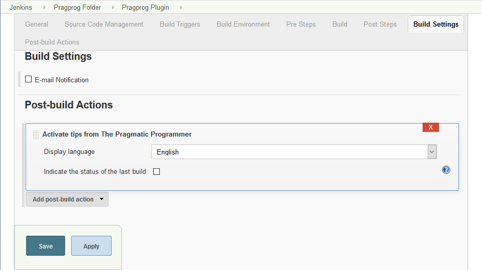
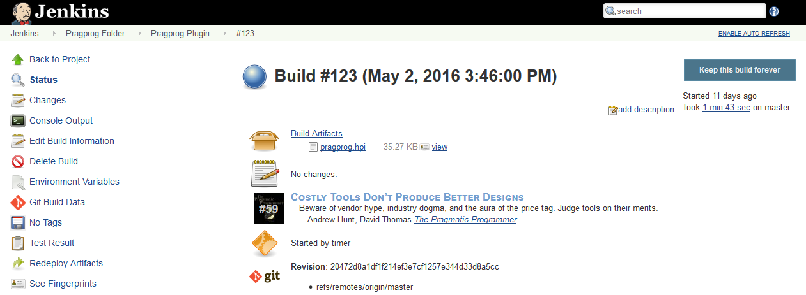

#### Plugin Information

[TABLE]

This plugin displays random chosen tips extracted from the book [The
Pragmatic Programmer: From Journeyman to
Master](http://pragprog.com/the-pragmatic-programmer/ "The Pragmatic Programmer: From Journeyman to Master by Andrew Hunt and David Thomas, 1st edition, copyright 2000. Reprinted by permission of Pearson Education, Inc., Upper Saddle River, NJ.")
by Andrew Hunt and David Thomas on the job page and each build page.

## Installation

### Automatic installation

This is the easiest and recommended way. Open your Jenkins instance's
*Plugin Manager* and find the *Pragprog Plugin* in the *Available* tab,
`http``://<jenkins>/pluginManager/available`. Check the checkbox and
decide whether to *Install without restart* or *Download now and install
after restart* by clicking the corresponding button.

### Manual installation

Download the latest
[pragprog.hpi](http://updates.jenkins-ci.org/latest/pragprog.hpi) file.
Open your Jenkins instance's *Plugin Manager* and install the file by
using the upload form in the *Advanced* tab,
`http``://<jenkins>/pluginManager/advanced`, or save the file (and all
its dependencies) into the `$JENKINS_HOME/plugins` directory. Note that
you will need to restart your Jenkins instance.

## Usage

### Pipelines

Pipelines require a Jenkins instance that is set up with the appropriate
plugins. See the [Getting Started
Guide](https://jenkins.io/doc/pipeline/#preparing-jenkins-to-run-pipelines)
for more information.

Open the pipeline snippet generator,
`http``://<jenkins>/pipeline-syntax`. Expand the *Sample Step* list and
select the *Activate tips from The Pragmatic Programmer* option. Adjust
the provided *Pragprog Plugin options* and commit all changes by
clicking the *Generate Groovy* button.

{width="800"}

Copy the generated code, e.g.

``` syntaxhighlighter-pre
pragprog displayLanguageCode: 'en', indicateBuildResult: true
```

Open your pipeline's configuration page and find the *Pipeline* section.
Paste the previously copied code into the *Script* field and commit all
changes by clicking the *Save* or *Apply* button.

{width="800"}

### Common jobs

Open your job's configuration page and find the *Post-build Actions*
section. Expand the *Add post-build action* button and select the
*Activate tips from The Pragmatic Programmer* option. Adjust the
provided *Pragprog Plugin options* and commit all changes by clicking
the *Save* or *Apply* button.

{width="800"}

{width="800"}

## Screenshots

{width="800"}

{width="800"}

## Help and support

Please make sure to check the changelog and the [bug
tracker](http://bitbucket.org/torsten_ehrhorn/pragprog/issues/ "External link to the bug tracker web site")
for solved and open issues. Feel free to [create a new
issue](http://bitbucket.org/torsten_ehrhorn/pragprog/issues/new "External link to the bug tracker web site")
if yours has not yet been reported.

## Changelog

### Version [2.0.0](http://updates.jenkins-ci.org/download/plugins/pragprog/2.0.0/pragprog.hpi) (June 10, 2016)

-   [Issue
    \#3](https://bitbucket.org/torsten_ehrhorn/pragprog/issues/3/):
    Support for
    [pipelines](https://wiki.jenkins-ci.org/display/JENKINS/Pipeline+Plugin)
    -   Requires at least Jenkins Core
        [1.642.3](http://updates.jenkins-ci.org/download/war/1.642.3/jenkins.war)
    -   Requires at least [Pipeline Step
        API](https://wiki.jenkins-ci.org/display/JENKINS/Pipeline+Step+API+Plugin)
        [1.15](http://updates.jenkins-ci.org/download/plugins/workflow-step-api/1.15/workflow-step-api.hpi)

### Version [1.0.5](http://updates.jenkins-ci.org/download/plugins/pragprog/1.0.5/pragprog.hpi) (May 13, 2016)

-   Minor UI improvements
    -   [Issue
        \#1](https://bitbucket.org/torsten_ehrhorn/pragprog/issues/1/):
        Tips are partially hidden on the job page
    -   [Issue
        \#2](https://bitbucket.org/torsten_ehrhorn/pragprog/issues/2/):
        Configuration shows initial validation error

### Version [1.0.4](http://updates.jenkins-ci.org/download/plugins/pragprog/1.0.4/pragprog.hpi) (May 01, 2013)

-   Initial public release

## Disclaimer

Permission to use the tips from the book [The Pragmatic Programmer: From
Journeyman to
Master](http://pragprog.com/the-pragmatic-programmer/ "The Pragmatic Programmer: From Journeyman to Master by Andrew Hunt and David Thomas, 1st edition, copyright 2000. Reprinted by permission of Pearson Education, Inc., Upper Saddle River, NJ.")
by Andrew Hunt and David Thomas in this plugin was granted by [Pearson
Education,
Inc.](http://www.pearson.com/ "External link to the Pearson Education, Inc. web site"),
Upper Saddle River, NJ.
