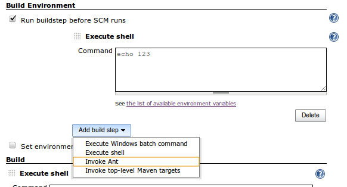

This plugin allows build step to run before SCM checkouts so that you
perform any build step action on the the workspace, (cleanup, add a file
with some settings for the SCM, etc) or call other scripts that need to
be run before checking out from the SCM.

#### Configuration example

This plugin was written to provide a build step point where a perl
script can be run after detecting changes in the polling but before the
SCM does the checkout. To make it more usable and flexible it was
decided to allow any number of build steps to be added and called.

### Warnings on the use of this plugin

Be Careful

-   The SCM may modify or remove any files that are in the workspace,
    before the main build steps.
-   Enviroment variables may not exist at this point, if they are
    created by other plugins, check using a shell script and the env
    (unix) or equivalent for your executor system.

Warning

-   IMPORTANT: Failed build steps will not cause the job to fail at this
    point, and all build steps will be called regardless of the result.

# History

### Version 0.2 (Feb 19, 2012)

-   Fixed Issue
    [JENKINS-12770](https://issues.jenkins-ci.org/browse/JENKINS-12770)

### Version 0.1 (Aug 23, 2011)

-   First release
