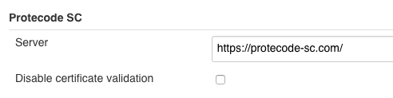
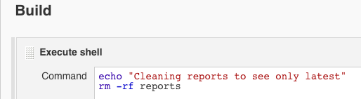

This plugin allows Jenkins builds to scan the resulting build artifacts
with Synopsys Protecode SC static analysis tool.

More information of Synopsys Protecode SC is available from
<http://www.synopsys.com/software/protecode/Pages/default.aspx>

# How to Use

------------------------------------------------------------------------

## Getting started

1.  Install the Protecode SC Jenkins plugin via the **Plugin Manager**
    and restart Jenkins.
2.  Configure system wide Protecode SC server address.
    -   Manage Jenkins \> Configure System
        -   **Protecode SC: Server address**
            -   Specify the HTTP address of the Protecode SC
                installation here, such as
                <https://protecode-sc.mydomain.com/>.
        -   **Protecode SC: Disable certificate validation**
            -   Allow connections to Protecode SC server without
                certificate validation. It is not recommended to use
                this option. Instead you should consider getting a valid
                certificate for your server.

                      

## Freestyle build configuration

Configure a build step as follows:

1.  **Protecode SC**
    -   *Credentials*
        -   (new) Add
            -   Select "Global" and "Username with password"
            -   Enter your user Protecode SC user details
        -   (existing) Select suitable credentials
    -   *Group ID*
        -   Specify the Protecode SC **Group ID** where the artifacts
            should be uploaded to. The group id is only the number of
            the group.  
            Group ID can be found from the Protecode SC service by
            looking at the URL when browsing an individual group:
            <https://protecode-sc.mydomain.com/group/1234/>  
            or with **Groups
            API**<https://protecode-sc.mydomain.com/api/groups/>.
    -   *Fail build if vulnerabilities*
        -   Trigger build failure if Protecode SC finds vulnerabilities
            from the artifacts.
    -   *Directory for files to scan*
        -   The directory to scan. There is no automatic scanning of
            artifacts yet (as of 0.15.1)
    -   Include subdirectories. Please see help for warnings.
        -   Include all files in a directory structure. *Please notice
            that this can send massive amounts of files if the
            "directory to scan" is set incorrectly.*
    -   Regular expression for including files
        -   A Java 8 type regexp pattern. Please see
            <https://docs.oracle.com/javase/8/docs/api/java/util/regex/Pattern.html>
            for more information.
    -   *Scanning timeout (minutes)*
        -   The timeout for the scanning build step. If the scan
            operation in protecode lasts longer than the given value,
            the build step will exit.
    -   *Convert results to Summary plugin format*
        -   Set to `true`
        -   The summary can be shown using Summary Display Plugin of
            Jenkins. The report file name to publish is
            protecodesc.xml.  
              
2.  **Publish XML Summary Reports** (requires **[Summary Display
    Plugin](https://wiki.jenkins.io/display/JENKINS/Summary+Display+Plugin))**  
    -   *Files to parse*
        -   Set to `**/protecodesc.xml`
    -   *Show on Project page*
        -   Set to `true`  

## Build Results 

-   If you use **Summar****y Display Plugin** the results of all files
    scanned in the whole history of the build on the right side of the
    builds main page.
-   *Please notice that the results shown on are **all** the results
    ever produced by the build.*  

         
{height="400"}

-   If you wish to see **only the latest results** you can manually
    delete the reports directory. This is most conveniently done in a
    "Execute shell" step.  
    A new directory is created in place of the deleted one
    automatically.  
      
      
-   If no summary plugin is used the build will only fail if
    vulnerabilities are found (as of 0.15)
    -   A more detailed UI to show vulnerabilities and history is being
        planned currently, but no release date has been set yet (as of
        7.2.2018).

## Pipeline build configuration

Simple example, more to be added:

    node {
        stage ("Scan files") {

            protecodesc credentialsId: 'PR2', directoryToScan: 'target', includeSubdirectories: true, protecodeScGroup: '<number>', scanTimeout: 40

        }
    }

## Troubleshooting

When you encounter problems while using the plugin, please provide the
following information:

-   What you were doing when the problem occurred.
-   The error message
-   The Jenkins server log file (the location is dependent on the
    container you use)
-   The content of ‘Manage Jenkins \> System Information’ (*Jenkins
    root*/systemInfo)
-   The configuration file for the job (*Jenkins root*/jobs/*job
    name*/config.xml)
-   The global configuration file for Jenkins (*Jenkins
    root*/config.xml)
-   In case of problems while saving the job configuration, a screenshot
    before submitting, and the browser you are using.

# Version History

### Version 0.17.8 (February 20, 2019)

-   Support APi key
-   Has texts changed to Black Duck Binary Analysis to reflect naming
    changes in tool.  

### Version 0.17.7 (November 30, 2018)

-   Added possiblity to never zip provided the plugin is run against a
    privately hosted appliance
-   removed some waiting from results checking
-   removed some waiting from sending files to Protecode SC  

### Version 0.17.6 (November 22, 2018)

-   Fixed a possible corner case nullpointer  

### Version 0.17.5 (November 22, 2018)

-   Updated okHttp libraries to latest
-   Added retryOnFail to okHttp
-   Added Header(Connection, close) to connection
-   Added logic to make sure that the result is binded to the correct
    response always.  

### Version 0.17.4 (November 19, 2018)

-   Added possiblity to only upload files to Protecode SC and not wait
    for results
-   Added some more logging  

### Version 0.17.3 (October 30, 2018)

-   Pipeline fix due to Jenkins change.
-   Loggin fixes
-   Logic made more robust  

### Version 0.17.2 (September 28, 2018)

-   Files are zipped only if there are 10 or more files. If there are 9
    or less files, they are sent in parallel.  
-   It is now possible to define the zip name (thus the Protecode SC
    analysis job name)
-   Clarifications to jenkins build console logging.
-   Robustness improvements.  

### Version 0.17.0 (March 28, 2018) 

-   Files are zipped before being sent to Protecode SC to avoid massive
    overhead for large amounts of files.

-   Results are shown for files individualy
-   File result has build number indicator to specify from which build
    the result is from.
-   Many minor improvements  

### Version 0.16.2 (February 15, 2018) 

-   Fixed: Plugin looses configuration and throws exception for missing
    fields in configuration when updating from earlier versions

### Version 0.16.1 (February 10, 2018) 

-   Limited parallel file uploads to four due to Protecode SC cloud
    limit.
    -   Files are now queued until free connections are available. This
        slows builds down, but avoids errors when the service is at low
        capacity.
-   Plugin now logs less useless info into jenkins log.

-   Fixed no name showing in lists when the file is hidden.

### Version 0.16.0 (January 31, 2018)

-   Advanced file options.
    -   Regexp support and include subfolders added as build
        configuration options.
    -   Removed some legacy options (safe to transfer old build
        configurations to new release).
-   Various bugfixes and logging improvements.
-   Improved jenkins logging.

### Version 0.15.8 (January 29, 2018)

-   Plugin uses latest API now. (this could break scan requests
    sometimes)
-   Fixed: File Input stream for a file to be scanned could not be read
    multiple times.

### Version 0.15.6 (January 19, 2018)

-   Fixed bug caused builds not to fail when required.

### Version 0.15.5 (January 16, 2018)

-   Added a warning that this breaks the configuration of builds before
    0.15.1

### Version 0.15.3 (January 15, 2018)

-   Minor bug fixes

### Version 0.15.1 (January 11, 2018)

-   **Complete overhaul**
-   Basic pipeline and snippet support
-   Compatibility break

### Version 0.13 (April 20, 2017)

-   Fixed an issue with file paths in distributed executor setup

### Version 0.12 (February 21, 2017)

-   Added ability to define scanning timeout
-   Fixed an issue that prevented uploading larger files
-   Improved API exception handling to show proper error messages
-   Upload build artifacts even when additional artifact directory is
    not defined
-   Increase polling interval

### Version 0.10 (August 12, 2016)

-   Initial release

## License

All rights reserved. This program and the accompanying materials are
made available under the terms of the Eclipse Public License v1.0 which
accompanies this distribution, and is available at
<http://www.eclipse.org/legal/epl-v10.html>

  

  
