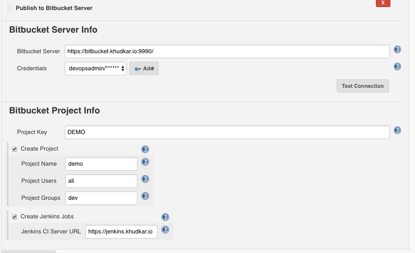
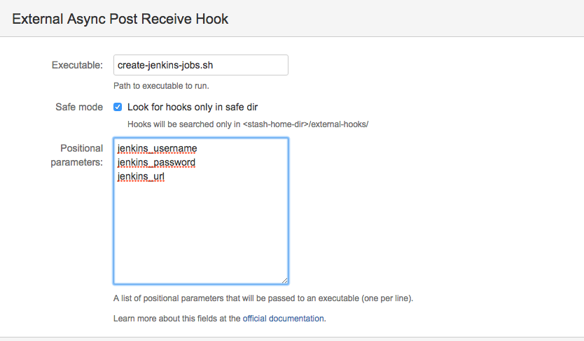

## How it Works:

## {width="200"}

Let's say you have been working day in, day out on a new
spike/code/project locally on your laptop with a local git repo. And now
ready to publish this to the Bitbucket server. This would require
following steps:

1\. Create a project on Bitbucket server.

2\. Create the repository under the new project.

3\. Assign users/group with write permissions to the project and
repository.

4\. Finally import your code into the remote repository by adding remote
"origin" and pushing the code.

5\. As an add-on, if you have Jenkins CI server, and want to run the one
time [external async post receive
hook. ](https://marketplace.atlassian.com/plugins/com.ngs.stash.externalhooks.external-hooks/server/overview)(<https://marketplace.atlassian.com/plugins/com.ngs.stash.externalhooks.external-hooks/server/overview>).
The hook is disabled after pushing the code.   
    (Note: The external post receive hook will be enabled with the
settings as shown below. The jenkins user/password is taken from the
credentials selected in plugin configuration).
{width="300"}  

>  This plugin does all of the above for you. 

Creates a Bitbucket repository (and associated project) from the current
code.

  
**Features**

-   Creates Bitbucket repository based on the current code in the
    workspace
-   Creates Bitbucket projects for the repository if needed.
-   Assign users with read/write permission to the repository
-   Assign group with read/write permission to the repository

### Potential upcoming features

-   Support for github
-   Support for pipeline

## Requirements

-   Existing Bitbucket server.
-   Bitbucket user with permission to create the repository/project

### Jenkins

Jenkins [version
1.625.3](https://jenkins.io/changelog-stable#v1.625.3) or newer is
required.

### Version 1.0 (March 27, 2017)

-   Initial release
