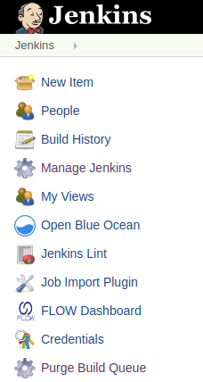

# Purge Build Queue Plugin

This plugin provides a mechanism to delete all jobs from the build queue
at once. 

------------------------------------------------------------------------

Ordinarily, you can only remove jobs from the build queue one by one.
 This is inconvenient when the build queue contains many jobs.

This plugin adds a *Purge Build Queue* button to the top-level Jenkins
page.

{width="213"
height="400"}  

Click *Purge Build Queue* to clear all jobs from the build queue.

### Changelog

#### 1.0 (released 2011-08-25)

-   fully I18N
-   initial implementation
