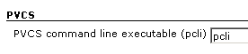
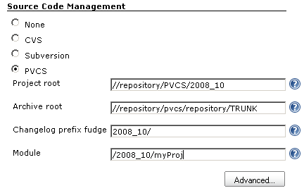
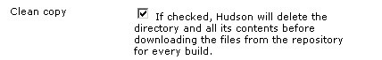

This plugin provides integration with Serena's PVCS Version Manager SCM.

## Configuring

Configuration of the PVCS plugin should be fairly straightforward, but
my experience with PVCS is that *nothing* about PVCS is straightforward,
simple, or in line with how other SCM systems work. This plugin was
developed around the PCLI command-line tool, and I basically had to
bludgeon that utility into submission....

### System-level config

Specify the path to the `pcli` executable, or just use "pcli" if it is
in the environment path of the user running Jenkins.

### Basic config

#### Project root

Specify the root of your project in this field. It is the path used by
all PVCS clients (including the desktop GUI) to access your source.

#### Archive root

This is the path to the actual archive files on the PVCS server's
filesystem. This is required to determine which files were changed from
build to build; you can go back and set this later, if you need to,
without modifying your builds.

#### Changelog prefix fudge

This is prefixed to the archive path of a file when determining the
changes made to a build, after the "Archive root" (above) has been
stripped off.

#### Module

This is the path to the directory which will be recursively retrieved
from the project root. It must start with a leading "/".

So, to tie it all together, let's say the top-level `pom.xml` for your
Maven project is at `/2008_10/myProject/pom.xml`, with a PVCS project
root of `//repository/PVCS/October_Release`. The archive files are
stored on the PVCS server's filesystem at
`//repository/pvcs/repository/TRUNK`, so `/2008_10/myProject/pom.xml`
actually resides at
`//repository/pvcs/repository/TRUNK/myProject/pom.xml`.

You would specify:

-   the project root as `//repository/PVCS/October_Release`
-   the archive root as
    `//repository/pvcs/repository/TRUNK/myProject/pom.xml`
-   changelog prefix fudge as `2008_10/`
-   module as `/2008_10/myProject`

### Advanced config

Since PVCS is too brain-dead to tell you when a file is deleted, it is
best to leave this box checked so that all checked-out files will be
deleted before a build is started. This ensures that your workspace
accurately reflects the current state of the repository.

## Change Log

##### Version 1.2 (Jan 23, 2018)

-   [ JENKINS-49024](https://issues.jenkins.io/browse/JENKINS-49024) -
    Getting issue details... STATUS

##### Version 1.1 (Jul 21, 2010)

-   Add ability to provide loginid, pvcs workspace, promotion group,
    version label while generating the pcli command
-   Fix help links
-   Updated code for more recent Hudson

##### Version 1.0 (Nov 5, 2008)

-   Initial release
