# About the Plugin

QMetry Test Management plugin for Jenkins has been designed to
seamlessly integrate your CI/CD pipeline with QMetry.

Easily configure Jenkins to submit your test results to QMetry without
needing to write any code or deal with REST API. Your Test Results could
be from any automation framework like Cucumber, Test NG, JUnit, QAF and
more.

For more info visit [QMetry Test
Management](https://www.qmetry.com/qmetry-test-management/). 

Read the following topics on this page:

1.  Pre-requisites
2.  How to install QMetry Test Management Plugin for Jenkins
3.  Configuring a standard Jenkins Job.
4.  Configuring QMetry Plugin job as a post build action.
5.  Triggering the job and publishing results in QMetry.

# Pre-requisites

1.  QMetry Test Management installed on Server or Cloud
2.  Jenkins installation

# How to install QMetry Test Management Plugin for Jenkins

1.  Login to Jenkins and go to Manage Jenkins.

  

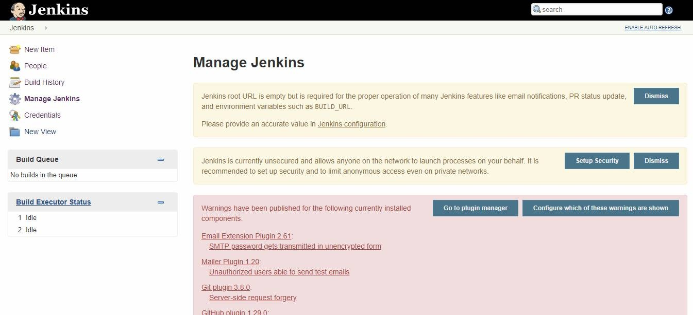

  

2\. Locate the **Manage Plugins** section.

  


  

  

3\. Open the **Available**  tab and search for "QMetry Test Management".

  


  

4\. Locate and select the QMetry Test Management Plugin. Choose install
option either **Install without Restart** OR **Download Now and install
after restart**.

  


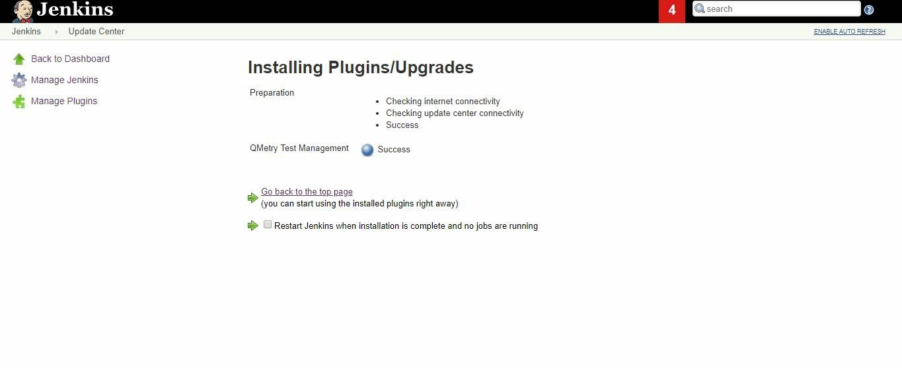

# Configuring a Standard Jenkins job

You can configure Jenkins job through either of the following options:

-   Freestyle Project
-   Pipeline

## Freestyle project

Let’s create a standard Freestyle job in Jenkins.

1\.  To create a new Jenkins job, click on the **New Item** option on the
    **Jenkins** menu.

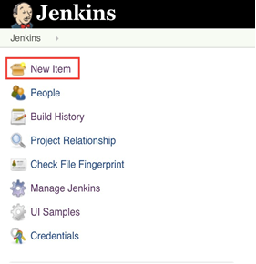

2\. Provide a name for your job.

    Select **Freestyle project** on the screen and then click OK.

  

 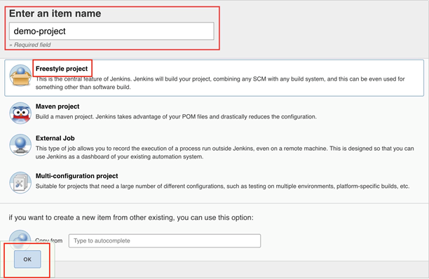

  

3\. Next, the configuration page appears where you can configure your job
by various categories: General, Source Code Management (SCM), Build
Triggers, Build, and Post build actions.

    

 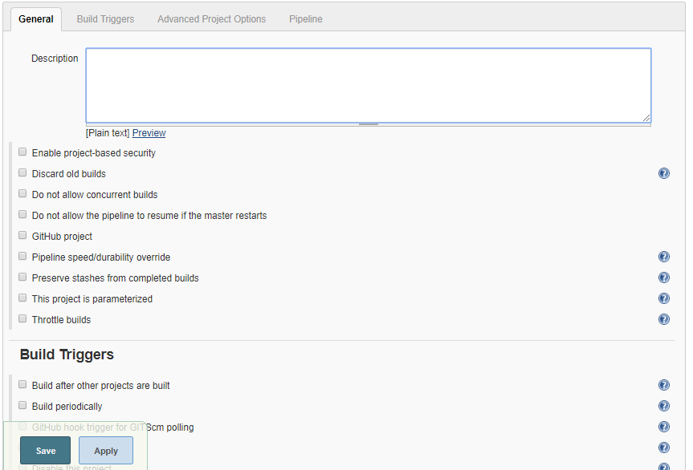

  

4\. On the **Source Code Management** tab, select the appropriate option
in which you have your source code. For example, here it is “Git”. So,
select “Git” and provide the necessary information. (Note: You need to
configure GitHub plugin in global configuration).

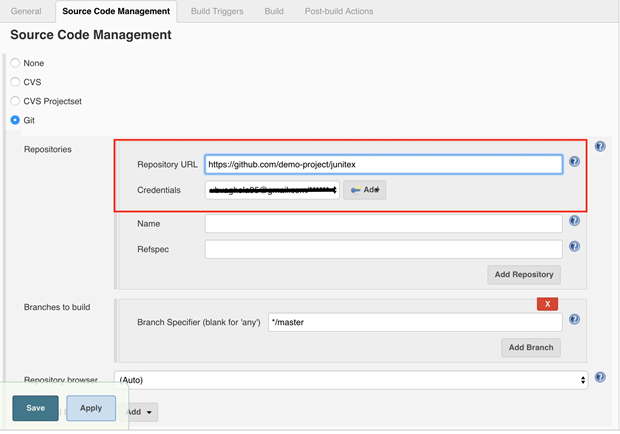

  

5\.  Optionally, you can set Build Triggers.

Select the **Build Triggers** tab. Let’s just add a periodic trigger
which triggers build every minute – every hour – every day (Schedule: \*
\* \* \* \*).

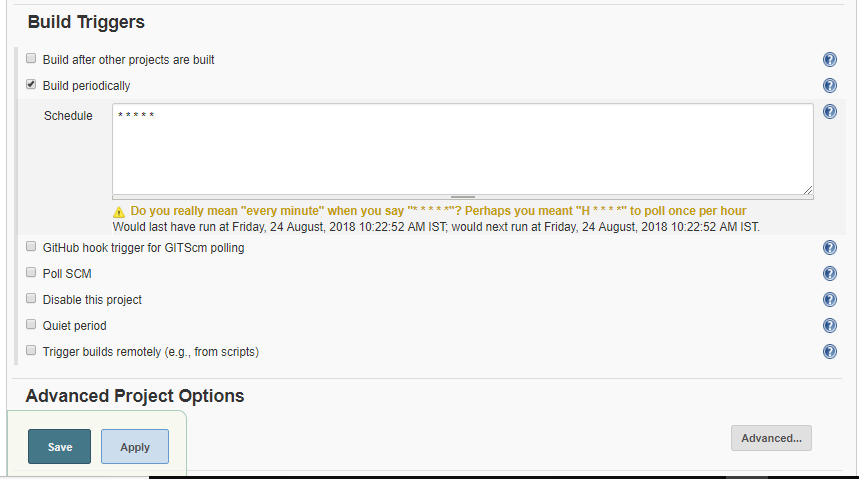

  

6\. Next, Select a build step. You can select from various options: Ant,
Maven, Windows batch process, etc. For example, for a maven project,
trigger a maven build and specify goals.

  

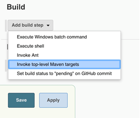

  

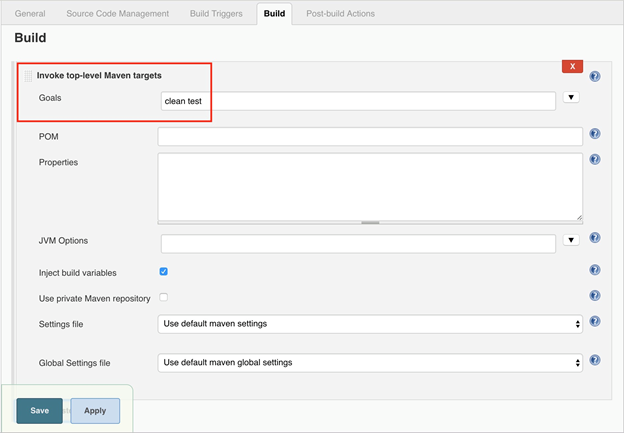

  

Next step is to add **Post-build Actions**. Here, add the plugin:
“QMetry Test Management Plugin”.

  

### Configuring QMetry Test Management Plugin as a Post-build Action

Jenkins works as a bridge between QMetry Test Management and automation
frameworks. To publish results in QMetry, define another post-build
action.

1\. On the **Add post-build Actions** drop-down, select the "Publish test
result to QMetry" option.

  

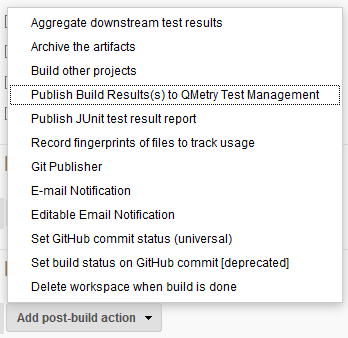

  

2.  Fill in the required data. You can get more information regarding
fields by clicking on the Help icon for respective fields. It explains
what to enter in that particular field.

  


  

  

**Parameters**


*Release is mandatory if Cycle is mentioned.

  

**Supported Fields**

  

-   **Field Name** as mentioned in QMetry \> Customization \> Manage
    Fields \> Field Name
-   For Look up list and multi lookup list fields
    -   If the value does not exist in Project and Auto Create value
        feature is on for Project, the value will get added in the list
        and it will be assigned to the test case.
    -   If the value does not exist in Project and Auto Create value
        feature is off for Project, the value will not be added in the
        list and Test Case field will be blank or have default value in
        it. 
    -   If a new value is added to Multi Look Up List, the older value
        will remain unchanged and the new value will be added to the
        list.
    -   List values are added to the same version of the test case.

  


  

  

**User Defined Fields**


  

**Test Case Fields with UDFs in JSON format**

  

``` syntaxhighlighter-pre
{

"component":["com1", "com2"],
"priority":"High",
"testCaseState":"Open",
"testCaseType":"Manual",
"testcaseOwner":"lizamathew",
"estimatedTime":60,
"description":"Sample Description",

"userDefinedFields" : {

"reviewedDate": "08-30-2019",
"executionTime": 40,
"tagName": "Sample test asset.",
"additionalComment": "This is a sample test asset"
"country": ["United States"]
"langaugePreference": ["English",Portuguese"]

}

}
```

**Test Suite Fields with UDFs in JSON format**

  

``` syntaxhighlighter-pre
{

"testSuiteState":"Open",
"testsuiteOwner":"lizamathew",
"description":"Testing 8.5.4 API Changes",

"userDefinedFields" : {

"reviewedDate": "08-30-2019",
"executionTime": 40,
"tagName": "Sample test asset.",
"additionalComment": "this is a sample test asset"
"country": ["United States"]
"langaugePreference": ["English",Portuguese"]
}

}
```

  

The following table depicts probable import result according to the
scenario.

| **Is System Field/UDF Mandatory?** | **Is Auto-Create Enabled?** | **Does UDF Value exist?** | **Import Result** |
|:-----------------------------------|:----------------------------|:--------------------------|:------------------|
| No                                 | No                          | No                        | Fail              |
| No                                 | No                          | Yes                       | Success           |
| No                                 | Yes                         | No                        | Success           |
| No                                 | Yes                         | Yes                       | Success           |
| Yes                                | No                          | No                        | Fail              |
| Yes                                | No                          | Yes                       | Success           |
| Yes                                | Yes                         | No                        | Success           |

  

3\. On successful completion of the process, you can see the console
output. It displays success message for uploading the result file.

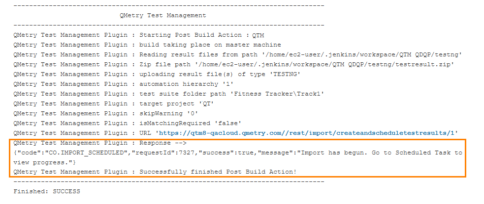

4\. Finally check test execution page in QMetry and review your test run
results.

  

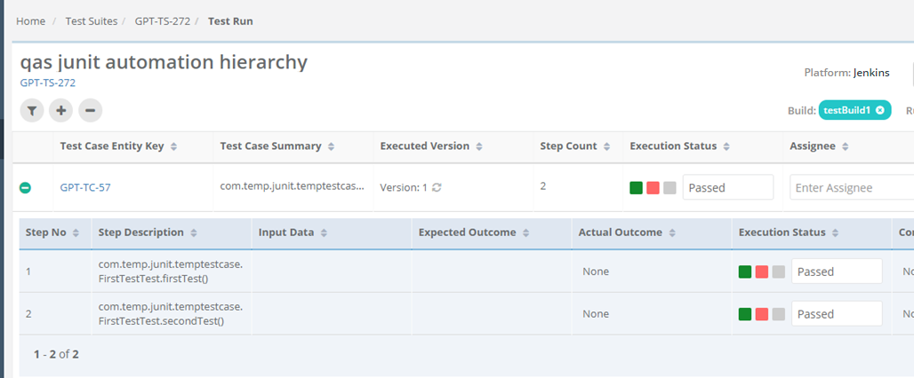

  

## Pipeline

QMetry Test Management supports Jenkins Pipeline for implementing and
integrating continuous delivery pipelines into Jenkins.

Let’s create a standard Pipeline job in Jenkins.

  

1\. To create a new Jenkins job, click on the **New Item** option on the
**Jenkins** menu.

  


  

2\. Provide a name for your job.

   Select **Pipeline** on the screen and then click OK.

  

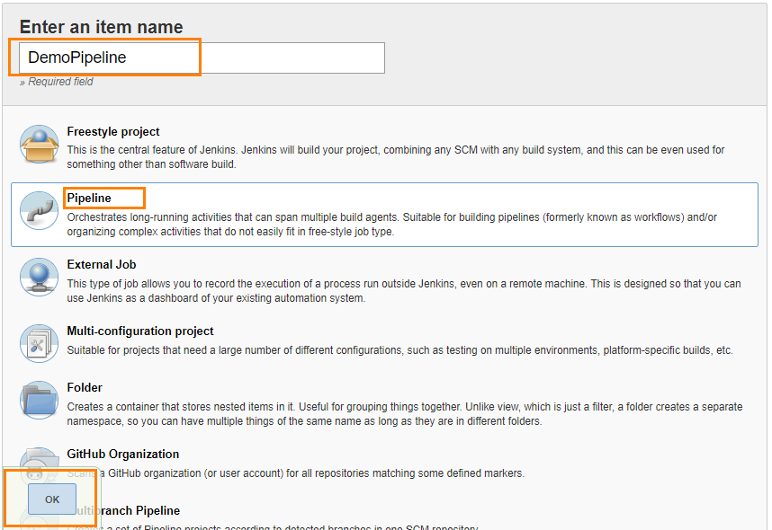

  

  

3\. Next, the configuration page appears where you can configure your job
by various categories: General, Build Triggers, Advanced Project
Options, and Pipeline.

    


  

4\.  Optionally, you can set Build Triggers.

Select the **Build Triggers** tab. Let’s add a periodic trigger
which triggers build every minute – every hour – every day (Schedule: \*
\* \* \* \*).

  


  

5\. Advanced Project Options: This is optional. You can give **Display
Name** which will replace the name you gave earlier to the Pipeline
project.

  


  

6\. Jenkins works as a bridge between QMetry Test Management and
automation frameworks. To publish results in QMetry, provide Pipeline
script.

Enter Pipeline script to define your code repository, generate test
result and upload test results into QMetry Test Management.

  

**Code Snippet**

  

**Pipeline Script**

``` syntaxhighlighter-pre
stage('Upload Result to QTM'){
       step([$class: 'QTMReportPublisher', disableaction:false, qtmUrl: 'https://newuiqa.qmetry.com/', automationFramework: 'JUNIT', automationHierarchy: '2', testResultFilePath: '/cucumber', qtmAutomationApiKey: '4FR2Oo1g42vUnb5NtDgi3JIjzrFOvUUV8QJBk38D', project : '7242', release: 'Release 1', cycle: 'Cycle 1', buildName: 'testBuild1', platformName: 'Jenkins', testSName: 'junit pipeline', proxyUrl:'', testSuiteName: 'TC2-TS-116', tsFolderPath: 'Fitness Tracker\Track1',    
       testcaseFields: '{"description":"Automated Test case", "testCaseType":"Automated", "testCaseState":"Open", "component":["UI"], "priority":"Blocker", "testcaseOwner":"liza.mathew", "estimatedTime":"143", "userDefinedFields" : {"Integrate" : "Custom Field Testcase"}}',
       testsuiteFields: '{"description":"Automated Test suite", "testsuiteOwner": "liza.mathew", "testSuiteState": "New", "userDefinedFields": {"Integrate" : "Custom Field Testsuite"}}', skipWarning: '0', isMatchingRequired: '1'
       ])
    }   
```

  

***Note:** testSName is "Test Suite Name" and testSuiteName is "Test
Suite ID" of the test suite.*

  

Syntax of *automationFramework*:

-   CUCUMBER
-   TESTNG
-   JUNIT
-   QAS
-   HPUFT
-   ROBOT

  

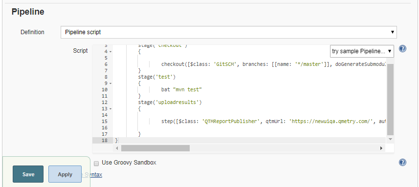

  

**Parameters**

Refer to the **Parameters section** for **Freestyle Project** above.

  

7\. On successful completion of the process, you can see the console
output. It displays success message for uploading the result file.

  

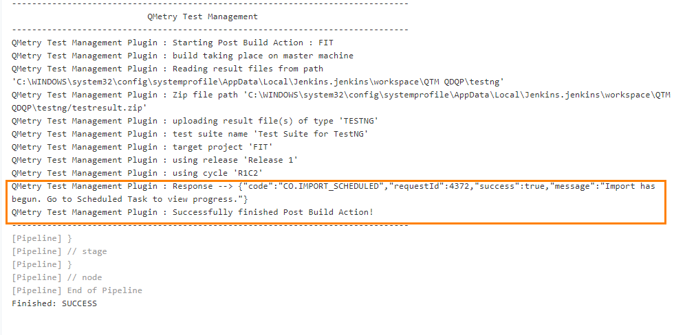

  

8\. Finally check test execution page in QMetry and review your test run
results.

  


## Define Parameters

To define parameters for your job, select the **This project is
parameterized** check box.

The **Add Parameter** drop-down is enabled with the list of parameter
types. Use the drop-down button to add as many parameters as you need.

  

 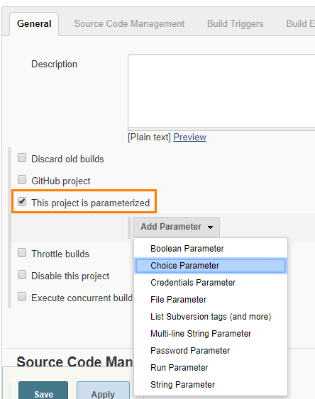

  

There are different parameter types available. The way parameters take
effect according their respective parameter type.

For example,

Choice Parameter and String Parameter are selected, and corresponding
parameters are added as shown below.

  

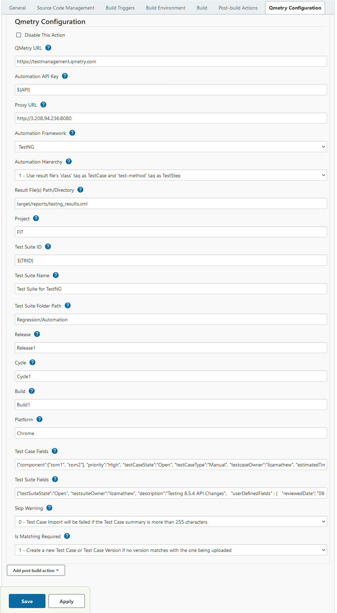

  

The above parameters will be parsed dynamically at the run time.

The field values should be entered in the following syntax:

*${ParameterName}*

For example,

For the parameters created above, the field value would be ${API} and
${TRID} respectively. The parameter values will be parsed accordingly
for the corresponding fields.

  

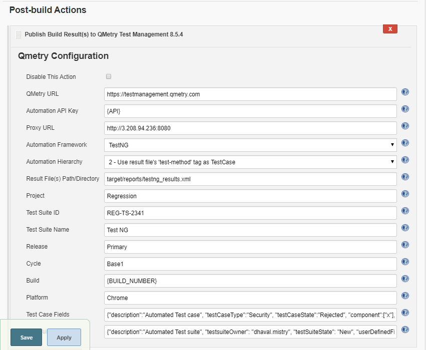

  
 

The values can also be changed before triggering the Jenkins build.

  

 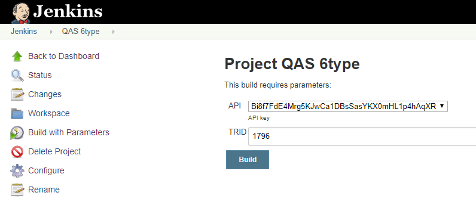

  

# QMetry Configuration for Specflow

Specflow by default generates the output results in Specflow JSON
format. QMetry can consume it as Cucumber JSON format. The following
solution will generate the output result in Cucumber JSON format in
parallel and the result could imported to QMetry.

### Part A : Make the following changes in your Specflow Project to generate result file format as Cucumber JSON

**Step 1 :** Add Dependencies

``` syntaxhighlighter-pre
https://www.nuget.org/packages/SpecNuts/
https://www.nuget.org/packages/SpecNuts.Json/
```

**Step 2 :** Add the below code in .cs of feature file

``` syntaxhighlighter-pre
[BeforeTestRun]
public static void BeforeTestRun() {
    SpecNuts.Reporters.Add(new JsonReporter());

    SpecNuts.Reporters.FinishedReport += (sender, args) => {

        String pathName = "specflow_cucumber.json";

        System.IO.File.WriteAllText(pathName, args.Reporter.WriteToString());

        Console.WriteLine("Result File: " + System.IO.Directory.GetCurrentDirectory().ToString() + System.IO.Path.DirectorySeparatorChar + pathName);

    };
}
```

**Step 3 :** Open Text Explorer in Visual Studio by Test \> Windows \>
Test Explorer -\> Choose Run All

**Step 4 :** In Visual Studio console, select show output from Test and
open Report File as path given in Console

### Part B : Make the following Configurations in Jenkins

**Configuration Steps**

-   Install "MSBuild Plugin" and "VSTest Runner Plugin"
-   Install Visual tools and Set path for MSBuild.exe and
    vstest.console.exe files in Manage Jenkins \> Global Tool
    Configuration

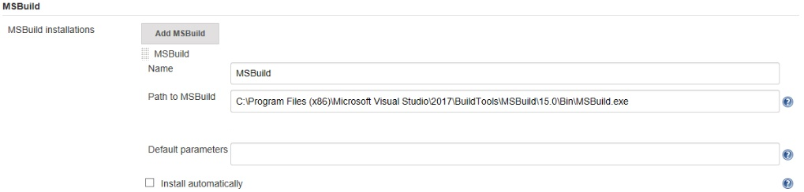

  

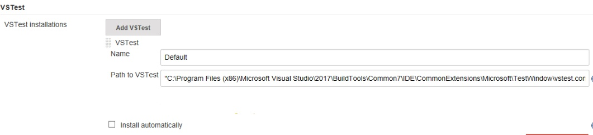

  

  

**Configure the following parameters in the Jenkins Job**

**Step 1 :** In the Build Step \>\> Choose - Build a Visual Studio
project or solution using MSBuild

  

**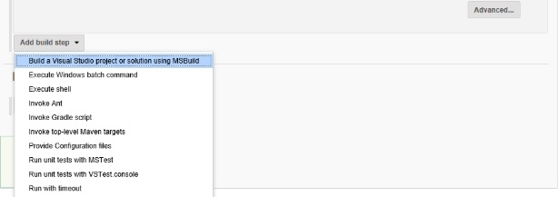 
**

  

**Step 2 :** Provide the MsBuild Version and relative path to solution
file

-   Select "MSBuild Version" which is configured in Global Tool
    Configuration
-   Specify the relative path for solution file in "MSBuild Build File"

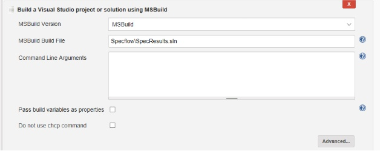  

**Step 3 :** Select a build step for VSTest in Build Section -  Run unit
tests with VSTest console

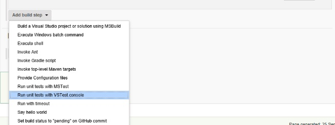

  

-   Select "VSTest Version" which is configured in Global Tool
    Configuration
-   Specify the relative path to your VSTest compiled assemblies in
    "Test Files"

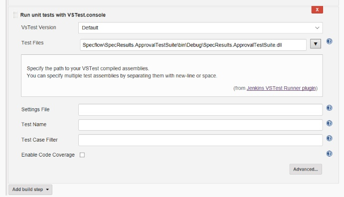  

**Step 4 :** In post build action setup QMetry Test Management plugin

-   Choose "Cucumber" format to upload
-   Relative Path to result file "specflow\_cucumber.json"
-   Choose other relevant parameters

  

  

[QMetry Privacy Policy](https://www.qmetry.com/privacy-policy/)

  
