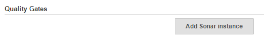
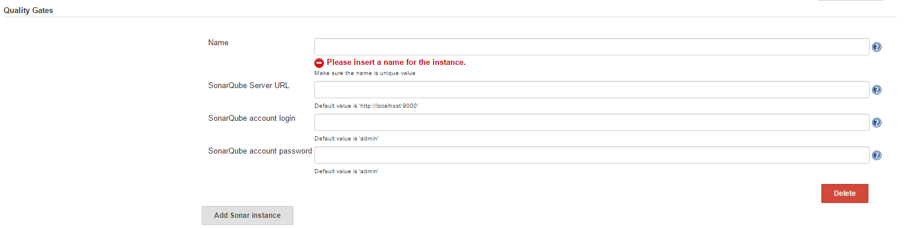
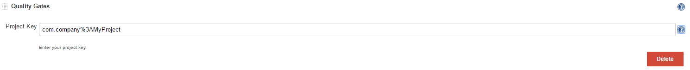
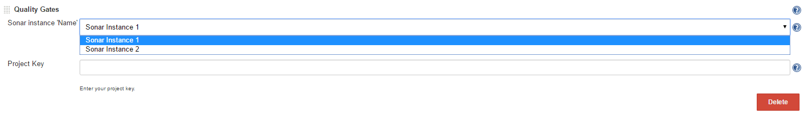

The current version of this plugin may not be safe to use. Please review
the following warnings before use:

-   [Credentials transmitted in plain
    text](https://jenkins.io/security/advisory/2020-03-09/#SECURITY-1519)

  
This plugin will fail the build whenever the Quality Gates criteria in
the Sonar analysis aren't met (the project Quality Gates status is
different than "Passed").

## Requirements

### Jenkins

Jenkins [version 1.532](https://jenkins.io/changelog-stable/#v1.532) or
newer is required.

### Sonar

Working with all the versions of Sonar.

## Setup

##### 1. Global Configuration

**1.1. No Sonar Instance Configured**

        If there isn't any instance configured the Global Configuration
will look like this:

       

        And the plugin will be running with default Sonar Instance.
Which contains the following values: URL='http//localhost:9000',
Username='admin' and Password='admin'.

**1.2. One Sonar Instance Configured**

       

-   **Name** - Specify the value of the name, so that is not
    empty. Configurations with duplicated values for the name will not
    be saved.
-   **SonarQube Server URL** - Specify the URL of your Sonar
    instance URL format for HTTP protocol is any legal http address,
    e.g. [http://myhost.com:9000](http://myhost.com:9000/)
-   **SonarQube account login** - Specify the username for your account
    on this instance of Sonar, otherwise Quality Gates Plugin won't be
    able to get the necessary data if anonymous access is disabled for
    your project. If not specified the default Sonar username will be
    used.
-   **SonarQube account password** - Specify the password for your
    account on this instance of Sonar, otherwise Quality Gates Plugin
    won't be able to get the necessary data if anonymous access is
    disabled for your project. If not specified the default Sonar
    password will be used.

###### 1.3. **Two or more Sonar Instances Configured**

        If you have two or more configurations for Sonar Instances in
the Global Configuration you will need to choose one of them in your job
configuration.

##### 2. Job Configuration

Quality Gates Plugin needs a SonarQube code analysis so it can check its
Quality Gates status. In order to get the latest quality gates status
from the most recent Sonar analysis, Quality Gates Plugin should be put
below SonarQube plugin in the post-build step of the job if you use the
older version of SonarQube analysis or if you use the Standalone
SonarQube Analysis in the build step of the job just put our plugin in
the post-build step.

###### 2.1. No Sonar Instance in the Global Configuration

        

-   **When using the older SonarQube way of analysis in the post-build
    step:**  
    **Project Key -** To get the Project Key go to your Sonar instance
    (login if necessary) and click on the project whose key you need.
    You will be redirected to an URL like this:
    'http://myhost.:9000/overview?id=123'.    
    Another click on the project name will redirect you to the same view
    with the URL looking like this:
    'http://localhost:9000/overview?id=com.company%3AMyProject'.    
    ex: 'com.company%3AMyProject' is your Project Key
-   **When using the Standalone SonarQube Analysis as a build step: When
    using the Standalone SonarQube Analysis as a build step: **  
    **Y**ou define your own Project Key in the
    'sonar-project.properties' file of your project or directly in the
    'Analysis properties' textbox of the Standalone SonarQube Analysis

###### 2.2. One Sonar Instance in the Global Configuration

       

-   **Project Key** - same as above.

###### 2.3. Two or more Sonar Instances in the Global Configuration

        

-   **Sonar instance 'Name'** -  Choose the configuration for the Sonar
    Instance that you want to associate with this build.
-   **Project Key** - same as above.
