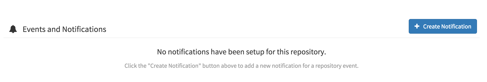
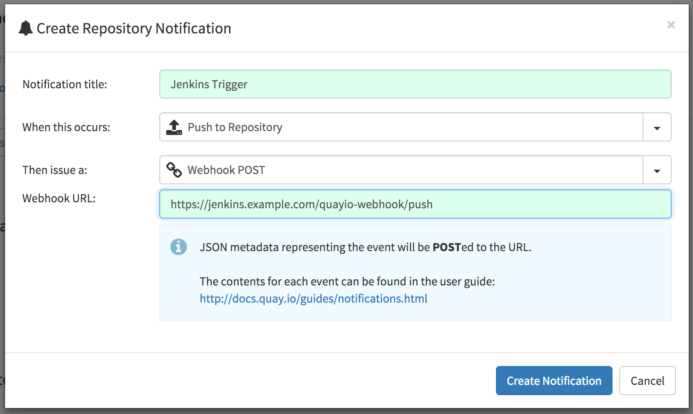
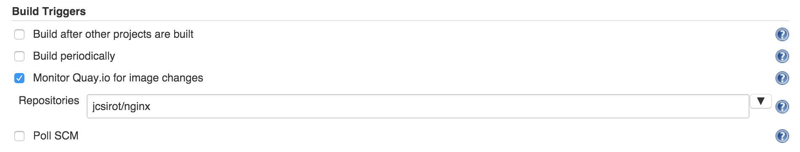

This plugin provides integration between Jenkins and
[Quay.io](https://quay.io/) docker registry.

### Usage

On Quay.io

1.  In the repository **Settings** tag click on the **Create
    Notification** button  
    {width="600"}
2.  Fill the Repository Notification form

-   When this occurs: **Push to Repository**
-   This issue a: **Webhook POST**
-   Webhook URL:
    `http://your.jenkins.server.tld/quayio-webhook/p``ush`  
    {width="600"}

In Jenkins

1.  Select the Monitor **Monitor Quay.io for image changes** and enter
    the list of repositories which can trigger a build  
    {width="600"}

### Job Parameters

When a job is triggered by a Quay.io notification these parameters are
passed to the job

| Parameter Name                | Value                                                |
|-------------------------------|------------------------------------------------------|
| QUAY\_IO\_TRIGGER\_REPOSITORY | The name of the repository which triggered the build |
| QUAY\_IO\_TRIGGER\_TAG        | The updated docker image tag                         |

### **Open Issues**

type

key

summary

assignee

reporter

status

created

Data cannot be retrieved due to an unexpected error.

[View these issues in
Jira](https://issues.jenkins-ci.org/secure/IssueNavigator.jspa?reset=true&jqlQuery=component%20=%20quayio-trigger-plugin%20AND%20status%20in%20%28Open,%20%22In%20Progress%22,%20Reopened%29&tempMax=1000&src=confmacro)

### **Changelog**

### **Version 0.1 (Jan, 20 2016)**

-   Initial version
