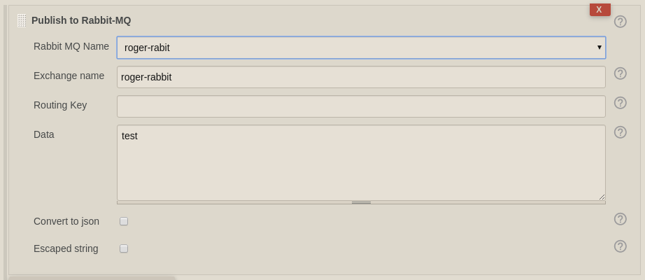
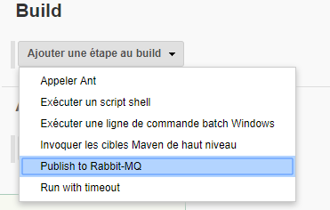
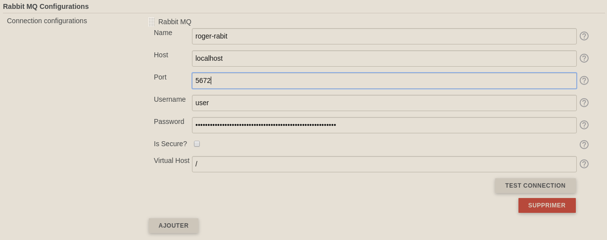

| Plugin Information                                                                                                 |
|--------------------------------------------------------------------------------------------------------------------|
| View Rabbit-MQ Publisher [on the plugin site](https://plugins.jenkins.io/rabbitmq-publisher) for more information. |

Older versions of this plugin may not be safe to use. Please review the
following warnings before using an older version:

-   [Credentials stored in plain
    text](https://jenkins.io/security/advisory/2019-03-06/#SECURITY-848)
-   [Server-side request
    forgery](https://jenkins.io/security/advisory/2019-03-06/#SECURITY-970)

## Description

This plugin allow to create a build step which can publish a message to
Rabbit MQ

2 parts :

-   Configuration of the Rabbit Host
-   Configuration of the step

The message can be a raw json, or a simple string,  or a list a
key/value which can be convert to a json string

## Usage

### System configuration

add you connection configurations with the parameters :

-   name : label to select the desired configuration on the build step
-   host : the default host to use for connections
-   port : the default port to use for connections
-   username : the AMQP user name to use when connecting to the broker
-   password : the password to use when connecting to the broker

Exemple : 

{height="400"}

### Job configuration

1.  Select the "Publish to Rabbit-MQ" step :  
    {height="250"}{height="250"}
2.  Add you configuration to publish your message   
    {height="400"}  
      
    You can use build parameters (eg: ${FOO} or $FOO) which will be
    resolve before sending the message. You can also use
    ${BUILD\_USER\_ID} and ${BUILD\_USER\_NAME} to retrieve the
    informations from the user who launch the job.

### Version 1.3.1 (May 22,2019)

-   [Have a better compatibility with old Jenkins (tested back to
    2.73)](https://github.com/jenkinsci/rabbitmq-publisher-plugin/pull/7)

### Version 1.3.0 (May 16,2019)

-   [Add a conversion flag that sends tidy JSON to
    RabbitMQ](https://github.com/jenkinsci/rabbitmq-publisher-plugin/pull/5)
-   [Add RabbitMQ VirtualHost
    parameter](https://github.com/jenkinsci/rabbitmq-publisher-plugin/pull/6)
-   Upgrade to last jenkins stable version (2.164)

### Version 1.2.1 (March 09,2019)

-   fix issues with latest Spring version by using previous versions

### Version 1.2.0 (March 02, 2019)

-   Enable environment variables in data  
-   Adding ability to use a secure connection protocol
-   Destroy the connection after finishing sending message
-   Security issues fixing (SECURITY-848 & SECURITY-970)
-   Minor bugs fixes

### Version 1.0 (April 03, 2018)

-   first release

  
