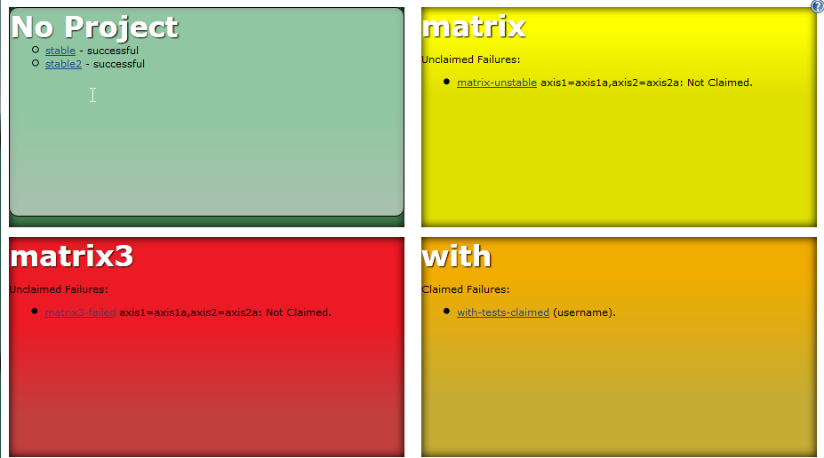
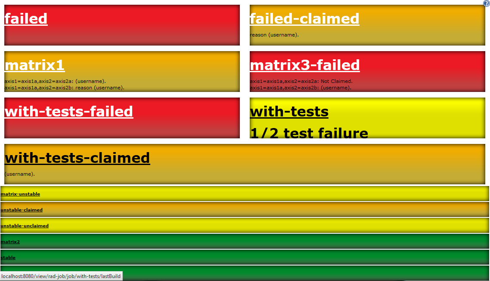

The current version of this plugin may not be safe to use. Please review
the following warnings before use:

-   [Stored XSS
    vulnerability](https://www.jenkins.io/security/advisory/2020-09-16/#SECURITY-1927)

Provides a job view displaying project status in a highly visible
manner. This is ideal for displaying on a screen on the office wall as a
form of Extreme Feedback Device.

   
Once the plugin is installed, click on the add view tab and select
"Radiator View". The job selection options are the same as the standard
list view -- either select projects to include or specify a regular
expression to select the options.   
This plugin will be integrated with the claim plugin if it is installed
- claimed failures are displayed in a column on the right.  

## Example:

  
This is showing a Radiator in 'Project' based mode - jobs with a common
prefix are grouped together and represented as a single box on the
screen. 

-   Green boxes are shown when all jobs are successful. 
-   Red boxes are shown when any jobs fail (including test failures).
    Links to the failed builds and details of possible culprits if known
    are also shown. 
-   Amber boxes are shown when jobs fail, but all failing jobs are
    claimed. Details of the claims are also shown. 

Hovering over the project name opens a list of all jobs relating to that
project as in the top-left project. Hovering over the ? button provides
configuration options. 

There are several different approaches to displaying the radiator,
including non-project based and only showing failing builds - give it a
try to see some of them. 

# Compatibility

[JENKINS-20415](https://issues.jenkins-ci.org/browse/JENKINS-20415)
causes views of this type to fail to be displayed (see
[JENKINS-20664](https://issues.jenkins-ci.org/browse/JENKINS-20664) for
details) if there are any multi-combination (matrix) jobs defined.

This applies to Jenkins 1.532.1 as well as some number of releases after
1.531 until 1.539. 1.40 has no compatibility issues.

As a workaround, when running on problematic Jenkins core releases,
uncheck "Recurse in subfolders" in the view.

# Open Tickets (bugs and feature requests)

type

key

summary

assignee

reporter

priority

status

resolution

created

updated

due

Data cannot be retrieved due to an unexpected error.

[View these issues in
Jira](https://issues.jenkins-ci.org/secure/IssueNavigator.jspa?reset=true&jqlQuery=project%20=%20JENKINS%20AND%20status%20in%20%28Open,%20%22In%20Progress%22,%20Reopened%29%20AND%20%28component%20=radiatorview-plugin%29%20ORDER%20BY%20issuetype%20ASC,%20key%20DESC&tempMax=1000&src=confmacro)

# Changelog

### Release 1.28 (06 November 2016):

-   **UPGRADE TO 1.642.3 BASELINE**
-   [FIX
    JENKINS-36320](http://localhost:8085/display/JENKINS/Radiator+View+Plugin#)
    Meaningless job names with Folders or Pipeline Multibranch Plugin
    -   Now the "Full Name" is used to display jobs in radiators
-   [JENKINS-36708](http://localhost:8085/display/JENKINS/Radiator+View+Plugin#)
    Wrong background image
-   [JENKINS-33645](http://localhost:8085/display/JENKINS/Radiator+View+Plugin#)
    Improve Folders Plugin handling: selecting a folder will now
    recursively select jobs in it

### Release 1.26 (16 February 2016):

-   **UPGRADE TO 1.554.1 BASELINE**
-   [JENKINS-26392](http://localhost:8085/display/JENKINS/Radiator+View+Plugin#)
    Support CloudBees Folders Plugin (Fix ClassCastException w/ Folders)
    -   No full support. Only avoid crashing when selecting Folders.

### Release 1.25 (25 January 2016):

-   JENKINS-32549 : Support the pipeline-plugin (previously known as the
    workflow-plugin)
-   (Technical details: plugin has been released using the [new plugin
    parent pom](https://github.com/jenkinsci/plugin-pom), in version
    2.1)

### Release 1.24 (25 January 2015):

-   
    Fixed a width issue appeared with Jenkins 1.593

### Release 1.20 (24 September 2014):

-   
    Upgraded to Jenkins 1.509.4 as a minimum version requirement

### Release 1.19 (24 September 2014):

-   
    7d22fd5 : Added possibility to display headline on the dashboard
    with configurable text and size
-   
    JENKINS-23306 : If no failing jobs, consider unstable as failures.
-   
    Add a feature to be able to define a caption for the radiator
-   
    JENKINS-23924: fix the broken UI.

### Release 1.18 (18 January 2014):

-   
    Add "Recurse in subfolders" as workaround to
    [JENKINS-18025](https://issues.jenkins-ci.org/browse/JENKINS-18025),
    [JENKINS-20415](https://issues.jenkins-ci.org/browse/JENKINS-20415)
    and
    [JENKINS-20664](https://issues.jenkins-ci.org/browse/JENKINS-20664).
    Thanks kazesberger for the patch!

### Release 1.17 (20 October 2013):

-   
    Radiator View plugin throws NullPointerException at
    ClaimWrapper.getClaimForRun(ClaimWrapper.java:39).
    [JENKINS-20129](https://issues.jenkins-ci.org/browse/JENKINS-20129)
-   
    Jobs not built are displayed as failed jobs.
    [JENKINS-12460](https://issues.jenkins-ci.org/browse/JENKINS-12460)

### Release 1.16 (17 October 2013):

-   
    Ignore old matrix combinations.
    [JENKINS-20089](https://issues.jenkins-ci.org/browse/JENKINS-20089)
-   
    Mark page as 'full-screen-capable' for iOS devices.
    [JENKINS-8981](https://issues.jenkins-ci.org/browse/JENKINS-8981)
-   
    Show last completed build, skipping aborted ones
    [JENKINS-8222](https://issues.jenkins-ci.org/browse/JENKINS-8222)

### Release 1.15 (12 October 2013):

-   
    Config checkbox to display build stability icon in radiator. [Pull
    request 8](https://github.com/jenkinsci/radiatorview-plugin/pull/8)
    from dhorbach.
-   
    Some minor spacing detail updates. [Pull request
    10](https://github.com/jenkinsci/radiatorview-plugin/pull/10) from
    outdooricon.
-   
    Remove dependency to Claim plugin that was introduced in release
    1.14.
    [JENKINS-19961](https://issues.jenkins-ci.org/browse/JENKINS-19961)

### Release 1.14 (3 October 2013):

-   
    Add support for matrix builds. Based on commits from pull request
    \#1 from Henrik Lynggaard Hansen (henriklynggaard). See new
    screenshots for examples.
    [JENKINS-8458](https://issues.jenkins-ci.org/browse/JENKINS-8458)
-   
    Show unstable builds as yellow. Based on pull request \#7 from
    antoniobustorff
    [JENKINS-9772](https://issues.jenkins-ci.org/browse/JENKINS-9772)
    [JENKINS-10585](https://issues.jenkins-ci.org/browse/JENKINS-10585)
    [JENKINS-10614](https://issues.jenkins-ci.org/browse/JENKINS-10614)
    [JENKINS-10846](https://issues.jenkins-ci.org/browse/JENKINS-10846)
-   
    use z-index to enforce radiator view always on top. Thanks to
    Nicolas De loof (ndeloof) for the pull request!
-   
    Support for concurrent builds in claim integration. Thanks to David
    Pärsson (davidparsson) for the pull request!
    [JENKINS-12661](https://issues.jenkins-ci.org/browse/JENKINS-12661)

### Release 1.13

-   Gradients, shadows and other UI changes. Please feel free to send
    new CSS and patches to improve it!
-   [JENKINS-8239](https://issues.jenkins-ci.org/browse/JENKINS-8239) -
    Added a button in the top left to access configure and delete view
    links. 

### Release 1.12 (18 April 2011):

-   Show list of projects as tooltip in project based views. Useful for
    figuring out what's in 'no project'

### Release 1.11 (22 March 2011):

-   No code changes
-   Fixed deployment issue to ensure this shows up in the update centre.

### Release 1.10 (17 March 2011) :

-   Modified to use div based layout to provide equal sized boxes.
-   Highlight time since last successful build more
-   Some tidying up of the UI (although still too cluttered!)
-   Created a sidebar to list claimed builds separately from the main
    builds, only showing the build name and claim reason.
-   Fixed creation of new views
-   Added an option to group multiple builds by 'project'. This is
    useful on systems with 100's of builds covering 10's of projects
    that are organised using a common job name prefix. 

### Release 1.9:

-   Claim plugin integration fixes.

### Release 1.8:

-   [JENKINS-6507](https://issues.jenkins-ci.org/browse/JENKINS-6507):
    If the claim plugin is installed, claim details are shown with
    broken builds.
-   Fixed a NPE calculating the culprit with builds that have been
    failing for many builds.
-   Spread stable builds over more rows, so they're wider to show more
    of the titles on installations with many jobs.

### Release 1.7 :

-   [JENKINS-6238](https://issues.jenkins-ci.org/browse/JENKINS-6238) :
    UI improvements
-   [JENKINS-6233](https://issues.jenkins-ci.org/browse/JENKINS-6233) :
    weather icons paths are wrong if hudson isn't deployed on /

### Release 1.6:

-   Merged contributions from Lucas Cavalcanti and Ryan Shelley (see
    comments at the end of this page), with a new configuration option.
    These have increased the visibility of the builds and help with
    embedding in other pages.
-   Black background – Better contrast with build colors (red and green
    in my case)
-   More opacity when the job is queue
-   Heart beat when the job is building – an animation like the building
    balls
-   Build health icons
-   Hidden header and sidebars

### Release 1.5:

-   Fix IllegalArgumentException when adding a new radiator view
    ([JENKINS-5198](https://issues.jenkins-ci.org/browse/JENKINS-5198)).

### Release 1.3, 1.4:

-   Include more information, based on Julien Renaut's work in the
    XFPanel.
-   Replaced layout with standard html tables to make better use of the
    space.
-   Optimised layout for installations with many (dozens) jobs.
-   Added configuration options to hide stable jobs or stable job
    details.

### Release 1.2:

-   Include Progress bar on all jobs.

### Release 1.1:

-   Initial public release.
