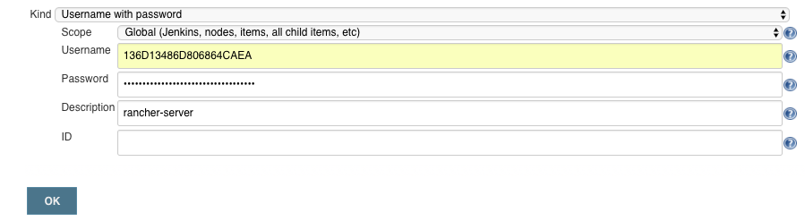
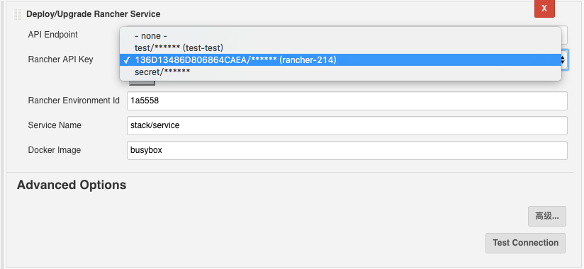

Enables Jenkins to deploy or upgrade Rancher stack service instance

## Features

-   Deploy docker image to Rancher 
-   Upgrade exist service instance in Rancher
-   Support options to finish the upgrade automatically 
-   Support build environment variable as docker image tag, e.q.
    busybox:${BUILD\_NUMBER}

### Potential upcoming features

-   Provision rancher stack with docker-compose and rancher-compose file

## Requirements

### Jenkins

Jenkins [version 2.11](https://jenkins.io/changelog-stable/#v2.11) or
newer is required.

### Rancher

Rancher [version
1.2.2](https://github.com/rancher/rancher/releases/tag/v1.2.2) or newer
is required.

## Setup

#### Install plugin

Install this plugin via the Jenkins plugin manager.

Or if installing the plugin via other means.

#### Create Rancher API Key

1.  To enable access to your rancher server, you must create a account
    api key:
2.  Siigin in to rancher server dashboard
3.  Select Menu → API
4.  Click "Add Account API Key"
5.  Give the  api key any name and description you like, e.g "Jenkins"
6.  Click the "Create Key"
7.  Save the "Access Key" and "Secret Key" any way you like, we will use
    it later
8.  You can now close the dialog 

#### Add the Rancher API Key to Jenkins

1.  Navigate to your Jenkins instance
2.  Select "Credentials" from the Jenkins sidebar
3.  Choose a credentials domain and click "Add Credentials"
4.  From the "Kind" drop-down, choose "Username with password"
5.  Enter a description for the credential — the actual value is not
    important
6.  Click "OK" to create the credential

### Per-job configuration

#### Freestyle job configuration

##### Deploy or Upgrade Service Instance

1.  Create a new free-style project
2.  Ensure. via whatever build stepds you need, tha the Docker image you
    want to deploy to Rancher will be available in the docker registry
3.  Add "Deploy/Upgrade Rancher Service" post-build action
4.  Enter the target Rancher Service API endpoint, e.g
    'http://rancher-server/v2-beta'
5.  Select the credential name from the drop-down list
6.  Enter the target rancher environment id, e.g '1a5558'
7.  Enter the target service name, e.g 'stack/service'
8.  Enter the docker image name, e.g 'busybox' (image name support
    current build environment variable like 'busybox:${BUILD\_NUMBER}'
    to support dynamic image tag)
9.  Optionally choose "Auto Confirm" to finish the upgrade automatically
10. Optionally choose "Public Ports" to export service ports. mutil port
    shoule e split be ",". e.g 8080:80,9191:91

{height="250"}

## Version history

### Version 1.0.0 (July 13, 2017)

-   Initial release

### Version 1.0.1 (July 17, 2017)

-   Fixed dependencies info missing issue.

### Version 1.0.2 (August 04 2017)

-   Preserves the log config while upgrading a service.

### Version 1.0.3 (September 03 2017)

-   Support export service ports.

### Version 1.0.4 (September 12 2017)

-   Support export environment variable.

### [Version 1.0.5 (October 10 2017)](https://github.com/jenkinsci/rancher-plugin#version-105-october-10-2017)

-   Support health check serialization.

### [Version 1.0.7 (December 11 2017)](https://github.com/jenkinsci/rancher-plugin#version-107-december-11-2017)

-   Support custom timeout, and build variable in all fields.

 

 

 
