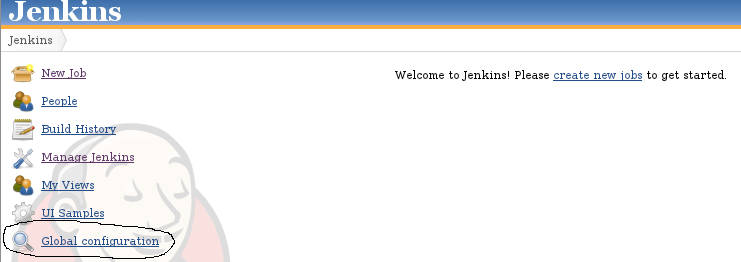
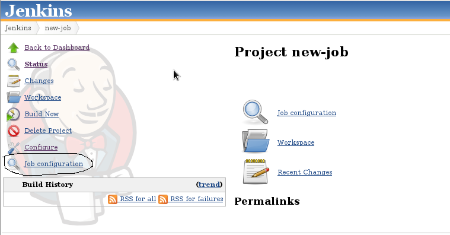

This plugin enables to show read-only configurations of job and global
Jenkins configurations  

The Jenkins global configuration is link "Global configuration" in
left-side menu in the main page and job configuration is link "Job
configuraiton" in the left-side menu in a job page

Note: the [Extended Read Permission
Plugin](https://wiki.jenkins.io/display/JENKINS/Extended+Read+Permission+Plugin)
provides a somewhat similar function, merely activating a permission
already defined in Jenkins core and honored by jobs and various plugins
providing configurable objects (but currently not the Jenkins global
configuration).
