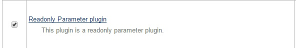
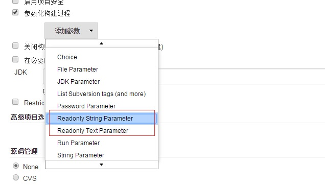
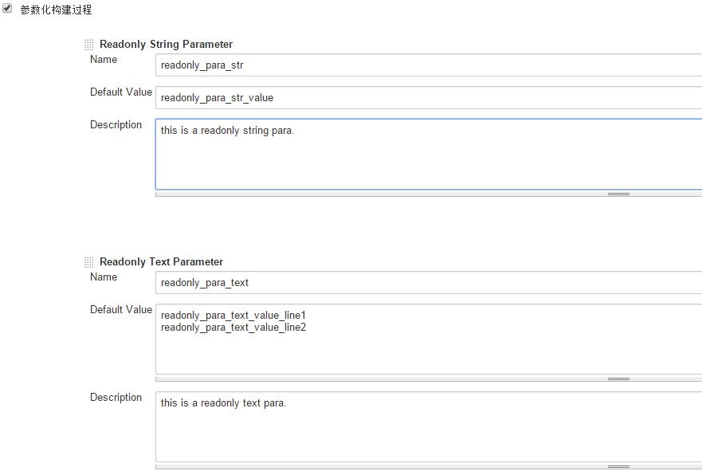
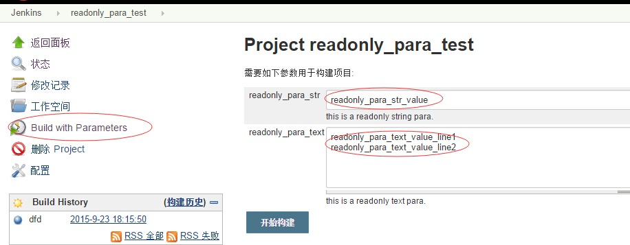

# Readonly Parameter Plugin

# 

This plugin adds support for Parameter. After the plugin is installed,in
job configuration's page,you can see Readonly Parameter.

### Characteristics 

1\. Some key parameters, once modified in the build execution, can lead
to the risk.these parameters,only administrator can modify,to reduce the
risk.

2\. Readonly parameter,readonly in the build execution, in job
configuration's page can modify.

3\. Readonly parameter,readonly in the rebuild excution also.

4\. This plugin contains string and text two readonly style.

### Install  

### Use Case

After the plugin is installed,in job configuration's page,you can see
readonly Parameter:

for example,you add two readonly parameter,respectively called
readonly\_para\_str and readonly\_para\_text.click 'Build With
Parameters' link ,the parameter readonly\_para\_str and
readonly\_para\_text of the set before ,display readonly,and can not be
edited in this page. 

  
click 'Build With Parameters' link ,the parameter readonly\_para\_str
and readonly\_para\_text of the set before ,display readonly,and can not
be edited in this page. 

### Contribute

Fork me on Github
at https://github.com/wy-scm/readonly-parameter-plugin/ (http://).
