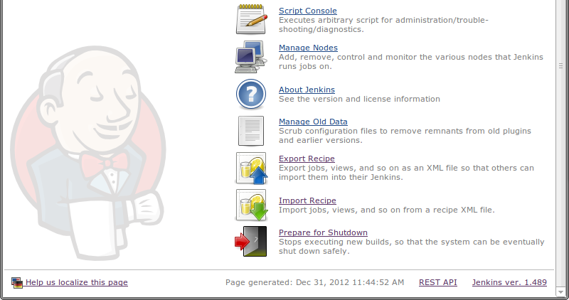
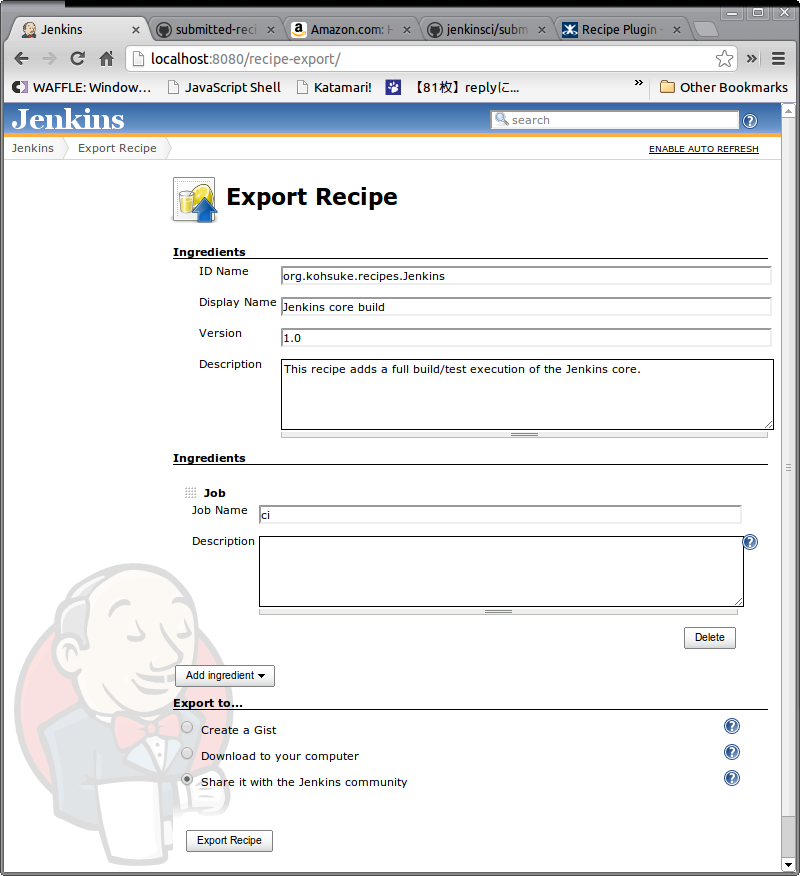
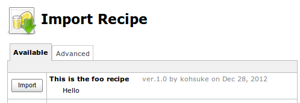
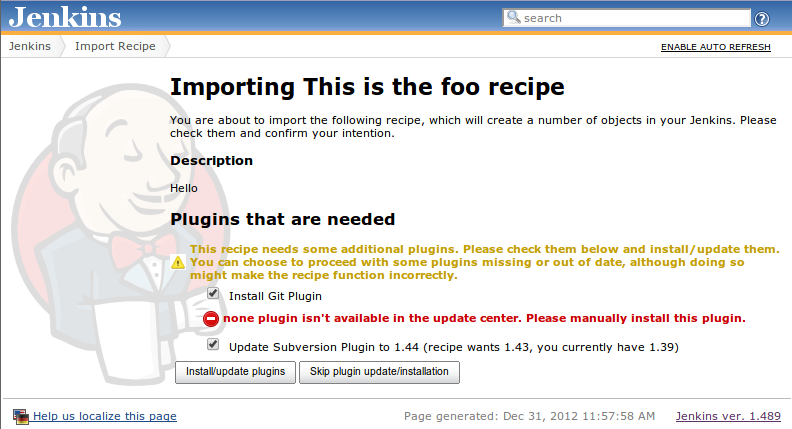
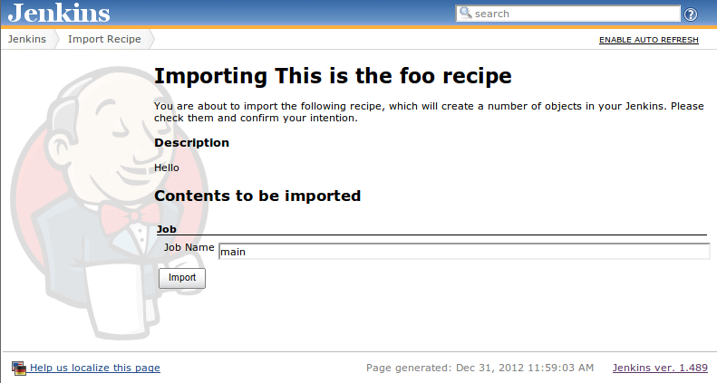

This plugin enables the community to share fragments of Jenkins
configurations (such as jobs, views, plugins, and so on) with others
through the mechanism similar to the plugin update center.

Such recipes provide a great starting point for users to get up to
speed, and it simplifies the transfer of knowledge from one Jenkins
instance to another.

# Workflow

The basic workflow is as follows:

1.  Joe exports a recipe
2.  from the export UI, he chooses to publish it to the community
    ([jenkins-ci.org account](https://jenkins-ci.org/account/) is
    necessary)
3.  The recipe gets uploaded to [the
    repository](https://github.com/jenkinsci/submitted-recipes)
4.  The recipe gets published to [the update
    center](http://updates.jenkins-ci.org/updates)
5.  Alice will be able to install this recipe from her Jenkins through
    the import UI

Since a recipe file is a plain old XML file, it can be also shared by
other means, and the import wizard allows you to upload such recipes
through a form submission.

# Screenshots

These features are accessible from the "Manage Jenkins" page:  

The export screen allows you to add the contents of the recipe and
choose where to submit the recipe:  

The import screen allows you to select from the community contributed
recipes (or upload)  

The recipe contains information about plugins used in the recipe, and
the first step in the import process is to install missing plugins and
update old ones.  

Then the details of the recipe import process will appear. You can make
some customizations in this stage:  

# Changelog

### Version 1.2 (Jun 3, 2014)

-   Implemented a proper import/export of views

### Version 1.1 (Nov 22, 2013)

-   Allow an existing job to be updated
    ([JENKINS-20727](https://issues.jenkins-ci.org/browse/JENKINS-20727))
-   Fixed broken icon

### Version 1.0 (Dec 31, 2012)

-   Initial version
