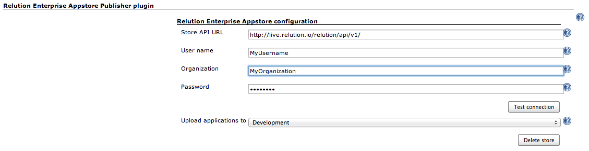
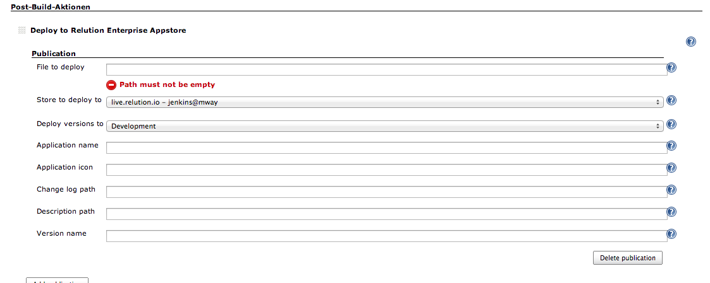

  
 

This Plugin may be used to deploy build artefacts like iOS and Android
apps to a [Relution Enterprise Appstore](http://www.relution.io/).

# relution-jenkins-plugin

A Jenkins plugin for the [Relution Enterprise
Appstore](http://www.relution.io/) by [M-Way Solutions
GmbH](http://www.mwaysolutions.com/).
See [http://www.relution.io](http://relution.io/) for more details about
the [Relution Enterprise Appstore](http://www.relution.io/) itself. This
plugin allows to automatically upload artefacts created by a Jenkins
build process to an instance of the [Relution Enterprise
Appstore](http://www.relution.io/). Typical build artefacts are Apple
iOS or Google Android binaries (.ipa and .apk files).

Publishing applications with this plugin is fairly straightforward.
Simply configure one or more stores in Jenkins' system configuration,
then add a post-build step to a Jenkins project and select one of the
previously configured appstores to upload to.

Just as Jenkins frees developers from the tedious task of producing
deployable application binaries, this plugin automates the task of
making these binaries available to anyone else. Testers get access to
binaries as soon as they become available, while ensuring that the code
of the binary that's being tested has been checked in to source control
and the binary has been produced using the official build process.

Additionally, this means that a binary published to the store has also
gone through all those nifty regression tests that everyone includes as
part of their build process. You are doing regression tests, right?

## Getting started

Before you can start using this plugin you should have set up an
automated build process, using Jenkins, and this build process should be
producing working application binaries for Apple iOS (.ipa) or Google
Android (.apk).

You also need to have set up and configured at least one [Relution
Enterprise Appstore](http://www.relution.io/). This store must have at
least one user account and one *Organization* this account belongs to.
However, it is recommended to create a separate user account for the
build machine. This way it is easy to tell whether a binary was uploaded
manually or by the plugin. The account must have the permissions
necessary to upload applications.

To configure the plugin you need to know your store's URL, for example
"<http://example.com/relution/>" and the credentials for the account you
are going to use. The plugin communicates with the store using its API
URL, which in this case would be
"<http://example.com/relution/api/v1/>".

After you have installed the plugin, Jenkins' system configuration
should now include a new entry *Relution publisher plugin*. Below that
entry should be a button *Add store*. Click on **Add store** to add a
new store to the configuration.

Enter your store's API URL (<http://example.com/relution/api/vi/>) and
the account's credentials (user name, organization and password). Do not
forget to click on **Test connection** to verify you have entered
everything correctly, then click on **Save** at the bottom of the page
to save your new configuration.

You can now add this appstore to one of your Jenkins projects to begin
uploading the binaries produced by this job to the appstore. To do so,
open the job's configuration page and add the post-build action *Deploy
to Relution Enterprise Appstore*.

You need to at least specify the binary that should be uploaded to the
store and select which appstore you want to upload to from a drop down
list. If required this step can be added multiple times in case you need
to upload a file to more than one store. Right now there should only by
one store available, which is represented as

example.com -"(username)" @ "(organization)" .

After you've built your project it should now be automatically uploaded
to the appstore. Be aware that you cannot upload the same version more
than once, so your application's version number should include an
auto-incremented build number.

## What's next?

By default the plugin uploads applications in the state *Development*,
which is typically only accessible to developers. Once a developer is
satisfied with his work, he can manually move the version to *Review*
state, using the appstore's web interface. After a version has passed a
review process it can be moved to *Release* state, making it available
to configured end users.

If developers already test builds on their local machines, you might
want to skip the first step. In this case you can set the application's
upload status to *Review* state in the post-build step's advanced
settings. Or, instead of doing this separately for every project, you
can also configure the default value in Jenkins' system configuration.
This means the binary is now directly uploaded to *Review* state.

It is also possible to skip the review process altogether by uploading
applications directly to *Release* state. Usually not recommended unless
you want all of your users to become beta testers. Or you're just that
confident in your own abilities.
