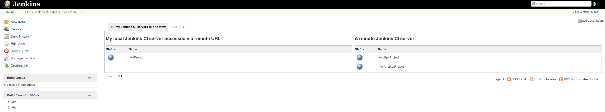
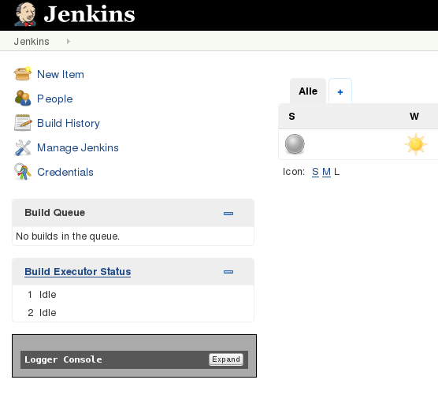
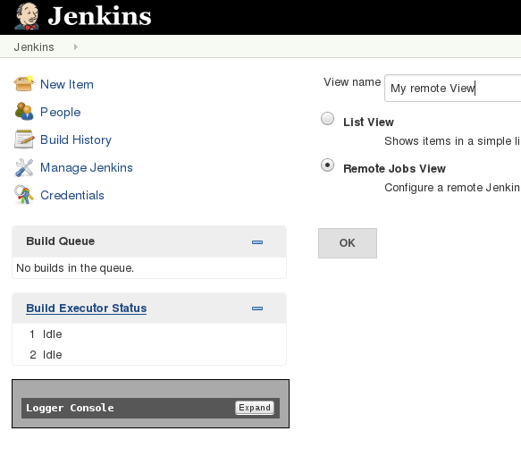
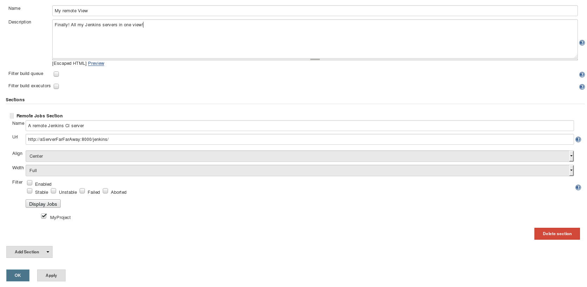

# Summary

View jobs executed on remote (master) Jenkins CI servers

In case you run several master Jenkins CI servers and you want to see
the jobs status from all your Jenkins servers in one view, you can use
this plugin to have them all in one view

{width="1471"
height="282"}

# Configuration

-   Add a new view by clicking '*+*'  
    {width="363"
    height="333"}
-   Select '*Remote Jobs View*'  
    {width="363"
    height="324"}
-   Enter the remote Server URL -\> Press '*Apply*' and reload (*F5*)
    screen to fetch jobs list from remote server. Select the remote jobs
    to display and you're done!  
    {width="1323"
    height="648"}

# Known Issues

-   In case your remote Jenkins is only accessible via HTTPS you must
    include the remote server certificate in your Java trust store.  
    Or (if you really know what you're doing!) you could also add the
    [Skip Certificate Check
    Plugin](https://wiki.jenkins-ci.org/display/JENKINS/Skip+Certificate+Check+plugin)
    to your Jenkins (which is running this view plugin) in order to skip
    any certificate check
-   Selecting 1/3 as width (for 3 remote servers - one left, one
    central, one right) does not align the views correct

# Open Tickets (bugs and feature requests)

type

key

summary

assignee

reporter

priority

status

resolution

created

updated

due

Data cannot be retrieved due to an unexpected error.

[View these issues in
Jira](https://issues.jenkins-ci.org/secure/IssueNavigator.jspa?reset=true&jqlQuery=project%20=%20JENKINS%20AND%20status%20in%20%28Open,%20%22In%20Progress%22,%20Reopened%29%20AND%20%28component%20=%20remote-jobs-view-plugin%29&tempMax=1000&src=confmacro)

# Changelog

### 0.0.3 (02-Oct-2015)

-   Initial release
