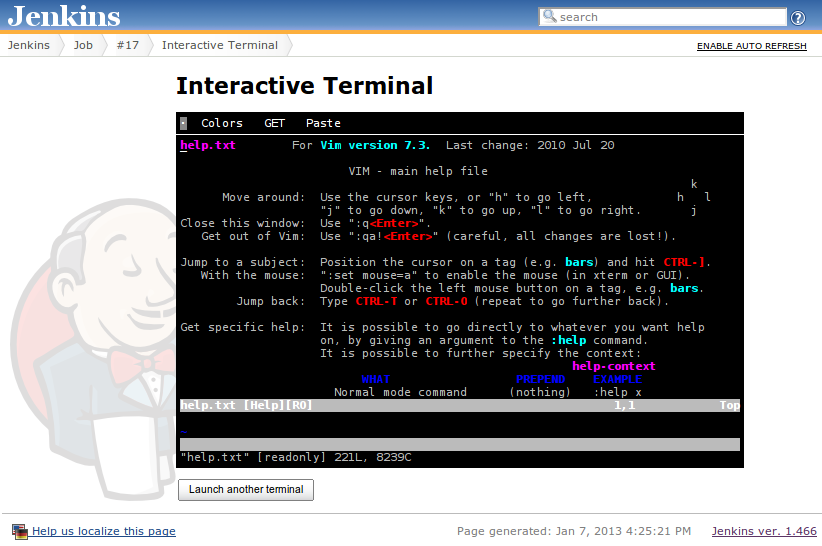
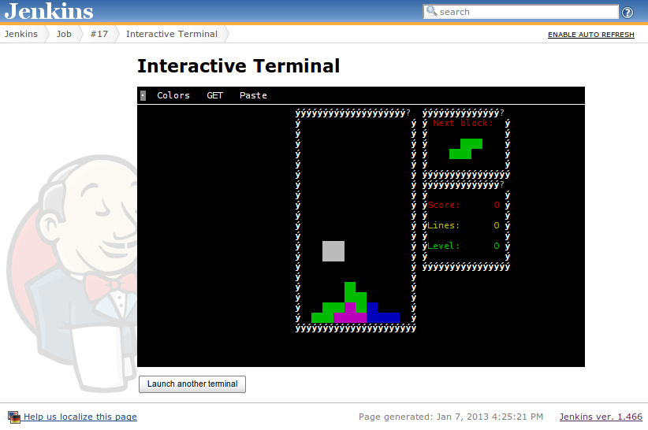

#### Table of Contents

# Leasing Jenkins slaves

This plugin adds a number of CLI/SSH commands to let you borrow
executors for things other than build executions.

When you "lease" an executor, Jenkins finds an appropriate executor as
"in-use" (as if you are running a build on it), until you are done with
the lease. While a lease is active, you can login to that slave from the
ssh client and use it.

In effect, this turns Jenkins into a general purpose batch job execution
environment. You can utilize Jenkins slaves without hardcoding their
names.

### Use Case

-   You have a test that involves multiple nodes. Your test script can
    launch additional JVMs on the Jenkins cluster to carry that out.
    Such test script can be run from both within Jenkins or from
    developer's laptops.
-   You have some computation that is expensive or require specific
    environment (say, building JDK or building a virtual machine image.)
    You can submit such computation to Jenkins from your shell.
-   As a basis for distributed scripting.

### Usage

You create a lease by running "lease-start" command. The following
example leases 3 executors from Jenkins slaves. In adition, `charlie`
will be allocated on a slave that satisfies the label boolean expression
`linux&amd64`:

    $ export JENKINS_URL=http://server/jenkins
    $ java -jar jenkins-cli.jar lease-start alpha bravo charlie="linux&amd64"

The above commands create `Leasefile` and `Leasefile.ssh` in the current
directory. The other lease commands will refer to this file to
understand an active directory, so those commands must be run inside the
directory tree where you created a lease.

Once the lease is created, you can login to the computer via ssh as if
it's a regular SSH server. The current directory will be the slave root
directory:

    $ ssh -F Leasefile.ssh alpha
    $ ssh -F Leasefile.ssh alpha ls
    $ scp -F Leasefile.ssh some.txt alpha:.

You can add more executors to the current lease by using the `lease-add`
command:

    $ java -jar jenkins-cli.jar lease-add delta

Similarly you can remove executors selectively by using the `lease-end`
command:

    $ java -jar jenkins-cli.jar lease-end charlie delta

If you are done with the lease, run the `lease-end` command with no
arguments to end the entire lease:

    $ java -jar jenkins-cli.jar lease-end

If you are running these commands from inside a Jenkins build,
`JENKINS_URL` environment variable is automatically set, and any active
leases will be automatically ended at the end of the build to prevent
resource leaks.

# Interactive Terminal Access

Ever wondered why your tests fail on Jenkins but never on your local
computer? Doesn't that make you feel like "Gee, if only I could ssh into
the build slave and look into what's going on..."? Then this plugin is
for you.

This plugin enables users to open an interactive terminal session
against on-going builds on Jenkins. You'll be dropped on the slave where
the build is happening, in the directory of the build, with all the same
environment variables that Jenkins set for the processes it's forking.
This lets you watch the build as it happens.

Jenkins will continue to go through the job as you watch it through your
terminal, but when the build comes to an end, this plugin will prevent
the build from marked as complete so long as your terminal is running.
This ensures that you can do forensic analysis of the build problem
without worrying about the workspace overridden by the next build.

### Browser access to the terminal

The terminal is accessible in two ways. The first is through a browser.
To get there, go to the page that shows an on-going build, then click
"Interactive Terminal". You'll have to press the "Launch a terminal"
button to start a session. Multiple people can watch and type into the
terminal at the same time, like
[screen](http://www.gnu.org/software/screen/) lets you.

This terminal emulates Linux console. It supports all the escape
sequences to run vim, top,
[sl](http://www.cyberciti.biz/tips/displays-animations-when-accidentally-you-type-sl-instead-of-ls.html),
or even rogue.






### SSH access to the terminal

While browser access is convenient, there's only so much browser allows
JavaScript to do. Its keyboard support isn't perfect, and you cannot do
copy&paste. For these reasons, this plugin also allows you to access the
terminal session through the standard SSH command through [Jenkins
SSH](https://wiki.jenkins.io/display/JENKINS/Jenkins+SSH) service.

To remotely login to the build, run the following command (the '-t'
option is to allocate tty, which is necessary because ssh doesn't do so
automatically):

``` syntaxhighlighter-pre
$ ssh -t -p PORT jenkins.acmecorp.com diagnose JOBNAME [command arg arg arg ...]
```

Once logged in, the environment is the same as the browser access to the
terminal (except your terminal is now a real terminal application.) Just
like SSH, if you specify the command and arguments, they execute and the
ssh terminates, instead of your getting interactive shell.

# Access control

Users must have the "Interactive Terminal - Access" permission to be
able to use these features.

### TODO

Make SFTP work.

### See also

[Terminal Plugin](https://wiki.jenkins.io/display/JENKINS/Terminal+Plugin)

# Changelog

### Version 1.6 (Aug 3, 2013)

-   Move Permission to own group to not loose the permission on saving

### Version 1.5.2 (Aug 2, 2013)

-   Fixed NullPointerException when saving Secure-Jenkins Page
    ([JENKINS-16600](https://issues.jenkins-ci.org/browse/JENKINS-16600))
-   Added an alpha version of the server-side CLI implementation for
    <https://github.com/TNG/remote-executor-gradle-plugin> and
    <https://github.com/TNG/surefire-jenkins-remote-executor>

### Version 1.4 (Jun 5, 2013)

-   Added lease related commands

### Version 1.3 (Apr 30, 2013)

-   Fixed a screen update bug on Windows

### Version 1.0 (Jan 7, 2013)

-   Initial version
-   Boss, I'm not slacking off! I'm just debugging a Jenkins plugin!
