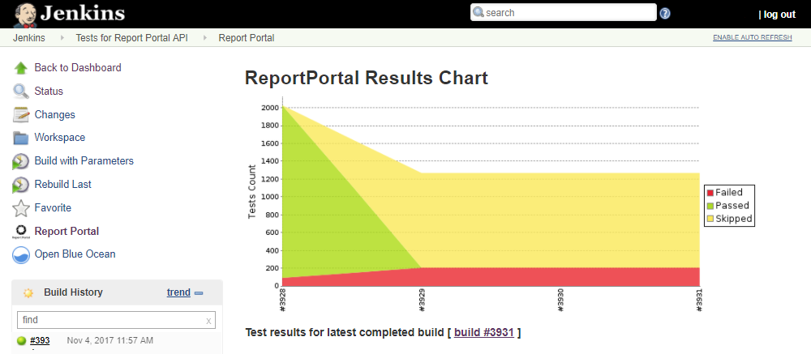

**ReportPortal Plugin** is a plugin for representing a statistics and a
test results visualization of already launched builds on the Jenkins job
page. Plugin builds a trend chart that is based on finished launches
that have been run from the moment of a plugin installation. It allows
you to take a quick overlook of a builds results structure and make a
firstly estimation of results. If you follow a link that is also
provided by a plugin, you will be redirected to the launch on
ReportPortal page where you can continue a deeper investigations. You
can read more about a plugin on GitHub **[ReportPortal Jenkins
Plugin](https://github.com/reportportal/plugin-jenkins).**

**{height="250"}**

**Build instruction:**

1.  Checkout source code
2.  Open console and move to root folder
3.  Perform command './gradlew clean jpi'
4.  Verify that rp4jenkins.hpi file appeared in build/libs/ directory
5.  Upload received file to Jenkins using following
    instruction <https://jenkins.io/doc/book/managing/plugins/#from-the-web-ui-2>

 

# http://ReportPortal.ioSummary

**Report Portal is a full featured report management tool for test
automation.**

Utilze Machine Learning to identify and categorize failed tests.

-   Manage all your automation results and reports in one place
-   Achieve full automation visibility in real-time by centralizing and
    aggregating all logs, reports and media data for indisputable
    evidence.
-   Make automation results analysis actionable & collaborative
-   Collaborate with your team members to associate each failed test
    with a known product bug, automation issue, system issue or other
    custom defect type.
-   Establish fast traceability with defect management
-   Submit and track defects with full evidence (logs, screenshots,
    comments, etc.) directly from a failed test case into a bug tracking
    system.
-   Accelerate routine results analysis
-   Use the collected history of executions and fail patterns to achieve
    hands-free analysis of your latest results.
-   Visualize metrics and analytics
-   Build custom dashboards and metrics to learn from the past and
    predict trends.
-   Make smarter decisions together
-   Use ReportPortal’s collaborative test automation environment with
    your team to improve your delivery quality.
