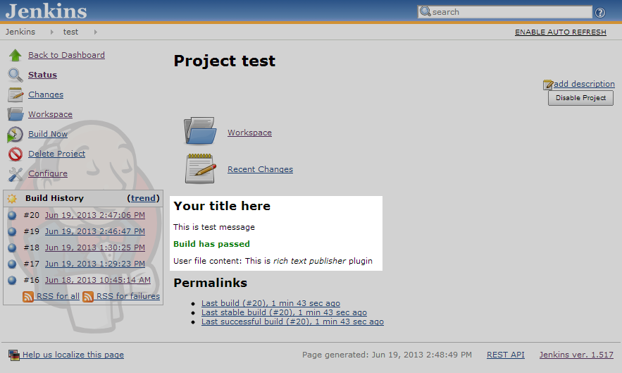
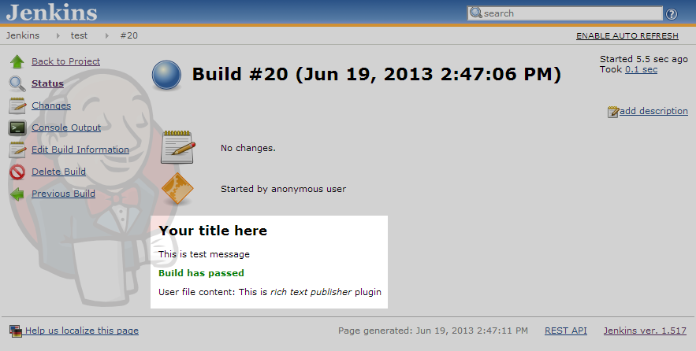
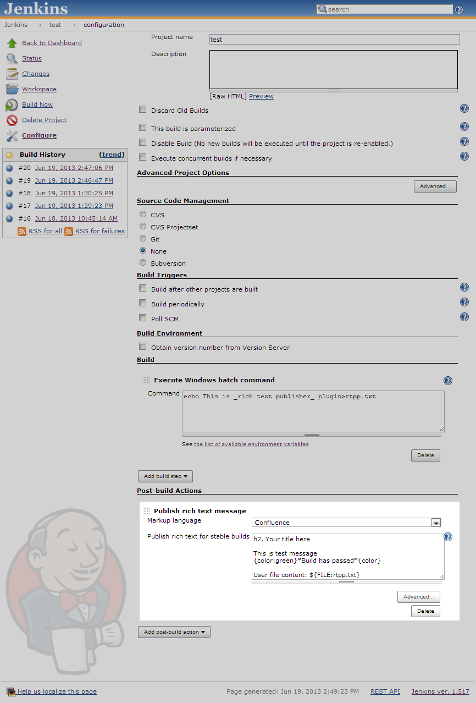
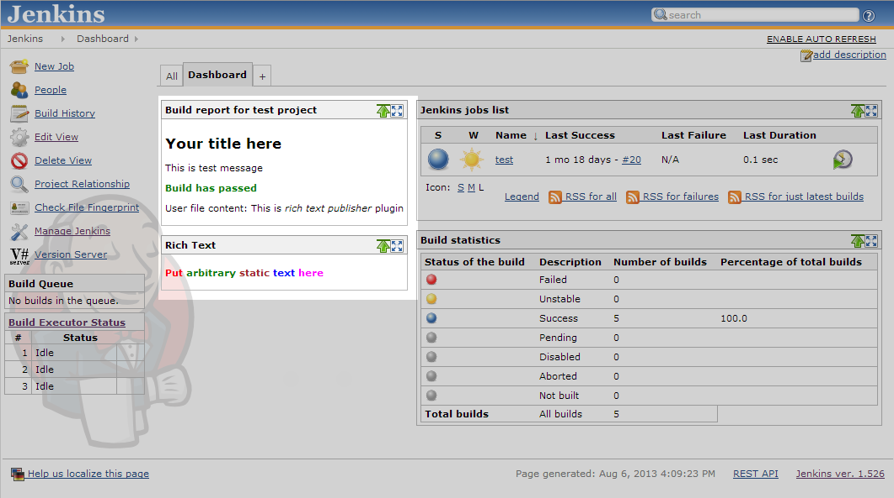

This plugin puts custom rich text message to the Build pages and Job
main page (for last build). Atlassian Confluence, WikiText and HTML
notations are supported.

Build parameters values, environment variables and contents of specified
files from workspace may be added to the message. Different messages may
be configured for Stable, Unstable and Failed builds.

## Screenshots

 
 
 

## Usage

This plugin publishes rich text message for each build. Message for the
latest build is also displayed on job main page.

Just add post-build action "Publish rich text message", pick formatting
language and enter message text. Click "Advanced" button to configure
separate messages for unstable and failed builds.

### Embedding build-time data into text message

Build parameters, environment variables and files may be embedded into
published message.

After the message is published it will not change even if configured
templates reference some files from workspace. All embedding is
performed in build tome, not in display time. Configuration changes do
not affect previous builds either.

Build parameters/variables may be added into the text by using
`${VARIABLE_NAME`} placeholders. Environment variables can be embedded
by using `${ENV:ENVIRONMENT_VAR_NAME`} format.

There are two supported placeholders for embedding files:
`${FILE:FILENAME`} and `${FILE_SL:FILENAME`}. The difference is that the
first one embeds file as is and the second one skips all CR and LF
characters (like breaks). In both cases file contents are rendered using
the same markup language as a part of the the whole text.

File names are relative to the workspace.

### Posting rich text messages on the Dashboard

Jenkins Dashboard view is provided by [Dashboard
View](https://wiki.jenkins.io/display/JENKINS/Dashboard+View) plugin.

Rich Text Publisher plugin adds two types of dashboard portlets: "Rich
Text" and "Rich text published within a build". The first one publishes
arbitrary rich text. The other one publishes current rich text message
for the specified build. The latest build and the latest stable build
may be configured as rich text source.

Note that "Rich text published within a build" portlet assumes that the
build has "Publish rich text message" post-build step configured and
executed at least once. Otherwise you will see empty portlet.

## Change Log

##### 1.4

Added pipeline support.

##### 1.3

Updated Jenkins core version.

##### 1.2

Added support for [Dashboard
View](https://wiki.jenkins.io/display/JENKINS/Dashboard+View). Arbitrary
and build-specific text may be displayed on the dashboard.

##### 1.1

Bumped up mylyn library version. Now more Confluence tags are supported.

##### 1.0

First version released.
