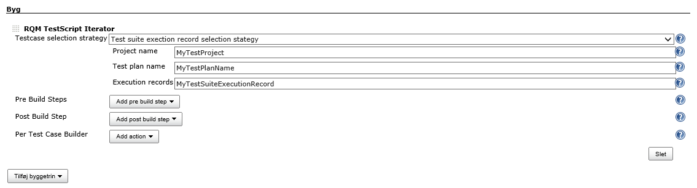
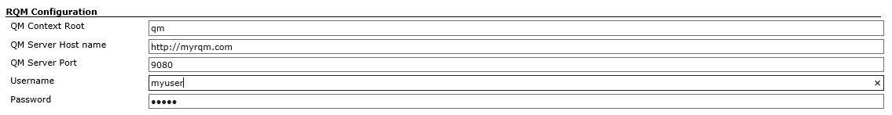
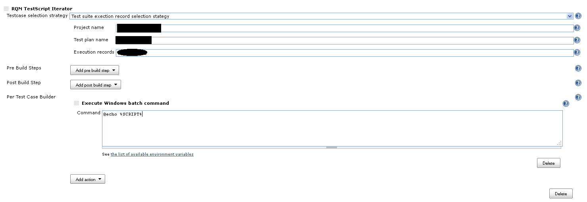

Developed by

  
Sponsored by

{width="200"}

# **Introduction**

[Rational Quality
Manager](http://www-01.ibm.com/software/rational/products/rqm/) (RQM) is
a quality and test management tool created by IBM.

In RQM a test plan is a dynamic quality contract that evolves with the
project tracking key criteria such as business objectives, exit and
entry criteria, priorities, and requirement scope.

A test plan has test cases and test suites. This plugin is able to pull
the test cases from a test plan and suite in RQM.

The plugin expands the logic of a test case by the convention, that
through the use of input fields for automatic test scripts. The plugin
will contribute any input fields added to your automatic test script as
an environment variable, which you can sue to script your test
execution. 

# **Setup**

The plugin appears as an "RQM TestScript Iterator" build phase option in
the build phase.

The plugin requires that you enter the following values:

-   **Project Name** - RQM Project you wish to use.
-   **Test plan name** - Name of the RQM test plan to use, it must be
    within the project you chose above.
-   **Execution records -** The execution records you wish to use as
    base.

You'll also need to configure the global options for the plugin: 

# How it works

In order for the plugin to function the following assumptions are made: 

1.  Your RQM installation has a testplan with a testsuite and a
    testsuite execution reocrd.
2.  The plugin expects that your RQM test scripts have a number of input
    fields assigned. 
3.  The plugin will add the value of these fields as environment
    variables as key-value pairs. For example if your automatic test
    script has an input field named Script, an enviroment varibale is
    added to each build step added in the "Per Test Case builder" and
    can be printed and used like so: %SCRIPT%
4.  Then you can add buildsteps to use the extracted values

This is an example. In this case i will for each testcase and selected
testscript i echo the value of the "Script" input parameter in a build
step. This can be used to script your test execution.  

# Exposed environment variables

The plugin will expose any input parameters defined on your automatic
test scripts. The input variables will be exposed under the form
**%\<input field name\>%**  (NOTE: Whitespace characters in input field
name gets replaced with underscore '\_')

-   **%TESTCASE\_TITLE%** The title of the currently iterating test case
-   **%TESTSCRIPT\_TITLE%** The current testscript title

**Migrating from v. 1.0 to 2.0**

We've made quite a few fundamental changes jumping from version 1.0 to
2.0. The plugin will no longer report back to RQM by creating a TCER,
this feature though, is planned in a future 2.X version.

-   You should still be able to collect your test results by using a
    JUnit report publisher.
-   Move your custom attributes to input fields for your test scripts.
    We now use non-manual test scripts to execute the tests, 

# Changelog

### Version 2.8(Nov 20, 2014)

-   Added integration with credentials plugin
    ([JENKINS-25593](https://issues.jenkins-ci.org/browse/JENKINS-25593))

### Version 2.7(Sep, 11 - 2014)

-   Fixed it so that builders do not overwrite results
    ([JENKINS-24669](https://issues.jenkins-ci.org/browse/JENKINS-24669))
-   The plugin stops working with empty testcase
    ([JENKINS-24670](https://issues.jenkins-ci.org/browse/JENKINS-24670))

### Version 2.5(Sep, 5 - 2014)

-   Fixed an error when counting number of test scripts.

### Version 2.4(Sep, 4 - 2014)

-   Fixed it so that you get better notifictions of errors
    ([JENKINS-24553](https://issues.jenkins-ci.org/browse/JENKINS-24553))
-   Test case execution order was not honoured
    ([JENKINS-24577](https://issues.jenkins-ci.org/browse/JENKINS-24577))
-   Too many test scripts selected
    ([JENKINS-24578](https://issues.jenkins-ci.org/browse/JENKINS-24578))

### Version 2.3(Aug, 14 - 2014)

-   Add message when one of the added build steps return a non-zero
    value.
    ([JENKINS-24264](https://issues.jenkins-ci.org/browse/JENKINS-24264))

### Version 2.2(July, 29 - 2014)

-   Added plugin description for update center

### Version 2.1

-   Changed maintainer in pom

### Version 2.0(May, 8)

-   New concepet. Iterate test contribute to environment.

### Version 1.0 (eol)

-   Initial proof of concept.

type

key

summary

Data cannot be retrieved due to an unexpected error.

[View these issues in
Jira](http://issues.jenkins-ci.org/secure/IssueNavigator.jspa?reset=true&jqlQuery=project%20=%20JENKINS%20AND%20status%20in%20%28Open,%20%22In%20Progress%22,%20Reopened%29%20AND%20component%20=%20%27rqm-plugin%27&src=confmacro)

  
