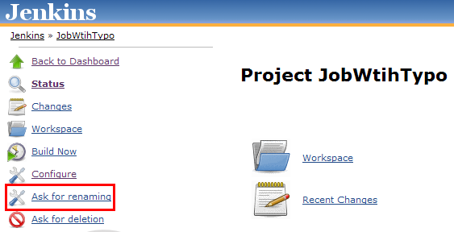
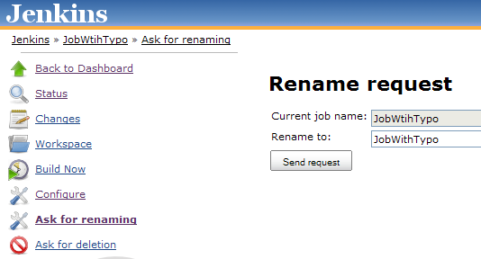
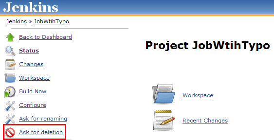
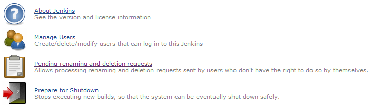
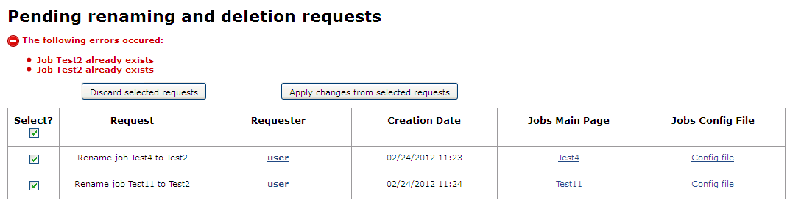

This plugin adds new actions on jobs for users to request that their
jobs are renamed or deleted

  

  

**This plugin is no longer maintained and has been deprecated. The
functionality has been migrated onto the new [Requests
Plugin](https://wiki.jenkins.io/display/JENKINS/Requests+Plugin). Please
download the new plugin from GitHub or search for “requests-plugin"
under “Manage plugins/Available” on your Jenkins system to install it
directly.**

  

# About this plugin

This plugin adds two new actions on jobs' screen, so that users who
don't have the required permissions to rename and/or delete jobs can
request the Jenkins administrator to do so.  
The Jenkins administrator then gets a dedicated screen to handle all the
incoming requests.

# How does it work?

## For users

### Renaming request

Users who have the configure permission but not the create and delete
ones can configure jobs but not rename them. With this plugin, they'll
get a new **Ask for renaming** action on their jobs:

When clicking on it, they'll be presented with a screen that allows
defining the new name for the job:

When clicking on the **Send request** button, a new item would appear in
the administrator's management screen (cf. below) for him to perform (or
not) the request.

### Deletion request

Users who don't have the delete permission can't, of course, delete
jobs. The plugin offers for them a new **Ask for deletion** action on
their jobs:

When clicking on it, they'll be presented with a confirmation screen
and, if the request for deletion is confirmed, a new item would appear
in the administrator's management screen (cf. below) for him to perform
(or not) the request.

## For administrators

Administrators get a new **Pending renaming and deletion requests**
entry in Jenkins' main configuration screen (**Manage Jenkins** \>
**Configure System**):

This offers a screen which centralizes all renaming and deletion
requests:

Administrators can then select a set of requests and apply or cancel
them.

# Version history

## Version 1.1.0 (03/01/2011)

-   Fixed
    [JENKINS-12897](https://issues.jenkins-ci.org/browse/JENKINS-12897):
    RROD enhancements: Sort requests, link to config.xml, etc.
-   "Pending renaming and deletion requests" screen enhancements
    -   Displays the requests' creation date
    -   A select All/None check box
    -   An error messages box

## Version 1.0.2 (10/17/2011)

-   Fixed permission handling when using the [Role
    Strategy](https://wiki.jenkins.io/display/JENKINS/Role+Strategy+Plugin)
    plugin

## Version 1.0.1 (10/07/2011)

-   Permissions were not properly handled when using projects-based ones

## Version 1.0 (09/08/2011)

-   Initial release
