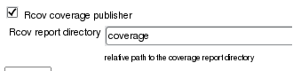
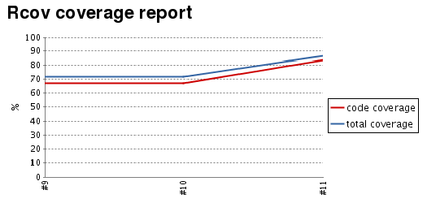
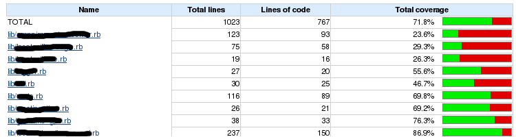
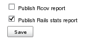
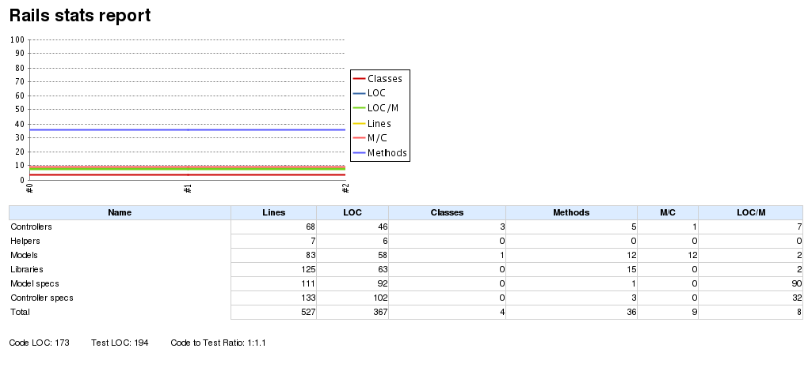

Ruby metric reports for Jenkins.
[Rcov](http://eigenclass.org/hiki.rb?rcov), Rails stats, Rails notes and
[Flog](http://ruby.sadi.st/Flog.html).

## Rcov support

Rcov plugin parses rcov html report files and shows it in Jenkins with a
trend graph.

Once we've installed the RubyMetrics plugin, we have to introduce the
output report directory into the job configuration:

If the build was successfully, Jenkins generates the trend report and
the graph:

## Rails stats support

Once the plugin is installed we can publish rails stats reports checking
the right option:

Jenkins generates a report by each successful build and keeps an
historic version while the project goes forward:

## Rails notes support

## Flog support

Flog measures code complexity. It shows you the most torturous code you
wrote.

Check the right option in your job's configuration and add the
directories that you want to monitorize, i.e app/models

### Changelog

Full changelog can be accessed
[here](https://github.com/jenkinsci/rubymetrics-plugin/blob/master/CHANGELOG.md)
