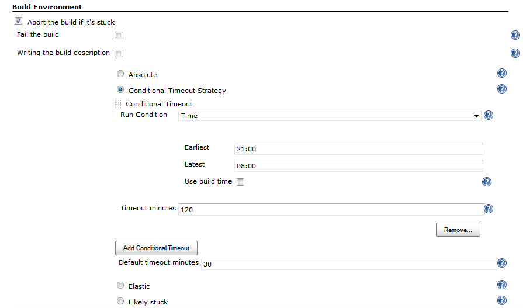

| Plugin Information                                                                                                    |
|-----------------------------------------------------------------------------------------------------------------------|
| View Run Condition Extras [on the plugin site](https://plugins.jenkins.io/run-condition-extras) for more information. |

**This plugin is up for adoption.** Want to help improve this plugin?
[Click here to learn
more](http://localhost:8085/display/JENKINS/Adopt+a+Plugin "Adopt a Plugin")!

  

  

  

This plugin provides additional run conditions and integrations for [Run
Condition
Plugin](http://localhost:8085/display/JENKINS/Run+Condition+Plugin)

# Page contents

## Contributors

1.  Members of Jenkins CI community
2.  [Oleg Nenashev](hhttp://www.linkedin.com/in/onenashev) (maintainer)

-   Initial plugin version has been sponsored by Synopsys Inc.,
    [www.synopsys.com](http://www.synopsys.com/)

## Features summary

Plugin integrations:

1.  [Email-ext
    plugin](http://localhost:8085/display/JENKINS/Email-ext+plugin)
    -   Conditional e-mail trigger
2.  [Build-timeout
    Plugin](http://localhost:8085/display/JENKINS/Build-timeout+Plugin)
    -   Conditional build timeout

## Examples

1.  "Use extended timeouts for nightly runs"

## Version history

### Version 0.2 (05/04/2015)

-   
    Classloading warnings in Jenkins logs during the startup
    ([JENKINS-28150](https://issues.jenkins-ci.org/browse/JENKINS-28150))
-   
    "Run condition trigger" for Email-ext does not retain "Send To"
    information on Save/Apply
    ([JENKINS-26005](https://issues.jenkins-ci.org/browse/JENKINS-26005))

### Version 0.1 (01/18/2014)

-   Conditional e-mail trigger for [Email-ext
    plugin](http://localhost:8085/display/JENKINS/Email-ext+plugin)
-   Conditional build timeout for [Build-timeout
    Plugin](http://localhost:8085/display/JENKINS/Build-timeout+Plugin)
