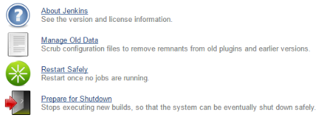

This plugin allows you to restart Jenkins safely.

 This plugin allows you to restart Jenkins safely: it's waiting that all
builds in progress finished before launching restart.

## Side panel

  
  

### Manage Jenkins page

  
  

## Change Log

### Version 0.3 (Apr. 22, 2013)

-   Provide a better image
    ([JENKINS-12574](https://issues.jenkins-ci.org/browse/JENKINS-12574)).

### Version 0.2 (Sep. 8, 2011)

-   updated for Jenkins 1.421
-   lots of restructure, but brought back into the standards
-   fixing safe restart exception when safe restart is not a valid
    option

### Version 0.1 (Oct. 18, 2010)

-   Initial release.
