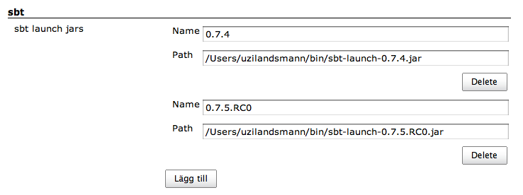
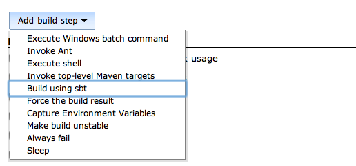
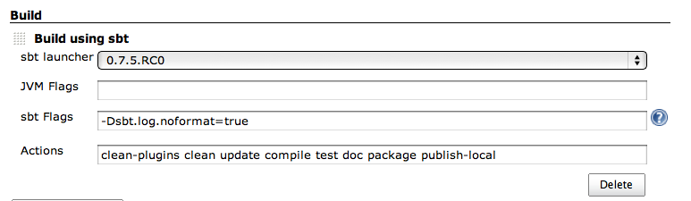

This plugin allows building Scala projects using
[sbt](http://code.google.com/p/simple-build-tool/).

## Configure the sbt plugin

-   In order to set up sbt-plugin, you need to specify the names and
    locations of one or more sbt launch jars. Press the **Manage
    Jenkins** link and then the **Global Tool Configuration**. You
    should now see the sbt configuration section where you will be asked
    to specify names and locations for your sbt launch jars.

## Configure your project to use sbt

-   Open your project configuration and add a **Build using sbt** build
    step

-   Now, choose which sbt launcher to use, add any jvm and sbt flags you
    need for your build, and specify which actions you want to run. Keep
    the **-Dsbt.log.noformat=true** sbt flag to keep the console output
    clean.

-   Once you saved the project configuration, you can run your project
    and watch the virtual console to see the magical sbt work.

## Todo

-   Allow multiple sbt launchers
-   Allow downloading an sbt launcher
-   Find a way to publish test results when the project does not have a
    test listener which creates junit xml (see [Christoph Henkelmann’s
    Blog](http://henkelmann.eu/2010/11/14/sbt_hudson_with_test_integration))

## Changelog

### Version 1.0

-   Initial release

### Version 1.1

-   This release got wrong, sorry

### Version 1.2

-   [Handle multi-word actions
    correctly](https://github.com/jenkinsci/sbt-plugin/pull/2) (thanks
    to [Ismael Juma](https://github.com/ijuma)).
-   [A work-around for missing JDK
    path](https://github.com/jenkinsci/sbt-plugin/pull/4) (thanks to
    [Maciek Makowski](https://github.com/mmakowski))
-   Ability to define multiple sbt launchers ([Include SBT Processor,
    jenkins-8661](http://issues.jenkins-ci.org/browse/JENKINS-8661))
-   Missing jvm arguments causes build to fail ([Exception in thread
    "main" java.lang.NoClassDefFoundError,
    jenkins-8587](http://issues.jenkins-ci.org/browse/JENKINS-8587))

### Version 1.3

-   Added an ability to run sbt in a sub-directory ([pull request
    \#6](https://github.com/jenkinsci/sbt-plugin/pull/6)
