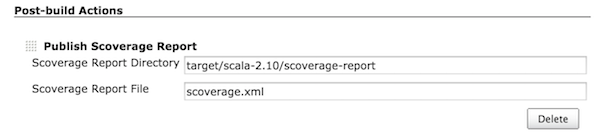
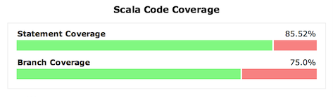

This plugin allows you to publish
[scoverage](https://github.com/scoverage) results in Jenkins as a trend
graph.

# Configuration

## Freestyle

1.  Enable "Publish Scoverage Report" in Post-build Actions.
2.  Specify the location where the scoverage.xml report is generated
    (e.g. target/scala-2.10/scoverage-report, scoverage.xml).

## Pipeline

`step([$class: 'ScoveragePublisher', reportDir: 'target/scala-2.11/scoverage-report', reportFile: 'scoverage.xml'])`

# Example

# Changelog

### v1.4.0 (Dec 19, 2018)

-   Fix ScoverageBuildAction for Jenkins 2.150.1+

### v1.3.3 (July 5, 2017)

-   Fix path regex on Windows.

### v1.3.2 (Mar 10, 2017)

-   Fix HTML table alignment when coverage is close to even 100%.

### v1.3.1 (Oct 3, 2016)

-   Fix path handling on Windows.

### v1.3.0 (Nov 1, 2015)

-   Expose data to list view.
-   Jenkins version is updated to 1.609.1.

### v1.2.2 (Sep 24, 2015)

-   Fix duplicate charts.

### v1.2.1 (Sep 6, 2015)

-   Fix remote reports.
-   Jenkins version is updated to 1.596.2.

### v1.2.0 (Jul 4, 2015)

-   Support workflow plugin.
-   Jenkins version is updated to 1.580.1.

### v1.1.2 (Apr 13, 2015)

-   Add icon to Project and Build page.
-   Fix NPE when there's only 1 successful build.
-   Expose data to remote access API.

### v1.1.1 (Jan 28, 2015)

-   Make it work on Java 8.

### v1.1.0 (Jan 12, 2015)

-   Support both SBT and Maven.

### v1.0.2 (Apr 29, 2014)

-   Bug fix to copy HTML and XML reports separately, verified with
    scoverage 0.98.2.

### v1.0.1 (Apr 04, 2014)

-   Bug fix to support scoverage 0.95.9 and 0.98.0.

### v1.0 (Mar 22, 2014)

-   Initial release, for scoverage 0.95.7.
