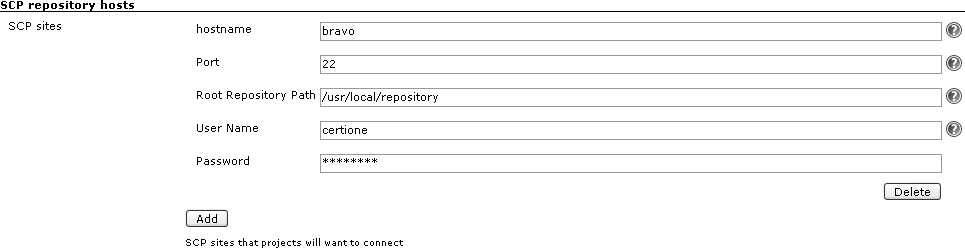
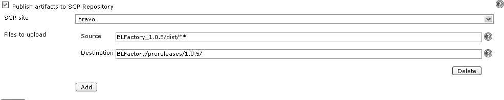

The current version of this plugin may not be safe to use. Please review
the following warnings before use:

-   [Insecure credential storage and
    transmission](https://jenkins.io/security/advisory/2017-10-23/)

This plugin uploads build artifacts to repository sites using SCP (SSH)
protocol. First you should define SCP hosts on hudson global config
page. After that you can refer to this hosts using select list. See
picture for global config:

After entering username/password automatic logon check is performed to
see if you entered it correctly.  
Root repository path must exist before you can reference it and should
be accessible by user who do publish of files.

------------------------------------------------------------------------

Then per job you can enable publishing of build artifacts:

*Source* points to files which will be uploaded. You can use ant
includes syntax, eg. folder/dist/\*.jar. Path is constructed from
workspace root.  
Note that you cannot point files outside the *workspace* directory. For
example providing: `../myfile.txt` won't work...  
*Destination* points to destination folder on remote site. It will be
created if doesn't exists and relative to root repository path.  
You can define multiple blocks of source/destination pairs.

### Change Log

##### Version 1.9 ( ? )

-   More verbose site name.
    ([JENKINS-7257](https://issues.jenkins-ci.org/browse/JENKINS-7257))

##### Version 1.8 (Jan 6, 2011)

-   Added "Keep Hierarchy" option.
    ([JENKINS-8170](https://issues.jenkins-ci.org/browse/JENKINS-8170))

##### Version 1.7 (Oct 19, 2010)

-   i18n & l10n(ja)
    ([JENKINS-8109](https://issues.jenkins-ci.org/browse/JENKINS-8109))

##### Version 1.6 (Feb 2, 2010)

-   Update code for more recent Hudson

##### Version 1.5.2 (Nov 12, 2008)

-   Fix for
    [JENKINS-2609](https://issues.jenkins-ci.org/browse/JENKINS-2609):
    version 1.5.1 of the SCP plugin is broken for "password only"
    authentication

##### Version 1.5.1

-   Enhancement, support for public key authentication
    ([JENKINS-1269](https://issues.jenkins-ci.org/browse/JENKINS-1269))
-   Enhancement, works now with Maven2 jobs
    ([JENKINS-1845](https://issues.jenkins-ci.org/browse/JENKINS-1845))

##### Version 1.5

-   Improved error diagnosis when the specified file pattern didn't
    match anything.

##### Version 1.4 (2008/07/23)

-   fixed NPE
    ([JENKINS-1269](https://issues.jenkins-ci.org/browse/JENKINS-1269))

##### Version 1.3

-   fixed bug with subdirectories creation

##### Version 1.2

-   Updated to work with Hudson 1.159
    ([JENKINS-1054](https://issues.jenkins-ci.org/browse/JENKINS-1054))
