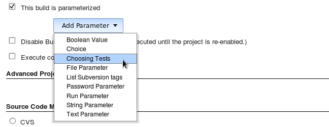
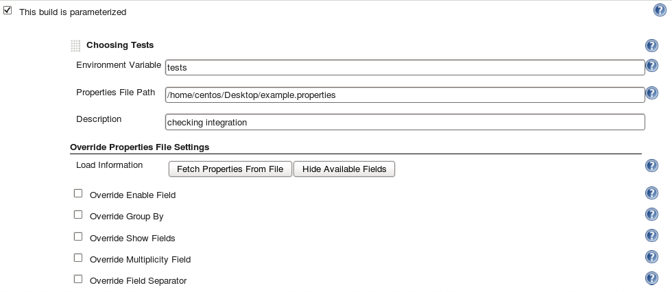
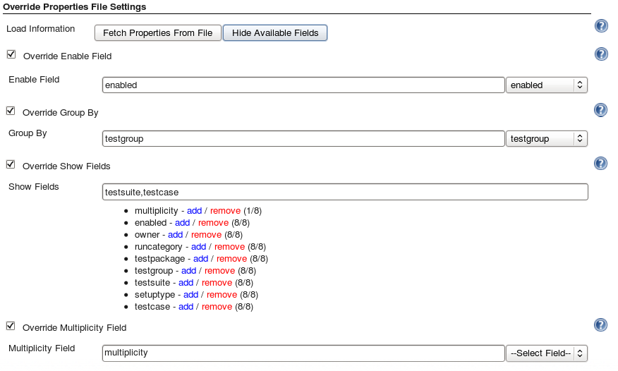
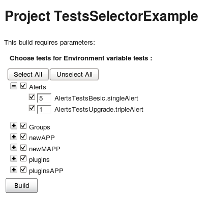

# Overview

This plugin allows you to choose specific tests you want to run.

# User guide

# Enabling The Plugin In Your Job

1.  Navigate to the Job configuration page.
2.  Choose the checkbox *T**his build is parameterized.*
3.  *Click on Add Parameter* drop-down list.
4.  Select *Choosing Tests.*

***Screenshot***  


## Filling The Parameters

1.  Specify the name of the environment variable in which you want your
    selected tests to be saved in.   
    After build the selected tests will be in this environment variable
    as a JSON array.
2.  Enter the properties file path (see more information bellow).
3.  Add a description (optional).

## About The Properties File

This file will contain all your tests and (maybe) some extra fields for
the plugin.

Your properties file **MUST** have a property called tests.  
The **tests** property value is a JSON array that contains a JSON object
for each test.   
In each test object you need to specify it's attributes by a key/value
pairs.  
The following properties will allow you to select specific fields which
have a special meaning:

[TABLE]

All fields are case-sensitive.  
**Each property must** be defined either in the properties file **OR**
in the override section.   
If you want to change the properties you defined in the file, you can
override them in the override section.

This is an **example** for a properties file which contains all above
properties:

``` syntaxhighlighter-pre
tests=[{"enabled":true,"owner":"shushu","testgroup":"A","testcase":"single"},{"enabled":false,"owner":"shushu","testgroup":"B","setuptype":"basic"}]
enableField=enabled
groupBy=testgroup
fieldSeparator=.
showFields=testsuite,testcase
multiplicityField=multiplicity
```

***Screenshot***  


## Override Section

In this section you can override the properties you defined in the
properties file or define them for the first time.  
If you want the override to be done you must check the appropriate
checkbox.  
If you click on the *Fetch properties From File* button it will fill the
properties bellow from the properties file above.  
***Screenshot***  


If you click on the *Show/Hide Available Fields* button it will
show/hide all the fields used in the tests you defined in the properties
file.** **  
In *Show Fields* section, Next to each Available field appears
(howManyTestsHasThisField/amountOfTests).  
*Multiplicity Field* can exist in some (all) of the tests.  
***Screenshot***  
  
After clicking on *Build Now* button you will need to choose the tests
(organized as a tree).  
For each test you chose, you will need to fill the amount of times you
want it to run.  
***Screenshot***  
  
Clicking on *Build* button will continue the build with the tests as
your parameter (in the environment variable you chose). 
