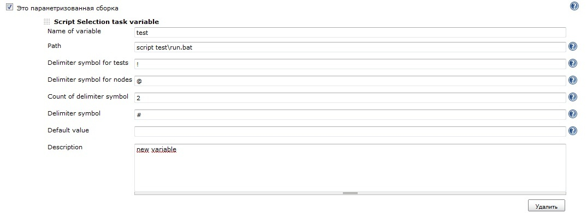
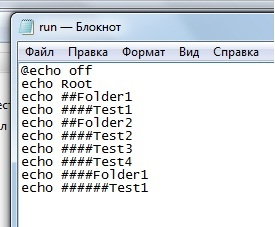
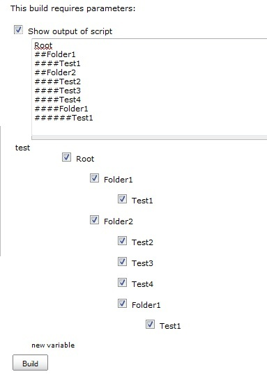
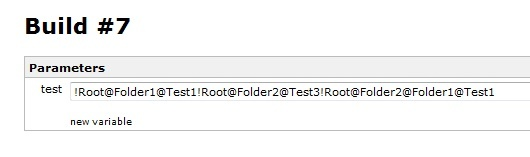

This plugin adds new variable. You may select several tasks (for
example, Selenium tests) for run.

Hudson 1.366 or later.

This plugin was created for Hudson 1.366. It might not work with earlier
versions of Hudson.

# User guide

1\. Add "Script Selection task" variable to your project. You need to
specify the path to executable file and several delimeters. See the
picture below.

2\. Our idea is quite simple. We have a folder with Selenium tests. We
want to select some of them using Hudson UI. Executable file knows the
structure of the directory with Selenium tests.

Executable file writes directory structure to standard output stream.
So, plugin runs the executable file and reads standard output stream.
Example of executable file

3\. If you press "Build now" button you will see the tree like this

4\. Select several tests and press "Build" button. For example

5\. In build parameters you may see

6\. You may use this variable in your Linux or Windows scripts. And you
may use selected value as default value for this type of variable.

# Changelog

##### Version 1.0 (February 28, 2011) 

-   Initial release.
