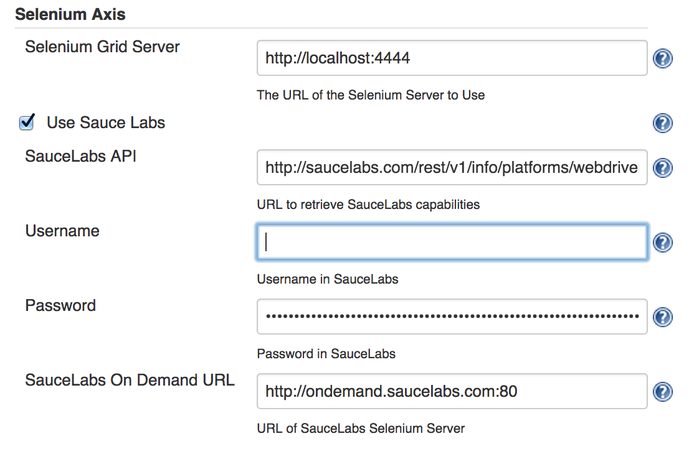
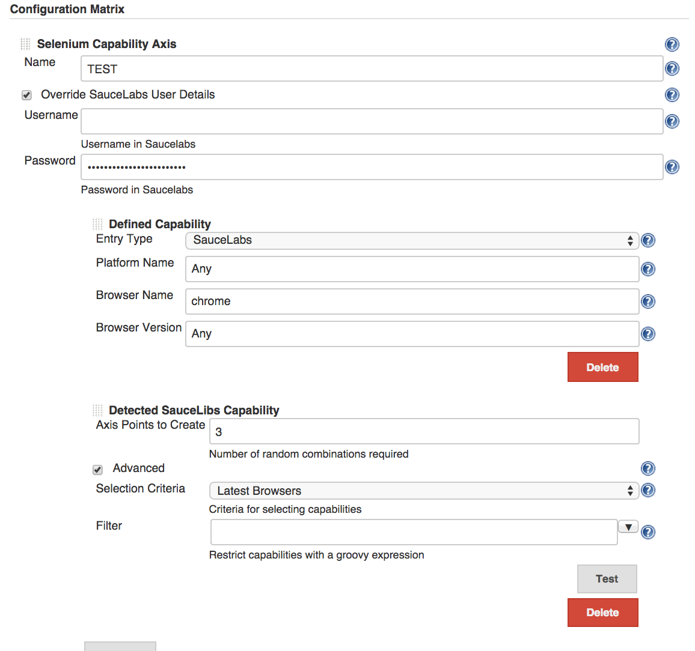

Creates an axis based on a local Selenium grid and also build against
the SauceLabs Selenium capability at the same time.  
Both components rebuild before each build to take advantage of any new
capabilities.

The Selenium grid uses all capabilities available and the SauceLab one a
random subset, which can be configured or disabled.

No Sauce Labs Free Plan

All Sauce Labs plans now require a monthly payment, rather than the
option of a free limited time plan when I developed this.

It does this by creating four environment variables to pass to the build
phase.

-   LABEL\_URL for either the local Selenium or SauceLabs
-   LABEL\_BROWSER for the browser (e.g. chrome, firefox)
-   LABEL\_PLATFORM for the platform (e.g. LINUX, VISTA)
-   LABEL\_VERSION for the browser version

You can use any label you want for the axis, so long as all the axes are
unique.

This is an example test in Perl which can be run as a build step

``` syntaxhighlighter-pre
use Test::More tests=>8;
use_ok 'Selenium::Remote::Driver';

ok $ENV{TEST_BROWSER}, "Browser name set";
ok $ENV{TEST_PLATFORM}, "Platform name set";
ok $ENV{TEST_VERSION}, "Version name set";
ok $ENV{TEST_URL}, "URL set";

my $browser  = $ENV{TEST_BROWSER};
my $platform = $ENV{TEST_PLATFORM};
my $version  = $ENV{TEST_VERSION};
my $url      = $ENV{TEST_URL};

#so perl likes the selenium url not to have http:// on the front
#for SauceLabs this will be user:password@ which is set in the global config
$url =~ s|^http://||;

my $parms = [remote_server_addr=>$url ];

push @$parms, (platform => $platform) unless $platform eq 'Any';
push @$parms, (browser_name => $browser) unless $browser eq 'Any';
push @$parms, (version => $version) unless $version eq 'Any';

push @$parms, (extra_capabilities => {name => $ENV{BUILD_TAG}||$0 });

use Data::Dumper;
print Dumper ($parms);

my $driver = new_ok('Selenium::Remote::Driver' => $parms);

ok $driver->get('http://www.google.com');
is $driver->get_title(), 'Google';
$driver->quit();
```

For Selenium it will detect the capabilities and display them.  
For SauceLabs it will pick some at random from the available.  
Both will be rebuilt at build time so new capabilities are incorporated
without revisiting the project.

I would advise using the [Mask Passwords
Plugin](https://wiki.jenkins.io/display/JENKINS/Mask+Passwords+Plugin) to
mask passwords in the console log.

You will need a SauceLabs account to use the SauceLabs part. If you
don't want this then you can turn it off in the global config.

### Global Settings



The Selenium Hub location defaults to
[http://localhost:4444](http://localhost:4444/)  
The SauceLabs URLS (one for the capabilities and the other for the
remote hub) are configured. These are here just in case SauceLabs change
their interface.

The SauceLabs username and password will be used for all axis set in the
jobs but these can be overridden in individual jobs.

Turning off Saucelabs will disable any SauceLabs components in all jobs,
except any manually added components.

### Job Configuration



The SauceLabs user details can be added on a job by job basis.

Individual capabilities can be added, these can be either for the local
hub or for SauceLabs.

SauceLabs capabilities can be limited to latest browsers, web browsers
or all and the number of points limited.

### Filter

You can filter based on a groovy script. The script uses a list of
already added capabilities (selected) and the next to add (current).

The filter should return true to include this capability, or false to
ignore it. The capabilities are randomized before selection and if the
criteria is too restrictive you may not end up with all the points you
want.

The standard filter used is - The import is required

``` syntaxhighlighter-pre
import org.jenkinsci.plugins.Levenshtien

def different = true
selected.any {
    if (Levenshtien.distance(current.toString(), it.toString()) < 12) {
        different = false
        true
    }
}
return different
```

Which will look for capabilities which are different by 12 edits.  
The properties on selected and current are

-   browserName
-   platformName
-   browserVersion

toString() will return the axis value as a 4 part string

``` syntaxhighlighter-pre
SL-<OS>-<BROWSER>-<BROWSER VERSION>
```

An alternative filters could be

``` syntaxhighlighter-pre
current.browserName.contains('chrome')
```

Which would restrict the capabilities to only chrome browsers.

The Test button will check your filter and return an example of what
could be expected.

### Acknowledgements

SauceLabs is available here <https://saucelabs.com/>

This plugin is not supported or endorsed by SauceLabs.
