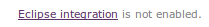
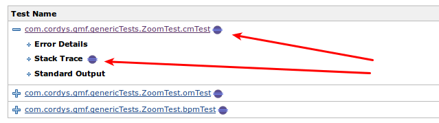
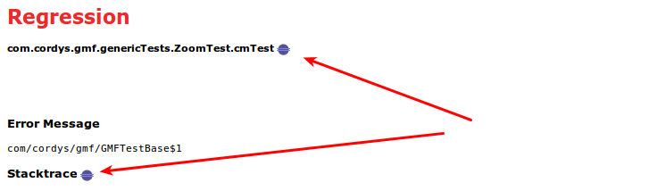
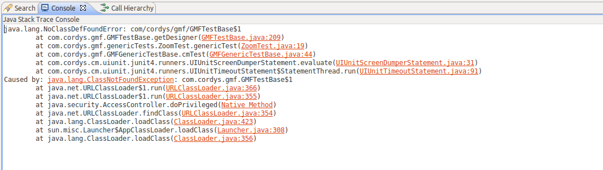
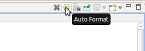

This plugin enables you to push a stacktrace to the Eclipse
[OpenFromExternalEvent
plugin](http://cbos.github.io/OpenFromExternalEvent/)

# Goal of the plugin

When you are browsing throw Jenkins and see test failures, you like to
see the Java code related to that issue, and you want to go through the
stacktrace.

To do that without plugin, you have to copy the stacktrace and paste
that in the console view of Eclipse (or manually lookup up each line of
code).

With this Jenkins plugin in combination with [this Eclipse
plugin](http://cbos.github.io/OpenFromExternalEvent/) you can do it a
lot faster.

# What will appear in Jenkins

The Eclipse icon can appear on a number of places when you have the
plugin installed and the [Eclipse OpenFromExternalEvent
plugin](http://cbos.github.io/OpenFromExternalEvent/) installed.

## Plugin enabled?

On the bottom of each page you well see one of these below:

This gives an indication whether the plugin in your Eclipse has been
detected.

## Where are the 'Send to Eclipse' icons?

Send to Eclipse options will appear for the test failures and
regressions.

They will appear in the summary overview:

And on the page of an individual failing testcase:

When you click on the icon behind the testcase name it will open that
class and the cursor will be on the testmethod.

When you click on the icon behind the stacktrace it will open the
console window.
  
In the console view, you can click on the several classes in the
stacktrace. That helps you to navigate through the issue.

TIP: Enable 'auto format' for the Eclipse console view, that give better
result in formatting of the stacktrace and making the classes clickable.

# Changelog

## Version 1.8 (March 13th, 2018)

Update to latest depencencies, prepare for Jenkins 2.0 deployment.

## Version 1.5 (May 28th, 2014)

Initial release to the community
