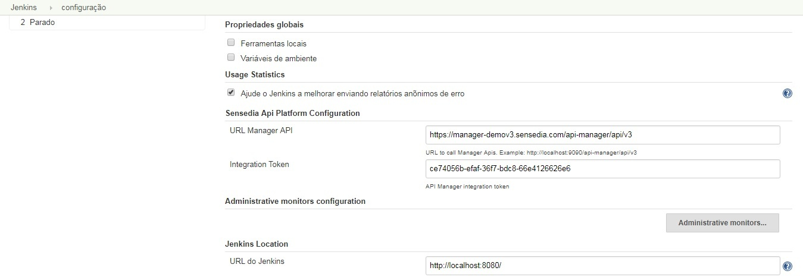
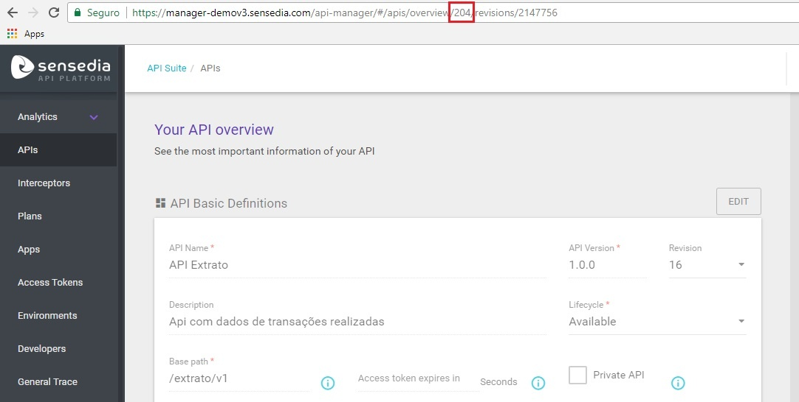
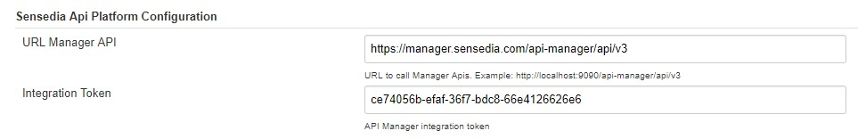
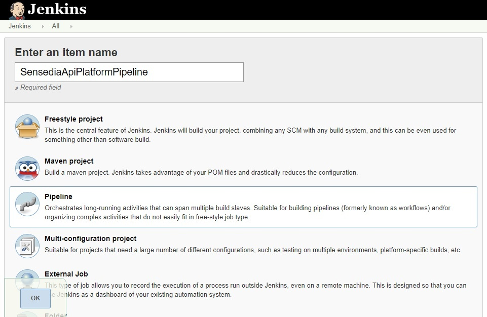
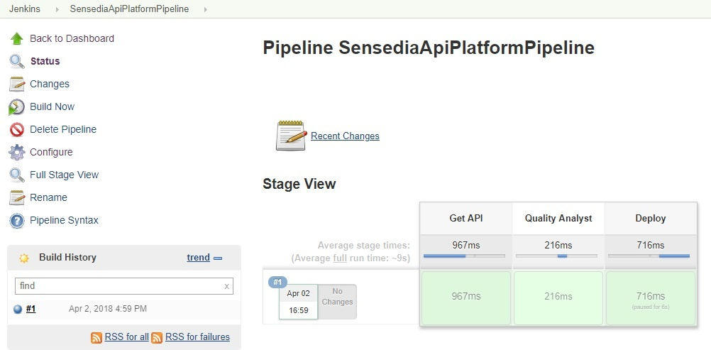

 

It is a **continuous integration** and **continuous delivery** plugin
for **Sensedia API Platform**

  

##  Configuration

Sensedia Api Platform manager URL

URL Example

https://manager.sensedia.com/api-manager/api/v3

  
Sensedia Api Platform integration token

Request the integration token by Sensedia Zendesk

Set this informations in *Jenkins **\>** Configuration **\>** Sensedia
API Platform Configuration*

{height="250"}

## Functions

### Get Api Json

  
Get the Api code, by Id. This Id can be seen at the Api URL on Sensedia
API Platform Manager

https:/manager.sensedia.com/api-manager/\#/apis/overview/**204**/revisions/2147756

{height="250"}

• **sensediaApiJson** : string(ApiId)

**Pipeline script**

``` syntaxhighlighter-pre
..
stage ("Get Api"){
    sensediaApiJson "204" 
}
..
```

This function save de api code in the workspace job (filename =
api.json). The other functions uses this code to work. If you don't want
to use this function, will need to save a api code in the workspace with
a file name "api.json"

### Quality Analyst

  
It validate the best pratices on API. The **destination** search for
hard coded endpoints, **logInterceptor** validates if log interceptor is
too used and **resourceOutOfSize** if the path is too large

• **sensediaApiQA**: boolean (destination), boolean (logInterceptor),
boolean (resourceOutOfSize)

**Pipeline script**

``` syntaxhighlighter-pre
..
stage ("Quality Analyst"){
    sensediaApiQA(destination: true, logInterceptor: true, resourceOutOfSize: true)
}
..
```

*If one of them is not set, the test will be skipped*

### Deploy

  
Performs a deployment in the enviroment

• **sensediaApiJson** : string(enviroment name)

**Pipeline script**

``` syntaxhighlighter-pre
..
stage ("Production deploy"){
    sensediaApiDeploy(enviromentName: "Production")
}
..
```

*By default the Api revision deployed is the last*

## Step-by-step guide

 

1.  Download and install Sensedia API Platform plugin
2.  In "Configure System" \> "Sensedia Api Platform Configuration"
    section, put the URL and Token values  
      
    {width="963"
    height="156"}  
      
3.  Create new Pipeline Job  
      
    {height="250"}  
      
4.  In section "Pipeline" put the script according to your process. See
    an example below

    **Pipeline script**

    ``` syntaxhighlighter-pre
    node {
        stage ("Get API"){
            sensediaApiJson "204"
        }
        stage ("Quality Analyst"){
            sensediaApiQA(destination: true, logInterceptor: true, resourceOutOfSize: true)
        }
        stage ("Deploy"){
            sensediaApiDeploy(enviromentName: "Production")
        }
    }
    ```

5.  Build pipeline  
    {height="250"}  
      

 
