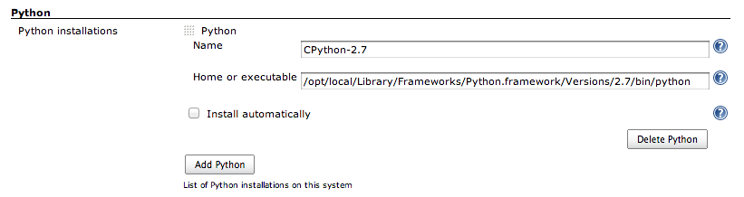

This plugin adds Python support to Jenkins with some useful builders
(Python builder, [virtualenv](http://pypi.python.org/pypi/virtualenv)
builder, [tox](https://bitbucket.org/hpk42/tox) builder...) and the
ability to use a Python axis in multi-configuration projects (for
testing on multiple versions of Python).

This plugin is developed by [ShiningPanda.](http://shiningpanda.com/),
the editor of [requires.io](https://requires.io/), a web service to
monitor the dependencies of your Python projects. [Contact
us](https://requires.io/contact/) for more informations!

# Configure Python installations

To configure Python installations, step in
`Manage Jenkins > Global Tool Configuration`. Then look for the `Python`
section.



To configure a new Python installation click on `Add Python`, then fill
the following fields:

-   `Name`: the name of this Python installation, make it meaningful by
    including the Python's version for example.
-   `Home or executable`: the path to the root folder of the Python
    installation (CPython, PyPy, Stackless Python, Jython or IronPython)
    or the path to the Python executable, such as:
    -   `/opt/local/Library/Frameworks/Python.framework/Versions/2.7` on
        MacOS X ([MacPorts](http://www.macports.org/)).
    -   `C:\Python27` on Windows.
    -   `/usr/bin/python2.6` on Unix.
    -   ...

A good practice is to install raw Pythons and then use the
`Virtualenv Builder` to setup your execution environment.

# Builders

Five builders dedicated to Python:

-   `Virtualenv Builder` (recommended): creates an isolated environment
    with [virtualenv](http://pypi.python.org/pypi/virtualenv),
-   `Buildout Builder`: use [Buildout](http://www.buildout.org/) to
    build your project,
-   `Tox Builder`: use [tox](http://tox.readthedocs.org/en/latest/) to
    build your project, only available for Jenkins multi-configuration
    projects,
-   `Python Builder`: use a Python installation configured on Jenkins
    via `Manage Jenkins > Global Tool Configuration > Python`,
-   `Custom Python Builder`: use an arbitrary Python installation,
    typically a manually created
    [virtualenv](http://pypi.python.org/pypi/virtualenv) environment.

# Publishers

One publisher dedicated to Python:

-   `Publish coverage.py HTML reports`: this publisher aims at
    displaying HTML reports generated by the
    [coverage](http://nedbatchelder.com/code/coverage/) package.

# FAQ

## Why can't I see all the builders?

Have you configured some Python installations in the `Python` section of
the `Manage Jenkins > Global Tool Configuration` page?

## How to configure IronPython on UNIX?

See this [blog
post](http://shiningpanda.com/shiningpanda-plugin-ironpython-here-we.html).

# Roadmap

1.  Support [pip](http://pypi.python.org/pypi/pip)'s requirements.txt in
    [virtualenv](http://pypi.python.org/pypi/virtualenv) builders
    (thanks @myusuf3 for the idea).
2.  Ease [PyLint](http://www.logilab.org/857) code analysis (and
    associated reporting).
3.  Improve [coverage](http://pypi.python.org/pypi/coverage) reporing.
4.  Automate installation of Pythons.
5.  Your idea here... [contact us](https://requires.io/contact/)!

# Version History

## Version 0.24 (15/07/2018)

-   Bundle virtualenv [16.0.0](https://pypi.org/project/virtualenv/16.0.0)
-   Do not use `pip.main`

## Version 0.23 (25/06/2016)

-   Bundle virtualenv
    [15.0.2](http://pypi.python.org/pypi/virtualenv/15.0.2)
-   Update `Tox` axis default environments

## Version 0.22 (29/08/2015)

-   Bundle virtualenv
    [13.1.2](http://pypi.python.org/pypi/virtualenv/13.1.2)
    ([JENKINS-30068](https://issues.jenkins-ci.org/browse/JENKINS-30068),
    [JENKINS-27551](https://issues.jenkins-ci.org/browse/JENKINS-27551)),
-   Fix
    [JENKINS-28428](https://issues.jenkins-ci.org/browse/JENKINS-28428):
    coverage 4 renames status.dat to status.json.

## Version 0.21 (14/06/2014)

-   Bundle virtualenv
    [1.11.6](http://pypi.python.org/pypi/virtualenv/1.11.6),
-   Remove package manager selector on `Virtualenv Builder`,
-   Remove hosted mode.

## Version 0.20 (30/06/2013)

-   Fix
    [JENKINS-18415](https://issues.jenkins-ci.org/browse/JENKINS-18415):
    can't run shining panda jobs on Jenkins 1.519.

## Version 0.19 (19/03/2013)

-   Bundle virtualenv
    [1.9.1](http://pypi.python.org/pypi/virtualenv/1.9.1).

## Version 0.18 (24/02/2013)

-   Add `py33` to `Tox` axis,
-   Copyright 2013.

## Version 0.17 (29/11/2012)

-   Bundle virtualenv
    [1.8.4](http://pypi.python.org/pypi/virtualenv/1.8.4).

## Version 0.16 (21/11/2012)

-   Fallback on virtualenv
    [1.7.2](http://pypi.python.org/pypi/virtualenv/1.7.2) for Python 2.4
    (default is [1.8.2](http://pypi.python.org/pypi/virtualenv/1.8.2)).

## Version 0.15 (06/11/2012)

-   Fix
    [JENKINS-14188](https://issues.jenkins-ci.org/browse/JENKINS-14188):
    path to executable is now allowed in the `Home` field of a Python
    installation,
-   Configurable ShiningPanda working directory,
-   Bundle virtualenv
    [1.8.2](http://pypi.python.org/pypi/virtualenv/1.8.2).

## Version 0.14 (25/07/2012)

-   Bundle virtualenv
    [1.7.2](http://pypi.python.org/pypi/virtualenv/1.7.2),
-   Fix `Buildout Builder`: bootstrap.py of zc.buildout 2 always uses
    distribute.

## Version 0.13 (17/05/2012)

-   Fix help.

## Version 0.12 (30/04/2012)

-   Add IronPython support,
-   Switch from Affero GPL to something we could call a Lesser Affero
    GPL (see
    [here](https://raw.github.com/jenkinsci/shiningpanda-plugin/master/LICENSE.txt)),
-   Fix path to Jython 2.2.1 executable.

## Version 0.11 (05/04/2012)

-   Bundle the development branch of virtualenv
    (1.7.1.2.post1@e299c87a1b9a63fcc2c3279cef3bf42e14ba0d32) to include
    PyPy and Jython fixes for Windows,
-   Fix the path to the binary of a PyPy based virtualenv on Windows in
    `Virtualenv Builder`,
-   Fix
    [JENKINS-13339](https://issues.jenkins-ci.org/browse/JENKINS-13339):
    configuration file not set when calling `buildout` in
    `Buildout Builder`.

## Version 0.10 (20/02/2012)

-   Bundle virtualenv
    [1.7.1.2](http://pypi.python.org/pypi/virtualenv/1.7.1.2),
-   New builder for [Buildout](http://www.buildout.org/).

## Version 0.9 (26/01/2012)

-   Improve the `Virtualenv Builder` cleanup algorithm to avoid useless
    virtual environment creations,
-   Move virtual environments generated by the `Virtualenv Builder`
    under `$JENKINS_HOME/shiningpanda` to avoid deletions caused by full
    checkouts, as a consequence the `Virtualenv home` field becomes a
    `Name` field: two `Virtualenv Builder` with the same `Name` will use
    the same virtual environment installation,
-   Fix the workspace addition in the `PATH` for the `XShell` nature.

## Version 0.7 (19/01/2012)

-   Add a `Nature` field on `Python Builder`, `Virtualenv Builder` and
    `Custom Python Builder` to specify the type of the `Command` field.
    In addition to shell (`Shell` nature), you can now type some Python
    with the `Python` nature, and some shell commands translated at
    runtime to match the targeted platform (variables, separator, ...)
    with the `XShell` nature,
-   Add a coverage.py HTML report publisher,
-   Add a `TOXENV pattern` field to the `Tox Builder` to compute the
    test environment (an alternative to `Tox` axis),
-   Detect Python installations in standard locations at first launch,
-   Unable to submit job configuration if only `Custom environments`
    field is used in `Tox` axis ([Mantis
    12](https://www.shiningpanda-ci.com/bugs/view.php?id=12)),
-   In specific cases the Python version was still asked in *Virtualenv
    Builder* and *Python Builder* on multi-configuration projects
    ([Mantis 14](https://www.shiningpanda-ci.com/bugs/view.php?id=14)),
-   Create symbolic links to Python shared libraries in
    `$VIRTUAL_ENV/lib` on Unix (see [virtualenv
    216](https://github.com/pypa/virtualenv/issues/216)),
-   Copyright 2012.

## Version 0.6 (05/12/2011)

-   Embed [virtualenv](http://pypi.python.org/pypi/virtualenv) 1.7
    including pull request
    [\#193](https://github.com/pypa/virtualenv/pull/193).
-   As a consequence, `No site packages` becomes `System site packages`
    (with the opposite value) for `Virtualenv Builder`.
-   Fix a 0.4 to 0.5 backward compatibility bug on Python installations.

## Version 0.5 (24/11/2011)

-   `Tox` `Builder`.
-   [Virtualenv](http://pypi.python.org/pypi/virtualenv) is no more
    required in Python installations.
-   Windows support.
-   [Jython](http://www.jython.org/) support.
-   `Custom Virtualenv Builder` becomes `Custom Python Builder` and
    handles now any kind of Python installation.
-   `Standard Python Builder` becomes `Python Builder`.
-   Full path to Python executable available via `PYTHON_EXE`
    environment variable in `Command` fields.
-   `Python` axis displayed as a tree on
    [shiningpanda-ci.com](https://www.shiningpanda-ci.com/).

## Version 0.4 (28/09/2011)

-   Adding ability to pass `--no-site-packages` to virtualenv (thanks
    @amcfague).
-   Remove `(Default)` Python version.
-   Add an explicit option on builders with `Command` to ignore non-zero
    exit code (previously done by specifying an header, which are now
    ignored).

## Version 0.3 (20/09/2011)

-   Whitespace characters are not allowed in Python names (as they are
    used to create the workspace path in multi-configuration projects).
-   Make the build fail if there a some whitespace characters in
    `PYTHONHOME` (see.
    <https://bugs.launchpad.net/virtualenv/+bug/241581>).
-   Propagate `User-defined Axis` variables in all builders
    (multi-configuration projects).

## Version 0.2 (13/09/2011)

-   PyPy support.

## Version 0.1 (31/08/2011)

-   Initial release.

     

# Running tests

If you want to run ShiningPanda plugin tests, ensure that you're on UNIX
and that following environment variables are not set: `PYTHONHOME`,
`VIRTUAL_ENV` and `JYTHON_HOME`.

You'll also need some Python installations:

-   a CPython 2 installation,
-   a CPython 3 installation,
-   a PyPy installation,
-   a Jython installation.

To declare them, create a new property file by copying the template
(only if template's configuration does not match your environment):

``` syntaxhighlighter-pre
cp src/test/resources/test.properties.model src/test/resources/test.properties
```

Then edit `test.properties` and modify the following entries:

-   `CPython.2.Home`: CPython 2's home folder (`PYTHONHOME`),
-   `CPython.3.Home`: CPython 3's home folder (`PYTHONHOME`),
-   `PyPy.Home`: PyPy's home folder,
-   `Jython.Home`: Jython's home folder (`JYTHON_HOME`),

You can also provide these values via command line:

``` syntaxhighlighter-pre
mvn -DCPython.3.Home=/path/to/cpython/3/home
```

To run all the tests:

``` syntaxhighlighter-pre
mvn clean install
```

To run a test:

``` syntaxhighlighter-pre
mvn -Dtest=jenkins.plugins.shiningpanda.builders.TestVirtualenvBuilder
```

And to debug one (with Eclipse for instance):

``` syntaxhighlighter-pre
mvn -Dmaven.surefire.debug -Dtest=jenkins.plugins.shiningpanda.TestVirtualenvBuilder
```

For those developing on Eclipse, its test runner is not compatible with
Jenkins's base test case. You'll need to run tests via command line.

And if you just want to check that everything is working for the `HEAD`,
just have a look on [our continuous integration
server](https://jenkins.shiningpanda-ci.com/shiningpanda.org/job/shiningpanda-plugin/).
