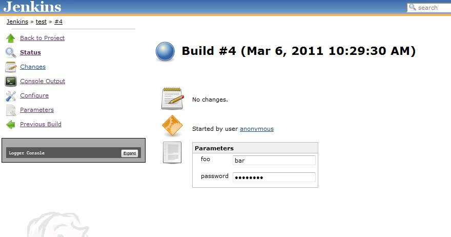

Show the parameters used for a build on the main build page

# Usage

This plugin is enabled by default once installed.  For new builds, the
parameter values used for a parameterized build will displayed on the
main build page.  

# Version History

## Version 1.0 (6-Mar-2011)

-   Initial Version
