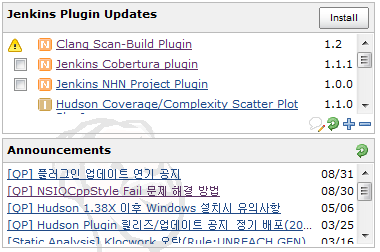

This plugin make Jenkins connect to the custom support site which
provide custom plugin update info and announcements.

-   Compatible with Jenkin 1.398 or after

## Feature

-   access to custom update site and shows the plugin update info
-   provide the announcements from RSS
-   provide the "Ask a support" button to the custom Jenkins support
    site

          

## Configuration

-   After installing this plugin, You will see the following screen in
    top when you access Jenkins with admin permission.  
    

&nbsp;

-   Click Jenkins configuration link
-   Provide the custom plugin update site url, announcements url, and
    ask a support url.
    -   simpleupdatesite plugin needs a server which sends the support
        information to the plugins.
    -   How to create URL is up to you. Easiest way is using
        simpleupdatesiterepo utility and googlecode.
    -   See "How to create create custom support site" section.
-   Save configuration
-   See what is in the Jenkins top page.

## Release

-   1.1.2 
    -   First official release in public.

## How to create custom support site

-   Prepare CMS server 
    -   It should provide the following.
        -   Issue Tracker for the support request.
        -   BuiltIn Board with RSS support for announcement
    -   They should be accessible by URL.
-   Create custom update-center.json
    -   Precondition
        -   URL based download enabled server(WEB-DAV support is best").
    -   How to make it.
        -   Create a basefolder in which plugins folder exists
        -   Put custom plugins info basefolder/plugins 
            -   pluginname.hpi, pluginname.wiki, pluginname.info
            -   \*.wiki should contain the detailed usage link about the
                plugin. (If not exists, wiki link assigned in the
                plugin's pom.xml is used for update-center.json)
            -   \*.info should contain the short description about
                plugin (I may have the release info.)
        -   Download simpleupdatesiterepo util.
            -   <http://github.com/junoyoon/simpleupdatesiterepo>
        -   Run following.
            -   java -jar
                simpleupdatesiterepo-1.0.0-jar-with-dependencies.jar
                -u (siteUrl)  -f (basefolder)
            -   siteUrl should be the base url of the update-center.json
                in the web server.
    -   Upload the basefolder into the web server.

&nbsp;

-   One of the easiest way is to use googlecode.
    -   TBD

## Reference

-   <http://www.cloudbees.com/jenkins-user-conference-2011.cb>

## To Korean

-   이 플러그인은 NHN에 의해 제공됩니다. 관련된 정보가 필요하시면
    junoyoon at 엔에이치엔닷컴(영어로..) 으로 메일 주세요.
