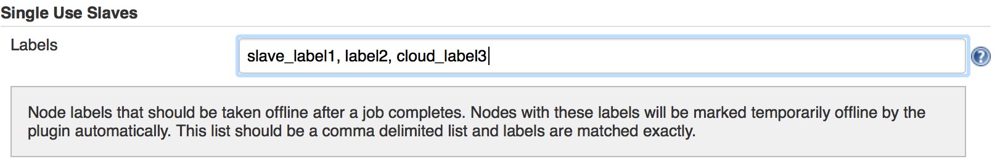

This plugin will allow taking slaves with specific labels offline when a
job completes

# What it does

This plugin will mark nodes as offline when a job completes on them. It
will do this only for nodes with one of the labels specified in the
Jenkins global configuration. One or more labels may be specified in the
global configuration.

This plugin is intended to be used with external tools like
[Nodepool](http://ci.openstack.org/nodepool.html), which has the ability
to spin up slaves on demand and then reap them when Jenkins has run a
job on them. This plugin is needed because there is a race condition
between when the job completes and when the external tool is able to
reap the node. This plugin addresses the race condition by intercepting
the build complete notifications generated internally to Jenkins and
offlining relevant nodes before another job can be schedule on them.

# How to use it

Go to "Manage Jenkins", then "Configure System".  You'll find a Single
Use Slave section as shown below.  The single field can be populated
with one or more slave labels that should be offlined when a job
completes on them.  Slaves with matching labels will be taken offline if
the job is successful or not.

# Screenshot

# 
