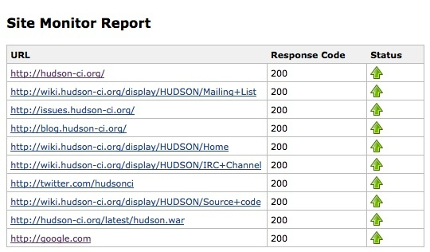
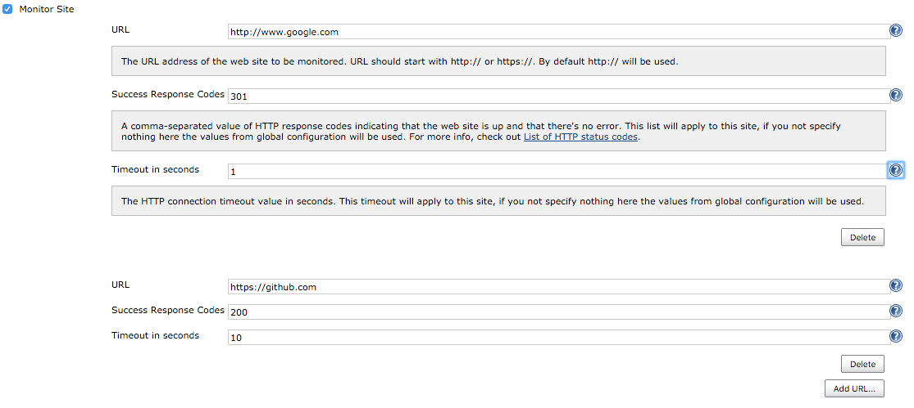
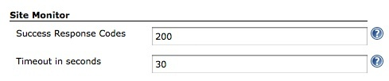

Monitors web site up/down status.

## Download & Installation

You can download the [latest
.hpi](http://updates.jenkins-ci.org/latest/sitemonitor.hpi) and install
it from the Manage Plugins menu, or install this plugin directly from
the Plugins Update Center.

## Usage

1.  After installing the plugin, go to job configuration page, select
    'Add post-build action', and select 'Monitor Site'.
2.  Tick the checkbox, add the URL(s) that you want to monitor, add a
    comma-separated list of response http status (optional) and a
    timeout (optional), and save the configuration. If you do not
    specify a list of http responses or a timeout, the monitor operation
    will get the default values from global configuration.
3.  Run a build. After it's completed, a link to Site Monitor Report
    page should appear on the build page. The report page would contain
    web site status and response code.
4.  It is also possible to configure success response codes and timeout
    settings in the global configuration page (Manage Jenkins -\>
    Configure System)

## Screenshots

  
  

## Change Log

##### Version 0.5 (April 30, 2019)

-   [Fix security
    issue](https://jenkins.io/security/advisory/2019-04-30/)
-   Add option to ignore SSL/TLS per site check

##### Version 0.5 (Dec 14, 2015)

-   Override default settings - You can define a custom list of http
    codes and a timeout for each site
    (<https://issues.jenkins-ci.org/browse/JENKINS-20494>)
-   Added cookies support - You can now support current session with
    cookies help (<https://issues.jenkins-ci.org/browse/JENKINS-31921>).
    Thanks to @Federico Fissore for his pull request.
-   Ignore blank sites - If the URL of a site is blank, that site is
    ignored (<https://issues.jenkins-ci.org/browse/JENKINS-31922>).
-   Default protocol - If no protocol is typed, http is assumed
    (<https://issues.jenkins-ci.org/browse/JENKINS-31923>).

##### Version 0.4 (Nov 1, 2011)

-   https support - accepts any cert

##### Version 0.2 (Feb 14, 2011)

-   Translation updates (Chinese, Japanese)

##### Version 0.1 (Apr 7, 2010)

-   Initial release
