This plugin allows you to use Jenkins to run continuous integration and
automated testing workflows using dynamically-created development and
testing environments in [Skytap](http://www.skytap.com/)

Sections in this document:

# Introduction

The **Skytap Cloud CI Plugin for Jenkins** allows you to create and
configure [Skytap Cloud](http://www.skytap.com/) environments as part of
your Jenkins-based continuous integration workflow. 

In a matter of minutes, you can create a Skytap virtual environment from
a golden template and then use that environment to develop your
application or run test passes for unit testing, functional testing,
integration testing, stress/performance testing or user acceptance
testing. All of the VM and network settings are saved with the template,
so once you've created an environment, the network is already set up and
you're ready to go. 

With **Skytap Cloud CI Plugin for Jenkins**, you can add the following
actions to your Jenkins build steps:

# Before You Begin

To use the **Skytap Cloud CI Plugin for Jenkins**, you must have a
Skytap account.

If you do not have a Skytap account, you can sign up for a demo account
at <http://www.skytap.com/>

# Step 1: Installing the Skytap Cloud CI Plugin for Jenkins

You can install the plugin from the Jenkins web UI, or you can download
the plugin from the plugin repository. 

**Option 1:**  
**To install the plugin from the Jenkins Web UI:**

1.  Navigate to the Jenkins **Manage Plugins** page.  
    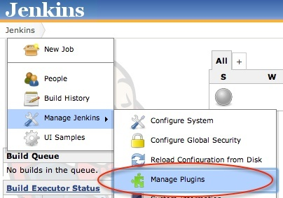
2.  Select the **Available** tab and filter for “Skytap”  
    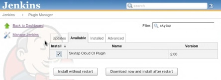
3.  Select the “Install” checkbox next to “Skytap Cloud CI Plugin for
    Jenkins.”
4.  Click **Download now and install after restart**.

**Option 2:**  
**To install the plugin from the Jenkins plugin repository:**

1.  Download the "skytap.hpi" plugin file from the Jenkins plugin
    repository.
2.  Navigate to the Jenkins **Manage Plugins** page.
3.  Select the **Advanced** tab.  
    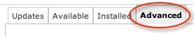
4.  From the “Upload Plugin” section, click **Choose File**.   
    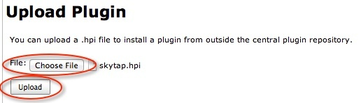
5.  Navigate to the downloaded plugin file (skytap.hpi) and select it. 
6.  Click **Upload**. 
7.  After the plugin is uploaded, restart Jenkins by navigating to
    http://\_your-jenkins-server\_/jenkins/restart
8.  Click **Yes** to confirm.  
    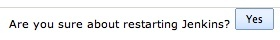 

# Step 2: Configuring the Plugin

To configure the plugin, you will need to enter to your Skytap
credentials. Optionally, you can also enable verbose logging.

1.  To enter your Skytap credentials:\#\# Navigate to the configuration
    page for your Jenkins build project.\#\# Under **Build
    Environment**, enter your Skytap User ID and API security token.   
     
    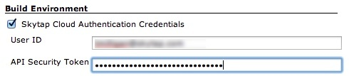  
    NOTE: You can retrieve your user ID (user name) and API security
    token from your Skytap account settings page
    (<https://cloud.skytap.com/account>). If you do not have an API
    security token listed, use the instructions
    at <http://help.skytap.com/#Access_Policy.html> to enable API
    security tokens in your account.
2.  To enable verbose logging for Skytap actions:\#\#  Navigate to
    **Manage Jenkins** \> **Configure System**.  
    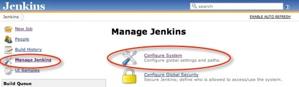\#\#
    In the Skytap Cloud Plugin settings, select **Enable Console Logging
    of Skytap Actions**.   
    Logs will be sent to the Jenkins Project build console.  
    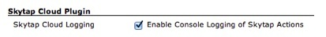

# Step 3: Adding Skytap Actions to Your Build Steps

Once the plugin is installed and configured, you can add Skytap actions
to your Jenkins build steps:

1.  Navigate to the Jenkins Project Configuration screen.
2.  From the **Add build step** dropdown menu, select **Execute Skytap
    Action**.   
    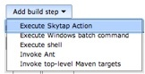
3.  Select an available action:  
    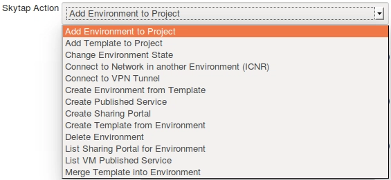
4.  Enter any required parameters. For a description of each action and
    the required parameters, see the sections below. 

# Reference: Skytap Actions and Required Parameters

NOTE: If you see different action names, please update the Skytap Cloud
CI Plugin to the latest version.

### Add Environment to Project

This action adds a Skytap environment to a Skytap project.

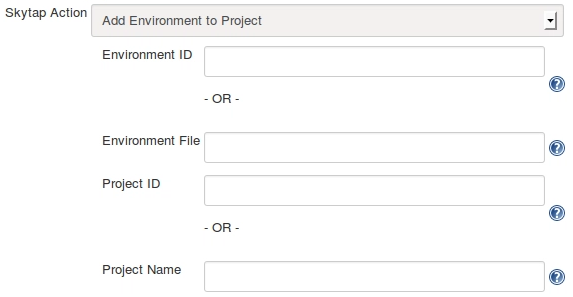  
 

[TABLE]

### Add Template to Project

This action adds a Skytap template to a Skytap project.

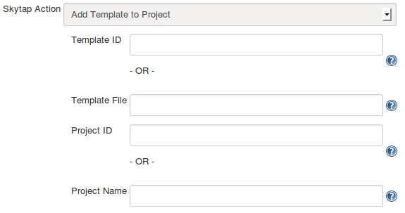

[TABLE]

### Change Environment State

This action will run, suspend, or shut down a Skytap environment.

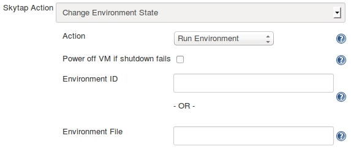

[TABLE]

### Connect to Network in another Environment (ICNR)

This action connects two networks in different Skytap environments. The
networks must already be configured to allow an [Inter-Configuration
Network Routing
(ICNR)](http://help.skytap.com/#Networking_Between_Environments.html)
connection to occur. 

[TABLE]

NOTE: If there is more than one network in the environment with the
specified name (not recommended), the plugin will use the first network
encountered in the metadata associated with the environment.

### Connect to VPN Tunnel

This action will connect a Skytap environment to a Skytap VPN.  
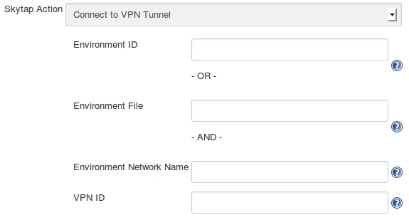

[TABLE]

### Create Environment from Template

This action creates a Skytap environment from a Skytap template.  
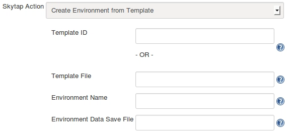

[TABLE]

### Create Sharing Portal

This action creates a Sharing Portal for a Skytap environment.

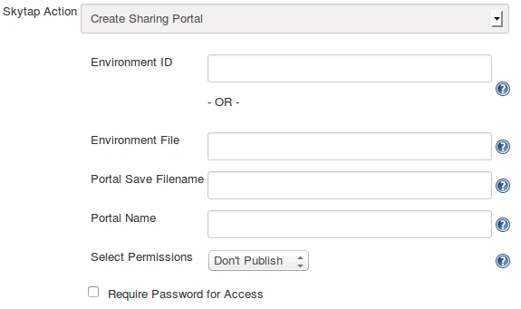

[TABLE]

### Create Published Service

This action creates a [Published
Service](http://help.skytap.com/#Accessing_VMs_with_Published_Services.html)
port opening on a VM's network adapter. This is commonly used to open
RDP or SSH access to a VM.  
    
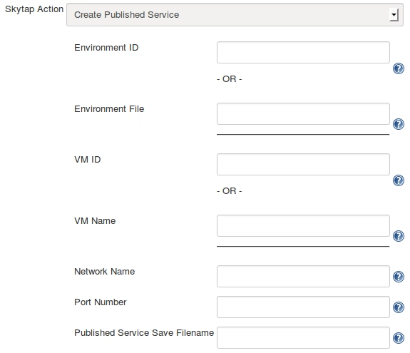

[TABLE]

### Create Template from Environment

This action creates a Skytap template from a Skytap environment.

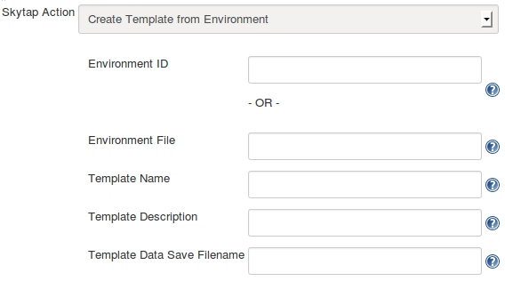

[TABLE]

### Delete Environment

This action deletes a Skytap environment.

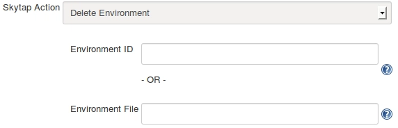

[TABLE]

### List Sharing Portal for Environment

This action returns the address for an existing sharing portal in a
Skytap environment.

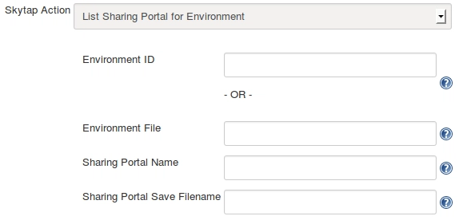

[TABLE]

### List VM Published Service

This action returns the "public-URL:port-number" for an
existing published service in a Skytap environment.

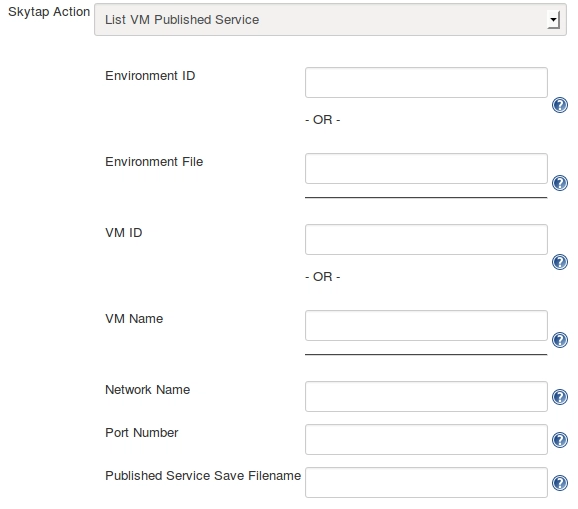

[TABLE]

### Merge Template into Environment

This action will copy VMs from a Skytap template into a Skytap
environment.  
  
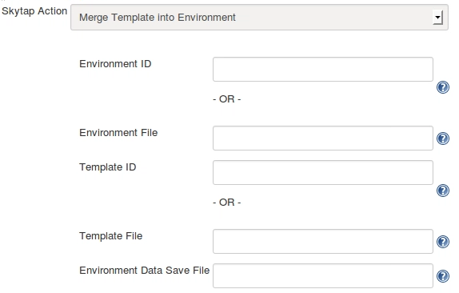

[TABLE]
