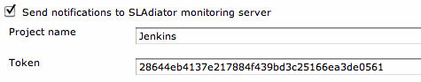
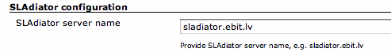
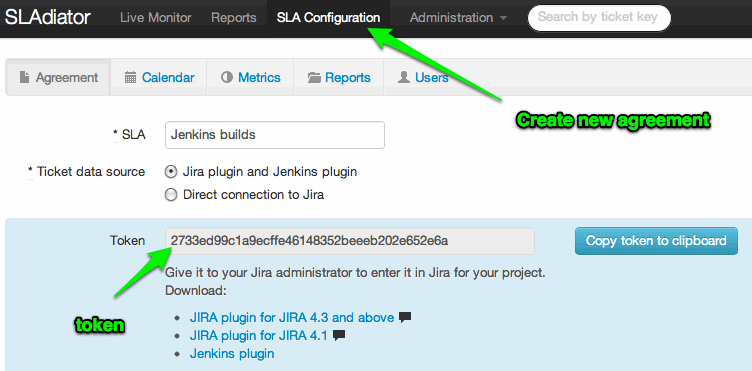
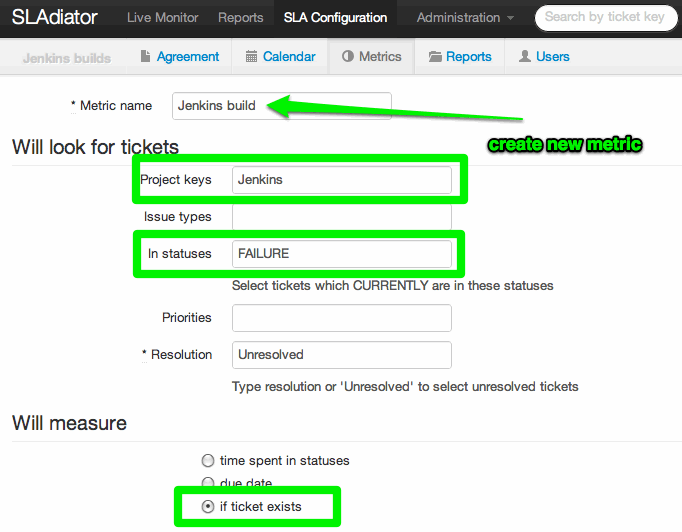

Sends build status notifications to the SLAdiator monitoring application
([http://sladiator.com](http://sladiator.com/)).

### Description

SLAdiator ([http://sladiator.com](http://sladiator.com/)) is online
Service Level Agreement monitoring tool, which allows you to define
various service level metrics and monitor their fulfillment in real
time. This Jenkins plugin allows to see Jenkins build status also on the
monitoring tool (if you would like to). Once installed and configured,
this plugin sends build status notifications upon build completion. 

### Configuration

There is a SLAdiator section in the build configuration screen where you
can specify project name (defaults to "Jenkins") and a field where you
need to paste in the agreement (token) number. See below in SLAdiator
application configuration guide, how to get the token.

By default notifications are sent to the global SLAdiator monitoring
service; however if you have your own copy of SLAdiator application,
then you can override server settings in the Jenkins global
configuration options:

### SLAdiator application configuration guide

First you need to get the agreement number (token) from the SLAdiator.
You get this number from the agreement configuration page. If you don't
have any agreement, yet, then simply create a new one and get the token.
Remember to paste the token into Jenkins build configuration!

After you have got the token, you need to set up metric that will watch
notifications sent from Jenkins

That's it.

### Change Log

##### Version 1.0.2

\* Initial official production release
