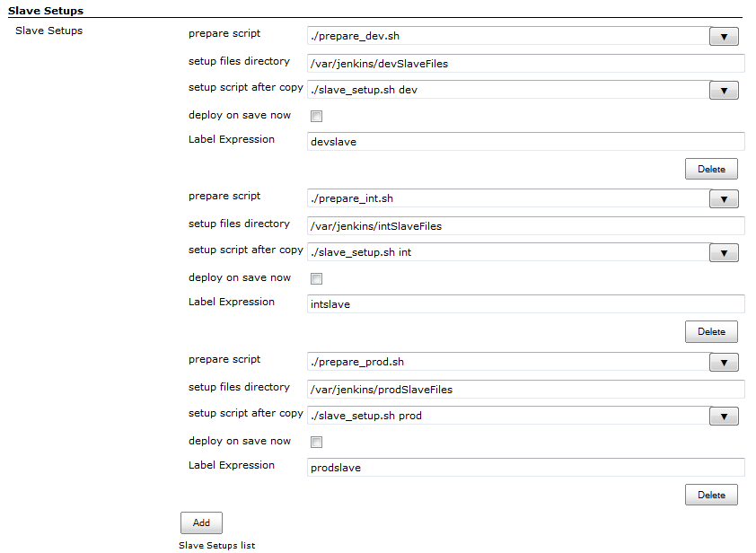
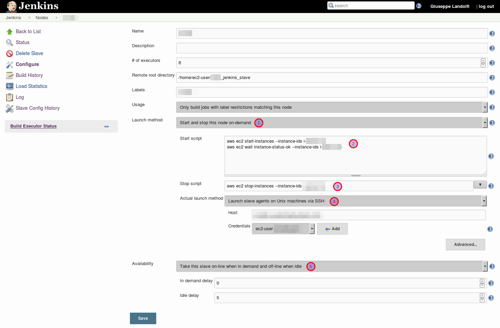

This plugin prepares slaves for build execution by letting you copy
files and execute scripts before the slave gets used.

It also allows you to start and stop slaves on demand from the master
node.

# Label-based setup

The slave setup plugin gets executed for a slave, if the given label
expression matches and on:

-   Jenkins startup as a slave gets connected.
-   Save of the Jenkins configuration page if the "deploy on save now"
    checkox is checked.
-   New or re-connection of a slave.

When you install this plugin, it adds a new system configuration section
that lets you specify a list of slave setup items. Each of them have to
following properties:

| Property                | Description                                                                                                                                                                                                                            | Example                                   |
|-------------------------|----------------------------------------------------------------------------------------------------------------------------------------------------------------------------------------------------------------------------------------|-------------------------------------------|
| pre-launch script       | Name of a pre-launch script relative to the **jenkins home directory**. This can be used to start the slave machine, before Jenkins tries to ssh it.                                                                                   | ./prelaunch.sh                            |
| prepare script          | Name of a prepare script relative to the **jenkins home directory** (not the setup files directory, this has changed in v1.6). This can be used to aggregate files into the setup files directory, patch them, pack them, and so on... | ./prepare\_files.sh                       |
| setup files directory   | Absolute path to the directory that will be copied to the slave.  The contents of this directory are copied to the home directory of the slave.                                                                                        | /var/jenkins/devSlaveFiles                |
| setup script after copy | Name of the script that should be executed on the slave after all files are copied. The script should be part of the files to copy.                                                                                                    | ./slave\_setup.sh                         |
| deploy on save now      | If checked, this slave setup item will be executed on save of the jenkins configuration page.                                                                                                                                          | checked                                   |
| Label Expression        | Like jobs a slave setup item can be configured to be executed only on the slaves that match the Label Expression.                                                                                                                      | "slaves", "!selenium", "slave1 OR slave2" |

First the directory gets copied, then the script gets run. The execution
of the script is reported to the slave log. When it fails, the slave is
not marked as online, so ill-prepared slaves never enter the slave pool.

This provides the administrator of the system an opportunity to prepare
slaves to the state suitable for build execution. This works
particularly well in conjunction with tools like Puppet that has
higher-level support for this kind of task.  

# On-demand slave setup 

This plugin also provides you a per-slave "start" and "stop" script
configuration specific for on-demand slaves.

Once installed, you will have an additional **"Launch method" (1)** for
this case: 

this one lets you specify the "Start" **(2)** and "Stop" **(3)**
scripts, and on top of that you will be able to **specify the
"conventional" connection (4)** method for reaching the slave after it
has been started.

You will likely also want to specify that you want this node to be
online only when Jenkins needs it **(5)**.

The figure below shows the configuration that you may want to use if
your on-demand slave is an Amazon EC2 instance.

{width="300"}

([show full
size](docs/images/68747470733a2f2f676f6c6466697368746970732e66696c65732e776f726470726573732e636f6d2f323031362f30362f746e63686a716e74766a2e706e67.png))

**NOTE:** if your jobs need the slave to be up for being scheduled, you
may end up in a situation where no jobs are scheduled because the slaves
are offline, and the slaves are not started because no jobs are
scheduled.

A common cause of this situation might be that you are polling Git by
the Git plugin, and "Fast remote polling" (polling from the master
instead of the slave) is disabled or not working. See the [Git plugin
documentation](https://wiki.jenkins-ci.org/display/JENKINS/Git+Plugin)
on how to get the "Fast remote polling" working.

# Changelog

#### Version 1.10 (July 1, 2016)

-   Fixed [JENKINS-31175](https://issues.jenkins-ci.org/browse/JENKINS-31175) -
    License missing in source code
-   Added per-slave start & stop scripts specifically for on-demand
    slaves. This also
    resolves [JENKINS-20489](https://issues.jenkins-ci.org/browse/JENKINS-20489) - start
    slave on demand and don't power off afterwards

#### Version 1.9 (June 17, 2015)

-   Fixed
    [JENKINS-28297](https://issues.jenkins-ci.org/browse/JENKINS-28297) -
    NPE in pre-launch Script for Jenkins Versions bigger than 1.609

#### Version 1.8 (September 23, 2014)

-   Fix a bug when Slave could not be started of no labels of the
    pre-launch Scripts match.

#### Version 1.8 (September 23, 2014)

-   Fix a bug when Slave could not be started of no labels of the
    pre-launch Scripts match.

#### Version 1.7 (September 22, 2014)

-   Expose NODE\_TO\_SETUP\_NAME and NODE\_TO\_SETUP\_LABELS
    ([JENKINS-24107](https://issues.jenkins-ci.org/browse/JENKINS-24107))
-   Help files are displayed now
-   Possibility to add pre-launch scripts which will be executed before
    the slave is launched

#### Version 1.6 (July 2, 2012)

-   Fixed error on using empty Slave Setup Config Item.

#### Version 1.5 (June 18, 2012)

-   Added the possibility to create a list of slave setup items to
    support different setups.
-   Added field for prepare script to provide the possibility to prepare
    the files to be copied to a slave.

#### Version 1.4 (Mar 08, 2012)

-   Added checkbox to enable setup deployment on save of the system
    configuration page.
-   Added label field to filter slaves to be used for setup deployment.

#### Version 1.0 (Sep 17, 2011)

-   Initial version
