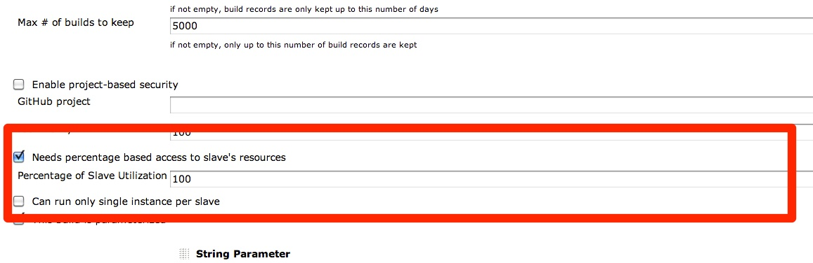

Lets you specify two things 

1.  Configure Percentage of node capacity that should be allocated when
    a job runs on particular node
2.  Configure if only one instance of a job can run on a given node at
    any given time

  
This plugin adds two new options to job config page 

1.Needs percentage based access to slave's resources

For example if you specify a job to take 50% of node's capacity and the
node is configured to use 6 executors. When this job runs on the node it
would only allocate jobs on the 3 remaining executors  and allocate 3
executors to this job.

2.Can run only single instance per slave

If you check this option only one job would be scheduled per node

  

